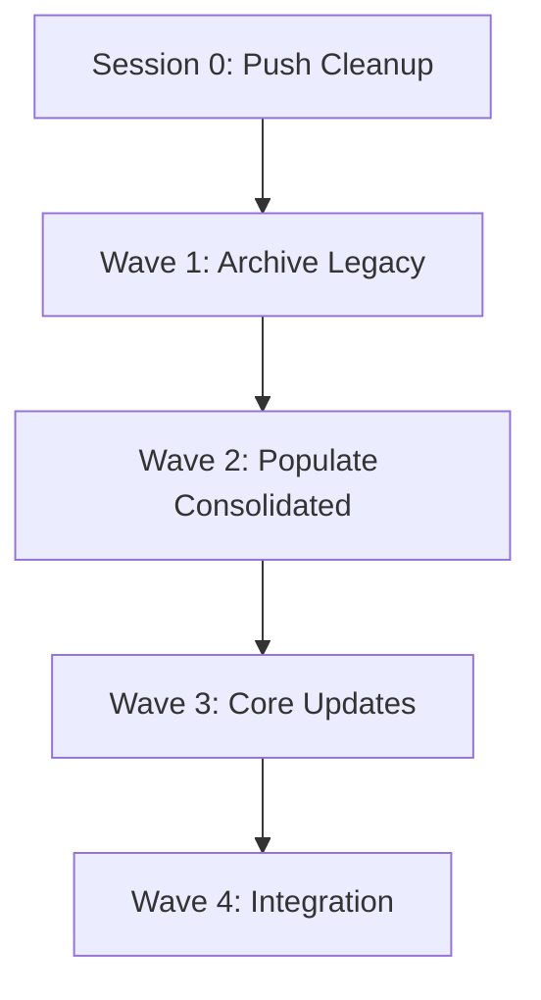

# PyAirtableMCP - Complete 14 Repository Cleanup Plan

## 📊 Current State: 14 Repositories

### Repository Breakdown:
- **3 Legacy Services** (to be archived) - replaced by consolidated versions
- **5 Consolidated Services** (minimal, need content) - created Aug 5, 2025
- **6 Core Repositories** (to be kept and cleaned)

### The 14 Repositories:

| # | Repository | Size | Status | Action Required |
|---|-----------|------|--------|-----------------|
| 1 | pyairtable-compose | 39MB (was 6.4GB locally) | Active, 15 issues | Push cleanup branch |
| 2 | pyairtable-common | 140KB | Active | Clean & update |
| 3 | pyairtable-frontend | 80KB | Active | Consolidate with dashboards |
| 4 | pyairtable-tenant-service-go | 13MB | Legacy | **ARCHIVE** |
| 5 | pyairtable-docs | 158KB | Private, Active | Receive migrated docs |
| 6 | pyairtable-infra | 246KB | Active | Update for new architecture |
| 7 | pyairtable-gateway | 39KB | Legacy | **ARCHIVE** |
| 8 | pyairtable-auth | 41KB | Legacy | **ARCHIVE** |
| 9 | pyairtable-auth-consolidated | 16KB | New (Aug 5) | Add implementation |
| 10 | pyairtable-tenant-consolidated | 9KB | New (Aug 5) | Add implementation |
| 11 | pyairtable-data-consolidated | 11KB | New (Aug 5) | Add implementation |
| 12 | pyairtable-automation-consolidated | 8KB | New (Aug 5) | Add implementation |
| 13 | pyairtable-ai-consolidated | 6KB | New (Aug 5) | Add implementation |
| 14 | pyairtable-gateway-consolidated | 9KB | New (Aug 5) | Add implementation |

## 🚀 Parallel Claude Sessions Strategy

### **Session 0: Push Current Cleanup** (IMMEDIATE - 30 min)
**Do this FIRST before starting any other sessions!**

```bash
cd /Users/kg/IdeaProjects/pyairtable-compose
git push origin cleanup-massive-mess-20250810
# Create PR on GitHub
# Merge to main branch
```

---

### **Wave 1: Archive Legacy Services** (3 Parallel Sessions - 2 hours)
Start these THREE sessions simultaneously:

#### **Session 1A: Archive pyairtable-auth**
- Document final state
- Extract any useful code to pyairtable-auth-consolidated
- Create migration guide
- Archive repository
- **Time**: 2 hours

#### **Session 1B: Archive pyairtable-gateway**  
- Document final state
- Extract routing logic to pyairtable-gateway-consolidated
- Update references
- Archive repository
- **Time**: 2 hours

#### **Session 1C: Archive pyairtable-tenant-service-go**
- Document final state (13MB of code!)
- Extract core logic to pyairtable-tenant-consolidated
- Preserve multi-tenant features
- Archive repository
- **Time**: 2 hours

---

### **Wave 2: Populate Consolidated Services** (5 Parallel Sessions - 3 hours)
Start these FIVE sessions simultaneously after Wave 1:

#### **Session 2A: pyairtable-auth-consolidated**
- Migrate code from archived pyairtable-auth
- Implement JWT, OAuth, session management
- Add tests and CI/CD
- **Time**: 3 hours

#### **Session 2B: pyairtable-gateway-consolidated**
- Migrate code from archived pyairtable-gateway
- Implement routing, rate limiting, load balancing
- Add monitoring endpoints
- **Time**: 3 hours

#### **Session 2C: pyairtable-tenant-consolidated**
- Migrate code from archived pyairtable-tenant-service-go
- Implement multi-tenancy, isolation, quotas
- Add tenant management API
- **Time**: 3 hours

#### **Session 2D: pyairtable-data-consolidated**
- Extract data service from pyairtable-compose
- Implement Airtable integration, caching
- Add data transformation logic
- **Time**: 3 hours

#### **Session 2E: pyairtable-automation-consolidated**
- Extract workflow engine from pyairtable-compose
- Implement automation triggers, scheduling
- Add workflow templates
- **Time**: 3 hours

---

### **Wave 3: Core Repository Updates** (3 Parallel Sessions - 2 hours)

#### **Session 3A: pyairtable-common Cleanup**
- Remove deprecated utilities
- Update shared models
- Fix circular dependencies
- Document API changes
- **Time**: 2 hours

#### **Session 3B: pyairtable-frontend Consolidation**
- Merge dashboard components
- Remove duplicate code
- Update to consolidated service endpoints
- Optimize bundle size
- **Time**: 2 hours

#### **Session 3C: pyairtable-infra Update**
- Update Terraform for consolidated services
- Modify K8s manifests
- Update CI/CD pipelines
- Add monitoring configs
- **Time**: 2 hours

---

### **Wave 4: Final Integration** (2 Parallel Sessions - 2 hours)

#### **Session 4A: Documentation Migration**
- Move 129 docs from pyairtable-compose to pyairtable-docs
- Create architecture diagrams
- Update API documentation
- Create migration guides
- **Time**: 2 hours

#### **Session 4B: Docker Compose Update**
- Update all service references
- Point to consolidated repositories
- Test full stack deployment
- Update environment configs
- **Time**: 2 hours

---

## 📈 Total Resource Requirements

| Metric | Value |
|--------|-------|
| **Total Claude Sessions** | 14 sessions |
| **Session 0 (Immediate)** | 1 session (30 min) |
| **Wave 1 (Parallel)** | 3 sessions (2 hours) |
| **Wave 2 (Parallel)** | 5 sessions (3 hours) |
| **Wave 3 (Parallel)** | 3 sessions (2 hours) |
| **Wave 4 (Parallel)** | 2 sessions (2 hours) |
| **Total Time (Parallel)** | ~8 hours |
| **Total Time (Sequential)** | ~40 hours |

## 🎯 Execution Timeline

### Day 1 (Today)
- **9:00 AM**: Session 0 - Push cleanup branch (30 min)
- **9:30 AM**: Start Wave 1 - 3 parallel sessions (2 hours)
- **11:30 AM**: Start Wave 2 - 5 parallel sessions (3 hours)
- **2:30 PM**: Lunch break

### Day 1 (Afternoon)
- **3:30 PM**: Start Wave 3 - 3 parallel sessions (2 hours)
- **5:30 PM**: Start Wave 4 - 2 parallel sessions (2 hours)
- **7:30 PM**: Complete!

## ⚠️ Critical Dependencies



## 🏁 Success Criteria

After all sessions complete:
- ✅ 3 legacy repositories archived
- ✅ 5 consolidated repositories populated with code
- ✅ pyairtable-compose cleanup merged (6.4GB → 716MB)
- ✅ All documentation in pyairtable-docs
- ✅ Docker compose updated to use consolidated services
- ✅ Full stack deployable with new architecture
- ✅ 14 repos → 11 active repos (21% reduction)

## 💡 Instructions for Each Claude Session

### Starting Each Session:
1. Reference this plan: "I'm working on Wave [X], Session [Y] from the 14_REPOS_PARALLEL_CLEANUP_PLAN.md"
2. Clone the specific repository
3. Create a feature branch: `cleanup-[repo-name]-wave[X]`
4. Focus ONLY on that repository's tasks
5. Create PR when complete

### Parallel Session Tips:
- Each session works on a DIFFERENT repository
- No conflicts between parallel sessions
- Coordinate only at wave boundaries
- Test changes independently

## 🔴 STOP! Do Session 0 First!

**Before starting ANY parallel sessions:**
1. Push the cleanup branch from pyairtable-compose
2. Create and merge the PR
3. This unblocks all other work

## 📋 Quick Reference

| Wave | Sessions | Repos | Focus |
|------|----------|-------|-------|
| 0 | 1 | pyairtable-compose | Push cleanup |
| 1 | 3 | Legacy services | Archive |
| 2 | 5 | Consolidated services | Populate |
| 3 | 3 | Core repos | Update |
| 4 | 2 | Docs & Docker | Integrate |

**Total: 14 Claude sessions to clean 14 repositories in ~8 hours with parallel execution**