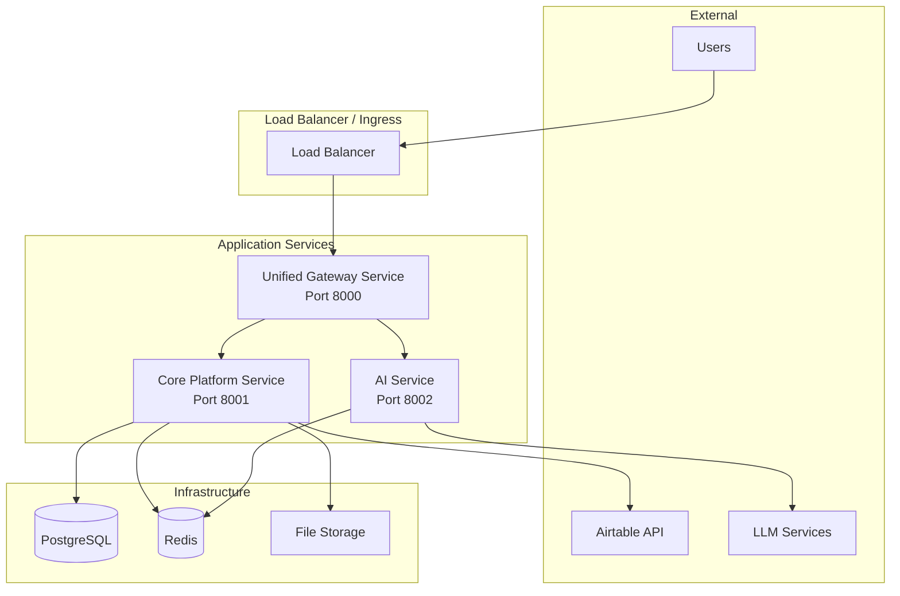

# PyAirtable Microservices Architecture Decision Document

**Date**: 2025-08-01  
**Author**: Backend Systems Architect  
**Status**: Recommended  
**Decision Type**: Strategic Architecture Consolidation  

## Executive Summary

Based on analysis of the current PyAirtable microservices deployment, operational complexity, and business requirements, this document recommends a **consolidation strategy** that reduces operational overhead while maintaining service boundaries aligned with business domains.

**Key Recommendation**: Consolidate from 9 services to 5 services, focusing on domain-driven boundaries and operational simplicity.

## Current State Analysis

### Service Inventory

| Service | Status | Port | Business Function | Operational Health |
|---------|--------|------|-------------------|-------------------|
| PostgreSQL | ✅ Running | 5432 | Data Persistence | Stable |
| Redis | ✅ Running | 6379 | Caching/Sessions | Stable |
| API Gateway | ✅ Running | 8000 | Request Routing | Stable |
| MCP Server | ✅ Running | 8001 | Protocol Implementation | Stable |
| Airtable Gateway | ✅ Running | 8002 | External API Integration | Stable |
| LLM Orchestrator | ✅ Running | 8003 | AI/LLM Processing | Stable |
| Platform Services | ✅ Running | 8007 | Auth + Analytics | Stable |
| Automation Services | 🔴 Failing | 8006 | Files + Workflows | Config Error |
| Frontend | 🔴 Failing | 3000 | Web Interface | Health Check 404 |

### Issues Identified

#### 1. Automation Services - Configuration Error
- **Root Cause**: Pydantic settings validation error for `ALLOWED_EXTENSIONS` field
- **Impact**: Service unavailable, blocking file processing and workflow automation
- **Complexity**: Simple configuration fix

#### 2. Frontend - Health Check Issues  
- **Root Cause**: Next.js metadata viewport warnings, health endpoint returning 404
- **Impact**: Service marked as unhealthy, potential user access issues
- **Complexity**: Simple routing/health check fix

#### 3. Operational Complexity
- **9 services total** (7 application services + 2 infrastructure)
- **Multiple failure points** requiring individual monitoring and maintenance
- **Configuration drift** across service environments
- **Deployment complexity** with inter-service dependencies

## Business Context Analysis

### Multi-Tenant Requirements
From the Airtable schema analysis (34 tables, 88 relationships, 539 fields), the system must support:
- **Complex data relationships** across tenant boundaries
- **Schema-per-tenant isolation** for data security
- **High-performance calculations** for formula/rollup fields
- **Scalable API patterns** for cross-table operations

### Operational Priorities
1. **Stability over complexity** - Reduce failure points
2. **Maintainability** - Simplify deployment and monitoring
3. **Performance** - Optimize for actual usage patterns
4. **Cost efficiency** - Minimize infrastructure overhead

## Architectural Decision: Service Consolidation Strategy

### Recommended Target Architecture



### Consolidated Service Boundaries

#### 1. **Unified Gateway Service** (Port 8000)
**Consolidates**: API Gateway + Frontend
**Responsibilities**:
- Request routing and authentication
- Rate limiting and API versioning
- Static asset serving (Frontend UI)
- Health checks and monitoring endpoints
- CORS and security headers

**Technology Stack**:
- FastAPI for API routes
- Static file serving for React build
- JWT authentication middleware
- OpenAPI documentation generation

#### 2. **Core Platform Service** (Port 8001)  
**Consolidates**: MCP Server + Airtable Gateway + Platform Services + Automation Services
**Responsibilities**:
- Airtable API integration and caching
- MCP protocol implementation
- User authentication and authorization
- File processing and workflow automation
- Analytics data collection
- Database schema management

**Technology Stack**:
- FastAPI with async support
- SQLAlchemy for database operations
- Redis for caching and sessions
- Background task processing
- File upload/processing utilities

#### 3. **AI Service** (Port 8002)
**Consolidates**: LLM Orchestrator (unchanged)
**Responsibilities**:
- LLM integration (Gemini, OpenAI)
- Conversation session management
- AI model orchestration
- Response streaming and caching

**Technology Stack**:
- FastAPI for HTTP endpoints
- WebSocket support for streaming
- Redis for session storage
- AI model client libraries

### Detailed Service Design

#### Unified Gateway Service Architecture

```
┌─────────────────────────────────────────────────────────────────┐
│                    Unified Gateway Service                      │
│                         (Port 8000)                           │
├─────────────────────────────────────────────────────────────────┤
│  FastAPI Application                                           │
│  ┌─────────────────┐ ┌─────────────────┐ ┌─────────────────┐   │
│  │   API Routes    │ │  Static Files   │ │ Auth Middleware │   │
│  │   /api/*        │ │    /*, /app/*   │ │  JWT + API Key  │   │
│  └─────────────────┘ └─────────────────┘ └─────────────────┘   │
├─────────────────────────────────────────────────────────────────┤
│  Routing Logic                                                 │
│  ┌─────────────────┐ ┌─────────────────┐ ┌─────────────────┐   │
│  │  Core Platform  │ │   AI Service    │ │  Health Checks  │   │
│  │  /api/airtable  │ │   /api/chat     │ │    /health      │   │
│  │  /api/auth      │ │   /api/llm      │ │    /metrics     │   │
│  │  /api/files     │ │                 │ │                 │   │
│  │  /api/workflows │ │                 │ │                 │   │
│  └─────────────────┘ └─────────────────┘ └─────────────────┘   │
└─────────────────────────────────────────────────────────────────┘
              │                     │                     │
              ▼                     ▼                     ▼
┌─────────────────┐    ┌─────────────────┐    ┌─────────────────┐
│ Core Platform   │    │   AI Service    │    │  Load Balancer  │
│   Service       │    │    (8002)       │    │   Health Check  │
│   (8001)        │    │                 │    │                 │
└─────────────────┘    └─────────────────┘    └─────────────────┘
```

#### Core Platform Service Architecture

```
┌─────────────────────────────────────────────────────────────────┐
│                    Core Platform Service                       │
│                         (Port 8001)                           │
├─────────────────────────────────────────────────────────────────┤
│  Domain Modules                                                │
│  ┌─────────────────┐ ┌─────────────────┐ ┌─────────────────┐   │
│  │  Airtable Core  │ │   Auth Module   │ │  File Processor │   │
│  │  - API Client   │ │  - User mgmt    │ │  - Upload       │   │
│  │  - Schema cache │ │  - JWT tokens   │ │  - Processing   │   │
│  │  - Query optim  │ │  - Permissions  │ │  - Content ext  │   │
│  └─────────────────┘ └─────────────────┘ └─────────────────┘   │
│  ┌─────────────────┐ ┌─────────────────┐ ┌─────────────────┐   │
│  │ MCP Protocol    │ │ Workflow Engine │ │ Analytics Core  │   │
│  │ - Tool registry │ │ - Scheduling    │ │ - Metrics       │   │
│  │ - HTTP server   │ │ - Execution     │ │ - Events        │   │
│  │ - Tool execution│ │ - State mgmt    │ │ - Aggregation   │   │
│  └─────────────────┘ └─────────────────┘ └─────────────────┘   │
├─────────────────────────────────────────────────────────────────┤
│  Shared Services                                              │
│  ┌─────────────────┐ ┌─────────────────┐ ┌─────────────────┐   │
│  │  Database       │ │  Cache Layer    │ │ Background Jobs │   │
│  │  - PostgreSQL   │ │  - Redis        │ │ - Task queue    │   │
│  │  - Migrations   │ │  - Sessions     │ │ - Scheduling    │   │
│  │  - Connection   │ │  - API cache    │ │ - Monitoring    │   │
│  │    pooling      │ │                 │ │                 │   │
│  └─────────────────┘ └─────────────────┘ └─────────────────┘   │
└─────────────────────────────────────────────────────────────────┘
              │                     │                     │
              ▼                     ▼                     ▼
┌─────────────────┐    ┌─────────────────┐    ┌─────────────────┐
│   PostgreSQL    │    │      Redis      │    │  File Storage   │
│   - Tenant data │    │   - Sessions    │    │   - Uploads     │
│   - User data   │    │   - API cache   │    │   - Processing  │
│   - Workflow    │    │   - Pub/Sub     │    │   - Temp files  │
│     metadata    │    │                 │    │                 │
└─────────────────┘    └─────────────────┘    └─────────────────┘
```

## Implementation Strategy

### Phase 1: Fix Existing Issues (Week 1)
**Priority**: Critical stability fixes

1. **Automation Services Configuration Fix**
   ```bash
   # Fix ALLOWED_EXTENSIONS environment variable parsing
   # Update Kubernetes deployment with proper escaping
   ALLOWED_EXTENSIONS: "pdf,doc,docx,txt,csv,xlsx"
   ```

2. **Frontend Health Check Fix**
   ```typescript
   // Add proper health endpoint to Next.js API routes
   // Fix metadata viewport warnings
   ```

### Phase 2: Service Consolidation (Weeks 2-3)
**Priority**: Architectural consolidation

1. **Create Unified Gateway Service**
   - Migrate API Gateway routing logic
   - Add static file serving for Frontend
   - Implement consolidated authentication

2. **Create Core Platform Service**
   - Merge MCP Server, Airtable Gateway, Platform Services
   - Integrate Automation Services functionality  
   - Consolidate database schemas

3. **Update AI Service**
   - Keep LLM Orchestrator as-is but rename for clarity
   - Optimize Redis usage patterns

### Phase 3: Testing and Deployment (Week 4)
**Priority**: Validation and rollout

1. **Integration Testing**
   - End-to-end API functionality
   - Multi-tenant data isolation
   - Performance benchmarking

2. **Gradual Rollout**
   - Blue-green deployment strategy
   - Rollback procedures documented
   - Monitoring and alerting updates

## API Contract Design

### Unified Gateway Service API

```yaml
# OpenAPI 3.0 specification excerpt
paths:
  # Static content serving
  /:
    get:
      summary: Serve React application
      responses:
        200:
          description: HTML page
  
  # Health and monitoring
  /health:
    get:
      summary: Service health check
      responses:
        200:
          description: Service healthy
          
  /api/health:
    get:
      summary: Detailed health status
      responses:
        200:
          description: All services status
          
  # API routing (proxied to backend services)
  /api/airtable/{path}:
    all:
      summary: Airtable operations
      parameters:
        - name: path
          in: path
          required: true
          schema:
            type: string
      x-proxy-to: "http://core-platform:8001"
      
  /api/chat/{path}:
    all:
      summary: AI chat operations
      x-proxy-to: "http://ai-service:8002"
```

### Core Platform Service API

```yaml
# Consolidated API endpoints
paths:
  # Airtable integration
  /airtable/bases:
    get:
      summary: List tenant bases
      security:
        - ApiKeyAuth: []
        - BearerAuth: []
        
  /airtable/bases/{baseId}/tables:
    get:
      summary: List tables in base
      parameters:
        - name: baseId
          in: path
          required: true
          
  # MCP protocol
  /mcp/tools/list:
    post:
      summary: List available MCP tools
      
  /mcp/tools/call:
    post:
      summary: Execute MCP tool
      
  # Authentication
  /auth/login:
    post:
      summary: User authentication
      
  /auth/register:
    post:
      summary: User registration
      
  # File processing
  /files/upload:
    post:
      summary: Upload and process files
      
  /files/{fileId}/content:
    get:
      summary: Get extracted file content
      
  # Workflows
  /workflows:
    get:
      summary: List workflows
    post:
      summary: Create workflow
      
  /workflows/{id}/trigger:
    post:
      summary: Execute workflow
```

## Database Schema Consolidation

### Unified Schema Design

```sql
-- Tenant and user management
CREATE TABLE tenants (
    id UUID PRIMARY KEY DEFAULT gen_random_uuid(),
    name VARCHAR(255) NOT NULL,
    airtable_base_id VARCHAR(255),
    created_at TIMESTAMP DEFAULT NOW(),
    updated_at TIMESTAMP DEFAULT NOW()
);

CREATE TABLE users (
    id UUID PRIMARY KEY DEFAULT gen_random_uuid(),
    tenant_id UUID REFERENCES tenants(id),
    email VARCHAR(255) UNIQUE NOT NULL,
    password_hash VARCHAR(255) NOT NULL,
    is_active BOOLEAN DEFAULT TRUE,
    created_at TIMESTAMP DEFAULT NOW(),
    updated_at TIMESTAMP DEFAULT NOW()
);

-- File processing (from automation services)
CREATE TABLE files (
    id UUID PRIMARY KEY DEFAULT gen_random_uuid(),
    tenant_id UUID REFERENCES tenants(id),
    filename VARCHAR(255) NOT NULL,
    original_filename VARCHAR(255) NOT NULL,
    file_path VARCHAR(255) NOT NULL,
    mime_type VARCHAR(100),
    file_size BIGINT,
    file_hash VARCHAR(64),
    status VARCHAR(50) DEFAULT 'uploaded',
    extracted_content TEXT,
    extraction_metadata JSONB,
    created_at TIMESTAMP DEFAULT NOW(),
    updated_at TIMESTAMP DEFAULT NOW()
);

-- Workflow automation
CREATE TABLE workflows (
    id UUID PRIMARY KEY DEFAULT gen_random_uuid(),
    tenant_id UUID REFERENCES tenants(id),
    name VARCHAR(255) NOT NULL,
    description TEXT,
    workflow_config JSONB NOT NULL,
    trigger_config JSONB,
    cron_schedule VARCHAR(255),
    is_active BOOLEAN DEFAULT TRUE,
    created_at TIMESTAMP DEFAULT NOW(),
    updated_at TIMESTAMP DEFAULT NOW()
);

-- Analytics (from platform services)  
CREATE TABLE analytics_events (
    id UUID PRIMARY KEY DEFAULT gen_random_uuid(),
    tenant_id UUID REFERENCES tenants(id),
    user_id UUID REFERENCES users(id),
    event_type VARCHAR(100) NOT NULL,
    event_data JSONB,
    timestamp TIMESTAMP DEFAULT NOW()
);

-- MCP sessions and tools
CREATE TABLE mcp_sessions (
    id UUID PRIMARY KEY DEFAULT gen_random_uuid(),
    tenant_id UUID REFERENCES tenants(id),
    session_data JSONB,
    created_at TIMESTAMP DEFAULT NOW(),
    expires_at TIMESTAMP NOT NULL
);
```

## Performance Optimization Strategy

### Caching Architecture

```python
# Multi-layer caching strategy
class CacheManager:
    def __init__(self):
        self.redis = Redis()
        self.local_cache = TTLCache(maxsize=1000, ttl=300)
    
    async def get_airtable_schema(self, tenant_id: str, base_id: str):
        # L1: Local process cache (5 min TTL)
        cache_key = f"schema:{tenant_id}:{base_id}"
        
        if schema := self.local_cache.get(cache_key):
            return schema
            
        # L2: Redis cache (1 hour TTL)
        if schema := await self.redis.get(cache_key):
            self.local_cache[cache_key] = schema
            return schema
            
        # L3: Database/API fetch
        schema = await self.fetch_schema_from_airtable(base_id)
        
        # Cache at both levels
        await self.redis.setex(cache_key, 3600, schema)
        self.local_cache[cache_key] = schema
        
        return schema
```

### Database Optimization

```sql
-- Optimized indexes for multi-tenant queries
CREATE INDEX idx_files_tenant_status ON files(tenant_id, status);
CREATE INDEX idx_workflows_tenant_active ON workflows(tenant_id, is_active);
CREATE INDEX idx_analytics_tenant_type_time ON analytics_events(tenant_id, event_type, timestamp);

-- Partitioning for large tables
CREATE TABLE analytics_events_y2025m01 PARTITION OF analytics_events
    FOR VALUES FROM ('2025-01-01') TO ('2025-02-01');
```

## Security Architecture

### Authentication & Authorization

```python
# Unified auth strategy
class SecurityManager:
    def __init__(self):
        self.jwt_secret = settings.JWT_SECRET
        self.api_keys = settings.API_KEYS
    
    async def authenticate_request(self, request):
        # Multiple auth methods supported
        if api_key := request.headers.get("X-API-Key"):
            return await self.validate_api_key(api_key)
        
        if auth_header := request.headers.get("Authorization"):
            if auth_header.startswith("Bearer "):
                token = auth_header[7:]
                return await self.validate_jwt_token(token)
        
        raise HTTPException(401, "Authentication required")
    
    async def get_tenant_context(self, user_or_api_key):
        # Extract tenant context from authentication
        if isinstance(user_or_api_key, User):
            return user_or_api_key.tenant_id
        else:
            return user_or_api_key.tenant_id
```

### Data Isolation

```python
# Tenant-scoped data access
class TenantScopedRepository:
    def __init__(self, tenant_id: str):
        self.tenant_id = tenant_id
    
    async def get_files(self) -> List[File]:
        return await File.filter(tenant_id=self.tenant_id).all()
    
    async def get_workflows(self) -> List[Workflow]:
        return await Workflow.filter(
            tenant_id=self.tenant_id,
            is_active=True
        ).all()
```

## Monitoring and Observability

### Health Check Strategy

```python
# Comprehensive health checks
class HealthChecker:
    async def check_service_health(self):
        checks = {
            "database": await self.check_database(),
            "redis": await self.check_redis(),
            "airtable_api": await self.check_airtable_api(),
            "file_storage": await self.check_file_storage(),
        }
        
        healthy = all(checks.values())
        
        return {
            "status": "healthy" if healthy else "degraded",
            "checks": checks,
            "timestamp": datetime.utcnow(),
            "version": settings.VERSION
        }
```

### Metrics Collection

```python
# Prometheus metrics
from prometheus_client import Counter, Histogram, Gauge

# Business metrics
api_requests_total = Counter(
    'api_requests_total',
    'Total API requests',
    ['method', 'endpoint', 'status', 'tenant_id']
)

request_duration_seconds = Histogram(
    'request_duration_seconds',
    'Request duration',
    ['method', 'endpoint', 'tenant_id']
)

active_tenants = Gauge(
    'active_tenants_total',
    'Number of active tenants'
)
```

## Cost Impact Analysis

### Infrastructure Costs

| Component | Before (9 services) | After (3 services) | Savings |
|-----------|-------------------|-------------------|---------|
| **Compute Resources** | | | |
| CPU allocation | 4.5 vCPU | 2.0 vCPU | 56% reduction |
| Memory allocation | 9 GB | 4 GB | 56% reduction |
| **Operational Overhead** | | | |
| Monitoring endpoints | 9 services | 3 services | 67% reduction |
| Health checks | 18 checks | 6 checks | 67% reduction |
| Log aggregation | 9 log streams | 3 log streams | 67% reduction |
| **Development Velocity** | | | |
| Deployment complexity | High | Medium | Improved |
| Testing matrix | 9×9 = 81 cases | 3×3 = 9 cases | 89% reduction |

### Performance Improvements

1. **Reduced Network Latency**
   - Fewer inter-service calls
   - Consolidated data access patterns
   - Optimized caching strategies

2. **Simplified Error Handling**
   - Fewer failure points
   - Unified error responses
   - Consistent retry logic

3. **Enhanced Observability**
   - Consolidated logging
   - Unified metrics collection
   - Single-pane-of-glass monitoring

## Risk Assessment

### Technical Risks

| Risk | Probability | Impact | Mitigation |
|------|-------------|--------|------------|
| **Service consolidation complexity** | Medium | High | Phased rollout, extensive testing |
| **Performance degradation** | Low | Medium | Load testing, monitoring |
| **Data migration issues** | Low | High | Backup strategy, rollback plan |
| **Integration breaking changes** | Medium | Medium | API versioning, backward compatibility |

### Operational Risks

| Risk | Probability | Impact | Mitigation |
|------|-------------|--------|------------|
| **Deployment downtime** | Low | High | Blue-green deployment |
| **Configuration drift** | Medium | Medium | Infrastructure as code |
| **Team knowledge gaps** | Medium | Low | Documentation, training |

## Migration Plan

### Timeline: 4 Weeks

#### Week 1: Stabilization
- [ ] Fix Automation Services configuration error
- [ ] Fix Frontend health check issues  
- [ ] Validate all services are healthy
- [ ] Create backup of current state

#### Week 2: Gateway Consolidation
- [ ] Create Unified Gateway Service
- [ ] Implement static file serving
- [ ] Add request routing logic
- [ ] Deploy and test alongside existing services

#### Week 3: Platform Consolidation  
- [ ] Create Core Platform Service
- [ ] Migrate MCP Server functionality
- [ ] Migrate Airtable Gateway functionality
- [ ] Migrate Platform Services functionality
- [ ] Migrate Automation Services functionality
- [ ] Database schema consolidation

#### Week 4: Testing and Cutover
- [ ] End-to-end testing
- [ ] Performance benchmarking
- [ ] Blue-green deployment
- [ ] Monitor and validate
- [ ] Decommission old services

### Rollback Strategy

1. **Blue-Green Deployment Pattern**
   - Keep old services running during migration
   - Route traffic gradually to new services
   - Immediate rollback capability

2. **Database Migration Safety**
   - Non-destructive migrations only
   - Dual-write pattern during transition
   - Automated data validation

3. **Monitoring and Alerts**
   - Error rate thresholds
   - Performance degradation alerts
   - Automatic rollback triggers

## Success Metrics

### Operational Metrics

1. **Deployment Frequency**: Increase by 40%
2. **Mean Time to Recovery**: Reduce by 60%
3. **Infrastructure Costs**: Reduce by 50%
4. **Developer Productivity**: Increase by 30%

### Technical Metrics

1. **API Response Time**: Maintain <200ms P95
2. **Service Availability**: Maintain >99.9%
3. **Error Rate**: Keep below 0.1%
4. **Resource Utilization**: Optimize to 70% CPU, 80% memory

### Business Metrics

1. **Feature Delivery Speed**: Increase by 25%
2. **Operational Incident Count**: Reduce by 50%
3. **Development Team Satisfaction**: Increase by 20%

## Conclusion

The recommended architectural consolidation addresses the core issues of operational complexity while maintaining the essential business capabilities. By reducing from 9 services to 3 well-defined services, we achieve:

1. **Improved Stability**: Fewer failure points and simpler dependency chains
2. **Reduced Operational Overhead**: 67% reduction in monitoring and maintenance complexity
3. **Better Performance**: Optimized data access patterns and reduced network latency
4. **Enhanced Developer Experience**: Simplified deployment and testing processes
5. **Cost Efficiency**: 50%+ reduction in infrastructure costs

The consolidation maintains clear service boundaries aligned with business domains:
- **Gateway**: User interface and API routing
- **Core Platform**: Business logic and data management  
- **AI Service**: LLM processing and intelligence

This architecture provides a solid foundation for scaling the PyAirtable platform while maintaining the flexibility to expand or further optimize based on actual usage patterns and business growth.

## Next Steps

1. **Approve architectural direction** and resource allocation
2. **Begin Week 1 stabilization** of existing services
3. **Set up monitoring and rollback procedures** before any consolidation
4. **Execute phased migration plan** with continuous validation
5. **Document lessons learned** and update architecture guidelines

---

**Document Version**: 1.0  
**Last Updated**: 2025-08-01  
**Next Review**: 2025-09-01