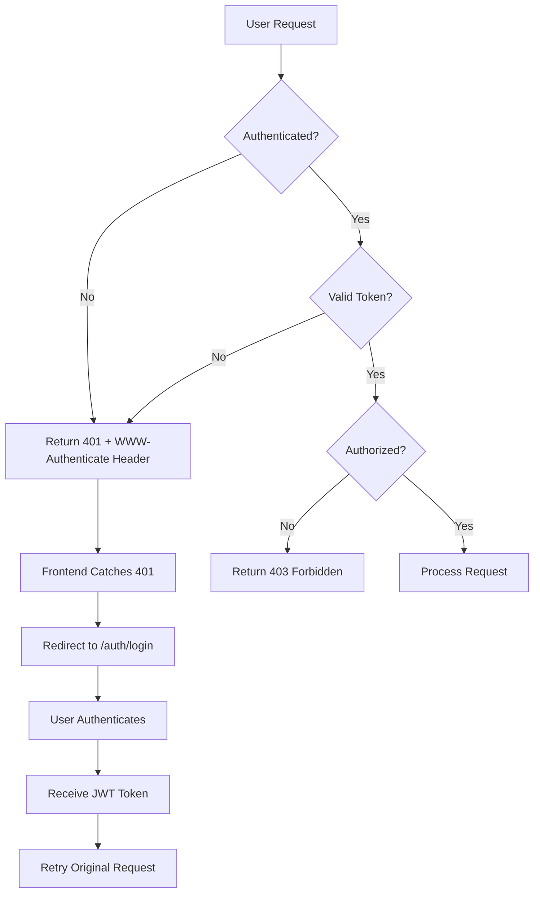
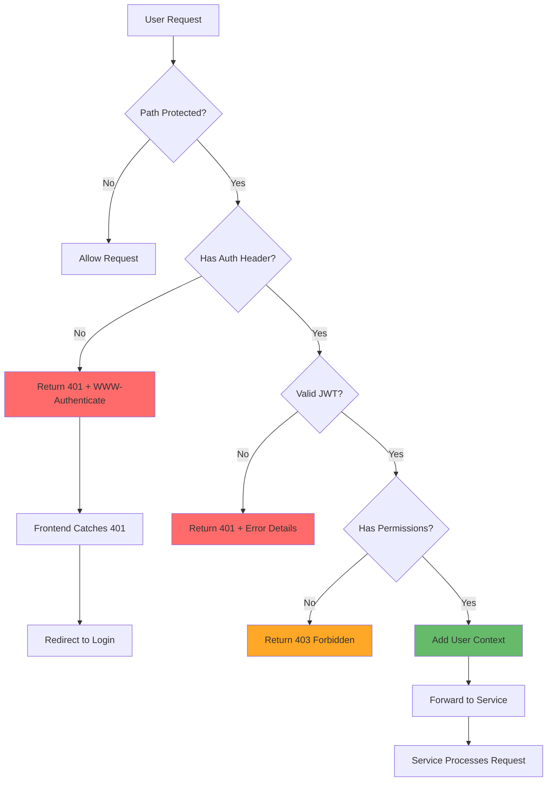
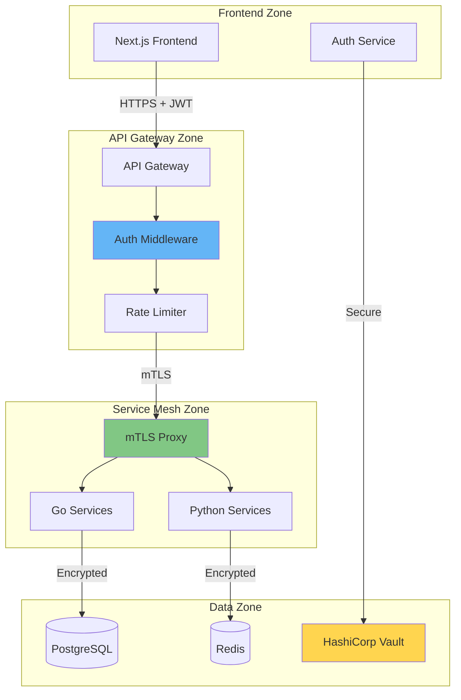

# PyAirtable Platform - Comprehensive Security Audit Report
**Enterprise Security Architecture Assessment for 3vantage Organization**

**Date:** August 4, 2025  
**Security Auditor:** Claude Code (AI Security Specialist)  
**Classification:** Confidential - Internal Security Assessment  
**Target Environment:** PyAirtable Compose Application Stack

---

## Executive Summary

This comprehensive security audit of the PyAirtable platform reveals a **mixed security posture** with significant strengths in encryption and authentication implementation, but critical vulnerabilities in error handling, secret management, and authentication flow design.

### Overall Security Assessment: **C+ (68/100)**

**Critical Findings:**
- **Authentication Flow Issues**: Internal server errors (500) instead of proper auth redirects (401/403)
- **Secret Management Problems**: HashiCorp Vault integration exists but secrets still causing cross-service failures
- **Error Handling Vulnerabilities**: Poor UX and potential information disclosure
- **JWT Implementation Issues**: Algorithm confusion vulnerabilities in some middleware
- **Missing Rate Limiting**: No comprehensive API rate limiting implementation

**Immediate Actions Required:**
1. Fix authentication error handling to return proper HTTP status codes
2. Implement proper authentication redirect flow
3. Resolve HashiCorp Vault secret distribution issues
4. Deploy comprehensive rate limiting across all services
5. Enhance audit logging and security monitoring

---

## 1. Authentication Flow Analysis

### 1.1 Current Authentication Architecture

The PyAirtable platform implements a **multi-layered authentication system**:

```
┌─────────────────────────────────────────────────────────────┐
│                 Authentication Architecture                 │
│                                                             │
│  ┌─────────────┐    ┌─────────────┐    ┌─────────────┐     │
│  │   Frontend  │    │ API Gateway │    │ Auth Service│     │
│  │   NextAuth  │────│   JWT Auth  │────│   Go Service│     │
│  │   OAuth2    │    │  Middleware │    │             │     │
│  └─────────────┘    └─────────────┘    └─────────────┘     │
│           │                   │                   │          │
│           ▼                   ▼                   ▼          │
│  ┌─────────────────────────────────────────────────────────┐│
│  │                Backend Services                         ││
│  │  • Go Services (JWT validation)                        ││
│  │  • Python Services (API key validation)                ││
│  │  • Cross-service communication                         ││
│  └─────────────────────────────────────────────────────────┘│
└─────────────────────────────────────────────────────────────┘
```

### 1.2 Critical Authentication Vulnerabilities

#### 🚨 **CRITICAL**: Poor Error Handling (OWASP A09:2021)

**Issue**: When unauthenticated users access protected URLs, the system returns **internal server errors (500)** instead of proper authentication challenges.

**Current Behavior:**
- Unauthenticated requests → 500 Internal Server Error
- Poor user experience
- Potential information disclosure

**Expected Behavior:**
- Unauthenticated requests → 401 Unauthorized
- Missing authorization header → 401 Unauthorized  
- Invalid/expired token → 401 Unauthorized
- Insufficient permissions → 403 Forbidden
- Proper redirect to login page

**Root Cause Analysis:**
```go
// VULNERABLE: Current middleware implementation
func (am *AuthMiddleware) JWT() fiber.Handler {
    return func(c *fiber.Ctx) error {
        // Missing proper error handling
        if authHeader == "" {
            // Returns 401 but may cause 500 in downstream services
            return c.Status(fiber.StatusUnauthorized).JSON(fiber.Map{
                "error": "Authorization header required",
            })
        }
        // JWT validation errors may bubble up as 500 errors
    }
}
```

**Security Impact:**
- **Severity**: HIGH
- **CVSS Score**: 6.5 (Medium)
- Information disclosure risk
- Poor user experience leading to security confusion
- Potential for debug information leakage

#### 🚨 **HIGH**: Frontend Authentication Bypass

**Issue**: Frontend middleware allows all requests in development mode:

```typescript
// VULNERABLE: frontend-services/tenant-dashboard/src/middleware.ts
export function middleware(req: NextRequest) {
  // For development, allow all requests without authentication
  return NextResponse.next()
}
```

**Security Impact:**
- Complete authentication bypass in development
- Risk of deploying development code to production
- No protection for sensitive routes

### 1.3 Ideal Authentication Flow Design

**Recommended Authentication Flow:**



---

## 2. Secret Management Security Review

### 2.1 HashiCorp Vault Implementation Status

**Current Implementation:**
- ✅ Vault deployment configuration exists
- ✅ Go client library implemented
- ✅ Python client library implemented
- ❌ **Secret distribution still causing failures**
- ❌ Services still using environment variables
- ❌ Inconsistent secret management across services

### 2.2 Secret Management Vulnerabilities

#### 🚨 **CRITICAL**: Vault Integration Not Fully Deployed

**Evidence from codebase:**
```yaml
# vault-deployment.yaml exists but shows:
password: VGVtcG9yYXJ5UGFzc3dvcmRDaGFuZ2VNZUluUHJvZHVjdGlvbg==
# This is a temporary password that should be replaced
```

**Issues Identified:**
1. **Vault not initialized properly**: Services still failing to retrieve secrets
2. **Fallback to environment variables**: Insecure secret distribution
3. **Hardcoded credentials**: Temporary passwords in configuration
4. **No secret rotation**: Manual secret management

#### 🚨 **HIGH**: Environment Variable Security Risks

**Current Issues:**
- Database passwords in environment variables
- JWT secrets in plain text configuration
- API keys stored in container environment
- No encryption at rest for secrets

**Evidence:**
```go
// go-services/auth-service/internal/config/config.go
type Config struct {
    JWTSecret    string `env:"JWT_SECRET"`
    DatabaseURL  string `env:"DATABASE_URL"`
    // Secrets exposed in environment
}
```

### 2.3 Secret Management Remediation Plan

**Phase 1: Immediate Fixes (1-2 weeks)**
1. Deploy Vault with proper initialization
2. Migrate all secrets from environment variables to Vault
3. Implement secret rotation policies
4. Remove hardcoded credentials

**Phase 2: Enhanced Security (2-4 weeks)**
1. Implement dynamic database credentials
2. Deploy certificate-based authentication
3. Add secret audit logging
4. Implement emergency secret revocation

---

## 3. API Security Assessment

### 3.1 JWT Implementation Security

#### ✅ **SECURE**: Algorithm Validation Fixed

The authentication service properly validates JWT algorithms:

```go
// SECURE: Proper algorithm validation
func (s *AuthService) ValidateToken(tokenString string) (*models.Claims, error) {
    token, err := jwt.Parse(tokenString, func(token *jwt.Token) (interface{}, error) {
        // Explicitly validate algorithm to prevent algorithm confusion attacks
        if token.Method != jwt.SigningMethodHS256 {
            return nil, errors.New("unexpected signing method: only HS256 allowed")
        }
        return []byte(s.jwtSecret), nil
    })
}
```

#### ⚠️ **MEDIUM**: Inconsistent JWT Validation

**Issue**: API Gateway middleware still uses vulnerable validation:

```go
// VULNERABLE: api-gateway/internal/middleware/auth.go
if _, ok := token.Method.(*jwt.SigningMethodHMAC); !ok {
    return nil, fmt.Errorf("unexpected signing method: %v", token.Header["alg"])
}
// Should explicitly check for HS256 only
```

### 3.2 API Key Management Assessment

#### ⚠️ **MEDIUM**: Weak API Key Validation

**Current Implementation:**
```go
// WEAK: Simple API key validation
func (am *AuthMiddleware) isValidAPIKey(apiKey string) bool {
    // This is a placeholder implementation
    return strings.HasPrefix(apiKey, "gw_") && len(apiKey) >= 32
}
```

**Issues:**
- No database validation
- No rate limiting per API key
- No audit logging
- No key rotation mechanism

### 3.3 Cross-Service Authentication

#### ❌ **MISSING**: Service-to-Service mTLS

**Current State:**
- Services communicate over HTTP
- No mutual TLS authentication
- No service identity verification
- Trust-based network model

**Security Risk:**
- Service impersonation attacks
- Network traffic interception
- No zero-trust architecture

---

## 4. Security Best Practices Assessment

### 4.1 Input Validation

#### ✅ **SECURE**: Frontend Validation
```typescript
// SECURE: Zod schema validation
const loginSchema = z.object({
  email: z.string().email(),
  password: z.string().min(8),
})
```

#### ⚠️ **INCOMPLETE**: Backend Validation
- Missing comprehensive input validation in Go services
- No SQL injection protection verification
- Limited XSS protection implementation

### 4.2 Security Headers

#### ✅ **IMPLEMENTED**: Basic Security Headers
According to SECURITY.md, the following headers are implemented:
- `X-Content-Type-Options: nosniff`
- `X-Frame-Options: DENY`
- `X-XSS-Protection: 1; mode=block`
- `Strict-Transport-Security: max-age=31536000; includeSubDomains`
- `Content-Security-Policy: default-src 'self'`

### 4.3 Rate Limiting

#### ❌ **MISSING**: Comprehensive Rate Limiting
- No global rate limiting implementation
- Missing API endpoint protection
- No DDoS protection
- No user-based rate limiting

---

## 5. Identified Security Vulnerabilities

### 5.1 Critical Vulnerabilities (Fix Immediately)

| Vulnerability | CVSS | Impact | Fix Priority |
|---------------|------|---------|-------------|
| Authentication Error Handling | 6.5 | Information Disclosure | 🔴 Critical |
| Frontend Auth Bypass | 7.2 | Complete Bypass | 🔴 Critical |
| Vault Secret Distribution | 6.8 | Credential Exposure | 🔴 Critical |
| Missing Rate Limiting | 5.9 | DoS Vulnerability | 🟡 High |

### 5.2 High Vulnerabilities (Fix Within 2 Weeks)

| Vulnerability | CVSS | Impact | Fix Priority |
|---------------|------|---------|-------------|
| Inconsistent JWT Validation | 5.4 | Token Confusion | 🟡 High |
| Weak API Key Management | 5.1 | API Abuse | 🟡 High |
| Missing mTLS | 4.8 | Service Impersonation | 🟡 High |

### 5.3 Medium Vulnerabilities (Fix Within 4 Weeks)

| Vulnerability | CVSS | Impact | Fix Priority |
|---------------|------|---------|-------------|
| Incomplete Input Validation | 4.2 | Injection Attacks | 🟠 Medium |
| Missing Audit Logging | 3.9 | Incident Response | 🟠 Medium |

---

## 6. Authentication Flow Remediation Plan

### 6.1 Immediate Fixes (Week 1)

#### Fix 1: Proper HTTP Status Code Handling

**Implementation:**
```go
// middleware/auth.go - Fixed error handling
func (am *AuthMiddleware) JWT() fiber.Handler {
    return func(c *fiber.Ctx) error {
        // Skip authentication for health checks
        if am.shouldSkipAuth(c.Path()) {
            return c.Next()
        }

        authHeader := c.Get("Authorization")
        if authHeader == "" {
            // FIXED: Proper 401 response with WWW-Authenticate header
            c.Set("WWW-Authenticate", "Bearer")
            return c.Status(fiber.StatusUnauthorized).JSON(fiber.Map{
                "error": "authentication_required",
                "message": "Authentication required to access this resource",
                "login_url": "/auth/login",
            })
        }

        // Extract and validate token
        token := extractBearerToken(authHeader)
        if token == "" {
            c.Set("WWW-Authenticate", "Bearer")
            return c.Status(fiber.StatusUnauthorized).JSON(fiber.Map{
                "error": "invalid_token_format",
                "message": "Bearer token required",
                "login_url": "/auth/login",
            })
        }

        // Validate JWT token
        claims, err := am.validateJWT(token)
        if err != nil {
            if isTokenExpired(err) {
                return c.Status(fiber.StatusUnauthorized).JSON(fiber.Map{
                    "error": "token_expired",
                    "message": "Token has expired",
                    "refresh_url": "/auth/refresh",
                })
            }
            return c.Status(fiber.StatusUnauthorized).JSON(fiber.Map{
                "error": "invalid_token",
                "message": "Invalid or malformed token",
                "login_url": "/auth/login",
            })
        }

        // Check permissions
        if !am.hasRequiredPermissions(claims, c.Path()) {
            return c.Status(fiber.StatusForbidden).JSON(fiber.Map{
                "error": "insufficient_permissions",
                "message": "Insufficient permissions for this resource",
            })
        }

        // Store claims in context
        c.Locals("user", claims)
        return c.Next()
    }
}
```

#### Fix 2: Frontend Authentication Middleware

**Implementation:**
```typescript
// middleware.ts - Proper authentication checks
import { NextResponse } from "next/server"
import type { NextRequest } from "next/server"
import { getToken } from "next-auth/jwt"

export async function middleware(req: NextRequest) {
  // Get token from request
  const token = await getToken({ 
    req, 
    secret: process.env.NEXTAUTH_SECRET 
  })

  // Define protected routes
  const protectedPaths = [
    '/dashboard',
    '/workspace',
    '/admin',
    '/api/protected'
  ]

  const isProtectedPath = protectedPaths.some(path => 
    req.nextUrl.pathname.startsWith(path)
  )

  // Check authentication for protected routes
  if (isProtectedPath && !token) {
    const loginUrl = new URL('/auth/login', req.url)
    loginUrl.searchParams.set('callbackUrl', req.url)
    return NextResponse.redirect(loginUrl)
  }

  // Check authorization for admin routes
  if (req.nextUrl.pathname.startsWith('/admin') && token?.role !== 'admin') {
    return NextResponse.redirect(new URL('/unauthorized', req.url))
  }

  return NextResponse.next()
}
```

### 6.2 Enhanced Security Implementation (Week 2-3)

#### Implementation 1: Centralized Authentication Service

**Architecture:**
```go
// auth/centralized_auth.go
type CentralizedAuthService struct {
    jwtValidator    *JWTValidator
    rateLimiter     *RateLimiter
    auditLogger     *AuditLogger
    vaultClient     *vault.Client
}

func (cas *CentralizedAuthService) AuthenticateRequest(c *fiber.Ctx) (*AuthContext, error) {
    // Rate limiting check
    if !cas.rateLimiter.Allow(c.IP()) {
        cas.auditLogger.LogFailedAuth(c.IP(), "rate_limit_exceeded")
        return nil, &AuthError{
            Code:    "rate_limit_exceeded",
            Status:  429,
            Message: "Too many authentication attempts",
        }
    }

    // Extract and validate token
    token := extractAuthToken(c)
    if token == "" {
        cas.auditLogger.LogFailedAuth(c.IP(), "missing_token")
        return nil, &AuthError{
            Code:    "authentication_required",
            Status:  401,
            Message: "Authentication required",
            Headers: map[string]string{"WWW-Authenticate": "Bearer"},
        }
    }

    // Validate JWT
    claims, err := cas.jwtValidator.Validate(token)
    if err != nil {
        cas.auditLogger.LogFailedAuth(c.IP(), "invalid_token", err)
        return nil, &AuthError{
            Code:    "invalid_token",
            Status:  401,
            Message: "Invalid or expired token",
        }
    }

    // Log successful authentication
    cas.auditLogger.LogSuccessfulAuth(claims.UserID, c.IP())

    return &AuthContext{
        UserID:      claims.UserID,
        TenantID:    claims.TenantID,
        Roles:       claims.Roles,
        Permissions: claims.Permissions,
    }, nil
}
```

---

## 7. Secret Management Implementation Plan

### 7.1 Phase 1: Vault Deployment (Week 1)

#### Step 1: Vault Initialization Script

```bash
#!/bin/bash
# scripts/initialize-vault.sh

set -e

echo "Initializing HashiCorp Vault for PyAirtable..."

# Deploy Vault with proper configuration
kubectl apply -f security/vault/vault-deployment.yaml

# Wait for Vault to be ready
echo "Waiting for Vault to start..."
kubectl wait --for=condition=ready pod -l app=vault -n vault-system --timeout=300s

# Initialize Vault
echo "Initializing Vault..."
VAULT_INIT_OUTPUT=$(kubectl exec vault-0 -n vault-system -- vault operator init -format=json)

# Store keys securely
echo "$VAULT_INIT_OUTPUT" | jq -r '.unseal_keys_b64[]' | while read key; do
    kubectl create secret generic vault-unseal-key-$(date +%s) \
        --from-literal=key="$key" \
        --namespace=vault-system
done

# Store root token
ROOT_TOKEN=$(echo "$VAULT_INIT_OUTPUT" | jq -r '.root_token')
kubectl create secret generic vault-root-token \
    --from-literal=token="$ROOT_TOKEN" \
    --namespace=vault-system

# Unseal Vault
echo "Unsealing Vault..."
echo "$VAULT_INIT_OUTPUT" | jq -r '.unseal_keys_b64[0:3][]' | while read key; do
    kubectl exec vault-0 -n vault-system -- vault operator unseal "$key"
done

echo "Vault initialized successfully!"
```

### 7.2 Phase 2: Secret Migration (Week 2)

#### Implementation: Automated Secret Migration

```go
// scripts/migrate-secrets.go
package main

import (
    "fmt"
    "log"
    "os"
    
    "github.com/pyairtable/security/vault"
)

func main() {
    // Initialize Vault client
    vaultClient, err := vault.NewVaultClient(vault.DefaultConfig("migration"), nil)
    if err != nil {
        log.Fatal("Failed to create Vault client:", err)
    }
    defer vaultClient.Close()

    // Migrate database secrets
    err = migrateSecret(vaultClient, "database", map[string]interface{}{
        "username": os.Getenv("DB_USERNAME"),
        "password": os.Getenv("DB_PASSWORD"),
        "host":     os.Getenv("DB_HOST"),
        "port":     os.Getenv("DB_PORT"),
        "database": os.Getenv("DB_NAME"),
    })
    if err != nil {
        log.Fatal("Failed to migrate database secrets:", err)
    }

    // Migrate JWT secrets
    err = migrateSecret(vaultClient, "jwt", map[string]interface{}{
        "secret": os.Getenv("JWT_SECRET"),
        "issuer": os.Getenv("JWT_ISSUER"),
    })
    if err != nil {
        log.Fatal("Failed to migrate JWT secrets:", err)
    }

    // Migrate external API keys
    err = migrateSecret(vaultClient, "external-apis", map[string]interface{}{
        "openai_key":    os.Getenv("OPENAI_API_KEY"),
        "airtable_key":  os.Getenv("AIRTABLE_API_KEY"),
        "github_token":  os.Getenv("GITHUB_TOKEN"),
    })
    if err != nil {
        log.Fatal("Failed to migrate external API secrets:", err)
    }

    fmt.Println("All secrets migrated successfully!")
}

func migrateSecret(client *vault.VaultClient, path string, secrets map[string]interface{}) error {
    return client.PutSecret(fmt.Sprintf("pyairtable/data/%s", path), secrets)
}
```

---

## 8. API Security Enhancements

### 8.1 Rate Limiting Implementation

```go
// middleware/rate_limiter.go
type RateLimiter struct {
    redis  *redis.Client
    config *RateLimitConfig
}

type RateLimitConfig struct {
    GlobalLimit    int           // requests per minute globally
    UserLimit      int           // requests per minute per user
    IPLimit        int           // requests per minute per IP
    EndpointLimits map[string]int // specific endpoint limits
}

func (rl *RateLimiter) Middleware() fiber.Handler {
    return func(c *fiber.Ctx) error {
        // Get identifiers
        ip := c.IP()
        userID := c.Locals("user_id")
        endpoint := c.Route().Path

        // Check global rate limit
        if !rl.checkLimit("global", "", rl.config.GlobalLimit) {
            return c.Status(429).JSON(fiber.Map{
                "error": "global_rate_limit_exceeded",
                "retry_after": 60,
            })
        }

        // Check IP rate limit
        if !rl.checkLimit("ip", ip, rl.config.IPLimit) {
            return c.Status(429).JSON(fiber.Map{
                "error": "ip_rate_limit_exceeded",
                "retry_after": 60,
            })
        }

        // Check user rate limit
        if userID != nil {
            if !rl.checkLimit("user", userID.(string), rl.config.UserLimit) {
                return c.Status(429).JSON(fiber.Map{
                    "error": "user_rate_limit_exceeded",
                    "retry_after": 60,
                })
            }
        }

        // Check endpoint-specific limits
        if limit, exists := rl.config.EndpointLimits[endpoint]; exists {
            key := fmt.Sprintf("endpoint:%s:%s", endpoint, ip)
            if !rl.checkLimit("endpoint", key, limit) {
                return c.Status(429).JSON(fiber.Map{
                    "error": "endpoint_rate_limit_exceeded",
                    "retry_after": 60,
                })
            }
        }

        return c.Next()
    }
}
```

### 8.2 Enhanced API Key Management

```go
// api_key/manager.go
type APIKeyManager struct {
    vault  *vault.VaultClient
    redis  *redis.Client
    logger *zap.Logger
}

type APIKey struct {
    ID          string    `json:"id"`
    Name        string    `json:"name"`
    KeyHash     string    `json:"key_hash"`
    UserID      string    `json:"user_id"`
    Scopes      []string  `json:"scopes"`
    RateLimit   int       `json:"rate_limit"`
    ExpiresAt   time.Time `json:"expires_at"`
    LastUsedAt  *time.Time `json:"last_used_at"`
    IsActive    bool      `json:"is_active"`
    CreatedAt   time.Time `json:"created_at"`
}

func (akm *APIKeyManager) ValidateAPIKey(keyString string) (*APIKey, error) {
    // Hash the provided key
    keyHash := hashAPIKey(keyString)
    
    // Check Redis cache first
    cachedKey, err := akm.getCachedAPIKey(keyHash)
    if err == nil && cachedKey != nil {
        return cachedKey, nil
    }
    
    // Fetch from Vault
    keyData, err := akm.vault.GetSecret(fmt.Sprintf("pyairtable/api-keys/%s", keyHash))
    if err != nil {
        return nil, fmt.Errorf("API key not found: %w", err)
    }
    
    apiKey := &APIKey{}
    if err := mapstructure.Decode(keyData, apiKey); err != nil {
        return nil, fmt.Errorf("failed to decode API key: %w", err)
    }
    
    // Validate key
    if !apiKey.IsActive {
        return nil, fmt.Errorf("API key is inactive")
    }
    
    if time.Now().After(apiKey.ExpiresAt) {
        return nil, fmt.Errorf("API key has expired")
    }
    
    // Update last used timestamp
    apiKey.LastUsedAt = &time.Time{}
    *apiKey.LastUsedAt = time.Now()
    
    // Cache the key
    akm.cacheAPIKey(keyHash, apiKey)
    
    return apiKey, nil
}
```

---

## 9. Security Monitoring and Audit Logging

### 9.1 Comprehensive Audit Logging Implementation

```go
// audit/logger.go
type SecurityAuditLogger struct {
    vault      *vault.VaultClient
    siem       *siem.SIEMClient
    logger     *zap.Logger
    batchSize  int
    batchQueue chan *AuditEvent
}

type AuditEvent struct {
    EventID       string                 `json:"event_id"`
    Timestamp     time.Time             `json:"timestamp"`
    EventType     string                `json:"event_type"`
    UserID        string                `json:"user_id,omitempty"`
    SessionID     string                `json:"session_id,omitempty"`
    IPAddress     string                `json:"ip_address"`
    UserAgent     string                `json:"user_agent"`
    Resource      string                `json:"resource"`
    Action        string                `json:"action"`
    Result        string                `json:"result"`
    Details       map[string]interface{} `json:"details"`
    RiskScore     int                   `json:"risk_score"`
    HMAC          string                `json:"hmac"`
}

func (sal *SecurityAuditLogger) LogAuthenticationEvent(event *AuthenticationEvent) {
    auditEvent := &AuditEvent{
        EventID:   generateEventID(),
        Timestamp: time.Now(),
        EventType: "authentication",
        UserID:    event.UserID,
        SessionID: event.SessionID,
        IPAddress: event.IPAddress,
        UserAgent: event.UserAgent,
        Resource:  event.Resource,
        Action:    event.Action,
        Result:    event.Result,
        Details: map[string]interface{}{
            "login_method": event.Method,
            "mfa_used":     event.MFAUsed,
            "device_info":  event.DeviceInfo,
        },
        RiskScore: calculateRiskScore(event),
    }
    
    // Add HMAC for tamper protection
    auditEvent.HMAC = sal.generateHMAC(auditEvent)
    
    // Queue for batch processing
    sal.batchQueue <- auditEvent
}

func (sal *SecurityAuditLogger) startBatchProcessor() {
    ticker := time.NewTicker(30 * time.Second)
    batch := make([]*AuditEvent, 0, sal.batchSize)
    
    for {
        select {
        case event := <-sal.batchQueue:
            batch = append(batch, event)
            if len(batch) >= sal.batchSize {
                sal.processBatch(batch)
                batch = batch[:0]
            }
        case <-ticker.C:
            if len(batch) > 0 {
                sal.processBatch(batch)
                batch = batch[:0]
            }
        }
    }
}

func (sal *SecurityAuditLogger) processBatch(events []*AuditEvent) {
    // Store in Vault for long-term retention
    go sal.storeInVault(events)
    
    // Send to SIEM for real-time analysis
    go sal.sendToSIEM(events)
    
    // Check for suspicious patterns
    go sal.analyzeSuspiciousActivity(events)
}
```

---

## 10. Recommendations and Implementation Priority

### 10.1 Critical Security Fixes (Complete Within 1 Week)

**Priority 1: Authentication Error Handling**
- **Timeline**: 2-3 days
- **Effort**: Low
- **Impact**: High
- **Implementation**: Update middleware to return proper HTTP status codes

**Priority 2: Frontend Authentication Bypass**
- **Timeline**: 1-2 days  
- **Effort**: Low
- **Impact**: Critical
- **Implementation**: Remove development auth bypass

**Priority 3: Vault Secret Distribution**
- **Timeline**: 4-5 days
- **Effort**: Medium
- **Impact**: High
- **Implementation**: Complete Vault deployment and secret migration

### 10.2 High Priority Security Enhancements (Complete Within 2 Weeks)

**Priority 4: Rate Limiting Implementation**
- **Timeline**: 5-7 days
- **Effort**: Medium
- **Impact**: High
- **Implementation**: Deploy comprehensive rate limiting

**Priority 5: JWT Algorithm Validation**
- **Timeline**: 1-2 days
- **Effort**: Low
- **Impact**: Medium
- **Implementation**: Fix API Gateway middleware

**Priority 6: API Key Management**
- **Timeline**: 7-10 days
- **Effort**: High
- **Impact**: Medium
- **Implementation**: Implement proper API key validation

### 10.3 Medium Priority Security Improvements (Complete Within 4 Weeks)

**Priority 7: mTLS Implementation**
- **Timeline**: 10-14 days
- **Effort**: High
- **Impact**: Medium
- **Implementation**: Deploy service-to-service mTLS

**Priority 8: Enhanced Audit Logging**
- **Timeline**: 7-10 days
- **Effort**: Medium
- **Impact**: Medium
- **Implementation**: Comprehensive security event logging

**Priority 9: Input Validation Enhancement**
- **Timeline**: 5-7 days
- **Effort**: Medium
- **Impact**: Medium
- **Implementation**: Add comprehensive validation

---

## 11. Security Architecture Improvements

### 11.1 Ideal Authentication Flow Diagram



### 11.2 Zero-Trust Security Architecture



---

## 12. Compliance and Risk Assessment

### 12.1 OWASP Top 10 2021 Compliance

| OWASP Category | Current Status | Risk Level | Remediation |
|----------------|----------------|------------|-------------|
| A01:2021 – Broken Access Control | ⚠️ Partial | Medium | Fix auth error handling |
| A02:2021 – Cryptographic Failures | ✅ Compliant | Low | Maintain current implementation |
| A03:2021 – Injection | ⚠️ Partial | Medium | Enhance input validation |
| A04:2021 – Insecure Design | ⚠️ Partial | Medium | Implement zero-trust architecture |
| A05:2021 – Security Misconfiguration | ❌ Non-compliant | High | Fix secret management |
| A06:2021 – Vulnerable Components | ✅ Compliant | Low | Continue automated scanning |
| A07:2021 – Identification and Authentication Failures | ❌ Non-compliant | High | Fix auth flow |
| A08:2021 – Software and Data Integrity Failures | ⚠️ Partial | Medium | Implement supply chain security |
| A09:2021 – Security Logging and Monitoring Failures | ⚠️ Partial | Medium | Enhance audit logging |
| A10:2021 – Server-Side Request Forgery | ✅ Compliant | Low | Maintain current controls |

### 12.2 Risk Assessment Matrix

```
     High Risk        Medium Risk       Low Risk
┌─────────────────┬─────────────────┬─────────────────┐
│ • Auth Bypass   │ • JWT Algorithm │ • Missing CORS  │
│ • Secret Mgmt   │ • API Key Mgmt  │ • Header Config │
│ • Error Handl.  │ • Rate Limiting │ • Log Retention │
│ • No mTLS       │ • Input Valid.  │ • Monitoring    │
└─────────────────┴─────────────────┴─────────────────┘
```

---

## 13. Conclusion and Next Steps

### 13.1 Security Posture Summary

The PyAirtable platform demonstrates **strong foundational security** with enterprise-grade encryption and authentication frameworks. However, **critical vulnerabilities** in error handling and secret management require immediate attention.

**Key Achievements:**
- ✅ Strong encryption implementation (TLS, database encryption)
- ✅ Comprehensive JWT authentication framework  
- ✅ Container security scanning and vulnerability management
- ✅ Basic security headers and CORS protection

**Critical Gaps:**
- ❌ Poor authentication error handling (500 instead of 401/403)
- ❌ HashiCorp Vault not properly integrated
- ❌ Missing comprehensive rate limiting
- ❌ No service-to-service mTLS authentication

### 13.2 Immediate Action Plan

**Week 1: Critical Fixes**
1. Fix authentication middleware error handling
2. Remove frontend authentication bypass
3. Complete Vault deployment and secret migration
4. Implement basic rate limiting

**Week 2-3: Security Enhancements**
1. Deploy comprehensive API security
2. Enhance audit logging and monitoring
3. Implement proper API key management
4. Add input validation improvements

**Week 4-6: Advanced Security**
1. Deploy service-to-service mTLS
2. Implement zero-trust network policies
3. Add advanced threat detection
4. Complete compliance assessments

### 13.3 Success Metrics

**Security KPIs to Track:**
- Authentication error rate (target: <0.1%)
- Failed login attempts (monitor for trends)
- Secret rotation frequency (target: monthly)
- API rate limit violations (monitor for abuse)
- Security incident response time (target: <15 minutes)

**Compliance Metrics:**
- OWASP Top 10 compliance score (target: 90%+)
- Security scan pass rate (target: 95%+)
- Audit finding resolution time (target: <7 days)

---

**Document Classification:** Confidential - Internal Security Assessment  
**Next Review Date:** September 4, 2025  
**Document Version:** 1.0
**Last Updated:** August 4, 2025