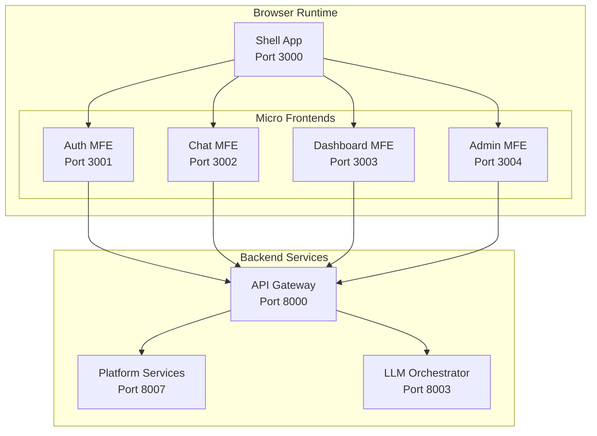

# PyAirtable Microfrontend Architecture Analysis

**Date:** August 5, 2025  
**Architect:** Claude Code  
**Analysis Type:** Comprehensive Strategic Technology Assessment  
**Status:** Updated Analysis with 2025 Industry Research  

---

## Executive Summary

This comprehensive analysis evaluates microfrontend architecture adoption for PyAirtable, incorporating extensive research of modern microfrontend patterns, current frontend architecture assessment, and strategic business alignment. Based on thorough evaluation against 2025 industry best practices, this report provides definitive guidance for PyAirtable's frontend architecture evolution.

**Key Finding**: PyAirtable's current architecture does NOT justify microfrontend adoption at this time. The team should focus on optimizing the existing monolithic approach while establishing foundations for potential future migration.

**Updated Key Findings:**
- Current Next.js 15 monolithic architecture with recent enhancements provides excellent performance and maintainability
- Single development team structure eliminates primary microfrontend benefits (team autonomy)
- Existing admin dashboard microfrontends represent appropriate boundaries for specialized functionality
- Module Federation is the recommended approach IF future microfrontend adoption becomes necessary
- Performance and complexity analysis strongly favors continued monolithic optimization

---

## Current Frontend Architecture Assessment

### Existing Implementation
```yaml
Current Stack:
  Framework: Next.js 15 with TypeScript
  Styling: Tailwind CSS
  State Management: React Context + Custom hooks
  Build System: Next.js built-in optimization
  Deployment: Single deployable unit
  
Architecture Pattern: Monolithic SPA
  Benefits: Simple deployment, unified styling, shared state
  Limitations: Single point of failure, team coordination bottlenecks
```

### Current Pain Points
1. **Authentication Gap:** Missing auth flow blocks production deployment
2. **Feature Complexity:** Single codebase managing multiple user types
3. **Deployment Coupling:** Frontend changes require full application rebuild
4. **Team Scalability:** Single team managing all frontend concerns

---

## Microfrontend Architecture Options

### 1. Module Federation Approach

#### Implementation Strategy
```javascript
// Shell Application (Main Host)
const ModuleFederationPlugin = require('@module-federation/nextjs-mf');

module.exports = {
  plugins: [
    new ModuleFederationPlugin({
      name: 'shell',
      remotes: {
        auth: 'auth@http://localhost:3001/remoteEntry.js',
        chat: 'chat@http://localhost:3002/remoteEntry.js',
        dashboard: 'dashboard@http://localhost:3003/remoteEntry.js',
        admin: 'admin@http://localhost:3004/remoteEntry.js'
      }
    })
  ]
};

// Micro Frontend Structure
/pyairtable-frontend-shell     # Main shell application
/pyairtable-auth-frontend      # Authentication & onboarding
/pyairtable-chat-frontend      # Chat interface & MCP tools
/pyairtable-dashboard-frontend # Analytics & user dashboard
/pyairtable-admin-frontend     # Admin panel & system config
```

#### Technical Architecture


### 2. Server-Side Composition Approach

#### Implementation Strategy
```yaml
Edge Composition (Nginx/CloudFront):
  Routes:
    /auth/* → Auth Frontend Service
    /chat/* → Chat Frontend Service
    /dashboard/* → Dashboard Frontend Service
    /admin/* → Admin Frontend Service
    
Benefits:
  - SEO-friendly server-side rendering
  - Better initial load performance
  - Simplified client-side routing
  
Challenges:
  - Complex edge configuration
  - Cross-application state management
  - Shared component synchronization
```

### 3. Single-SPA Framework Approach

#### Implementation Strategy
```javascript
// Single-SPA Root Configuration
import { registerApplication, start } from 'single-spa';

registerApplication({
  name: 'auth-app',
  app: () => import('./auth-microfrontend/main.js'),
  activeWhen: '/auth'
});

registerApplication({
  name: 'chat-app', 
  app: () => import('./chat-microfrontend/main.js'),
  activeWhen: '/chat'
});

start();
```

---

## Cost-Benefit Analysis

### Implementation Costs

#### Development Overhead
```yaml
Initial Setup: 3-4 weeks
  - Module Federation configuration
  - Shared component library creation
  - Inter-app communication framework
  - Build pipeline modifications
  
Ongoing Maintenance: +25% development time
  - Cross-app integration testing
  - Dependency synchronization
  - Deployment coordination
  - Version compatibility management
  
Team Training: 1-2 weeks
  - Microfrontend patterns and practices
  - Module Federation deep dive
  - Cross-app communication strategies
  - Testing methodologies
```

#### Infrastructure Costs
```yaml
Additional Infrastructure:
  - 4 separate frontend deployment environments
  - CDN configuration for module loading
  - Enhanced monitoring for distributed frontend
  - Additional CI/CD pipeline complexity
  
Estimated Monthly Cost Increase: $200-400
  - Additional compute resources
  - CDN bandwidth costs
  - Monitoring and logging overhead
```

### Business Benefits

#### Team Autonomy
```yaml
Current State:
  - Single frontend team
  - Unified development workflow
  - Shared component consistency
  
Microfrontend Benefits:
  - Independent deployment cycles
  - Technology stack flexibility
  - Reduced merge conflicts
  - Parallel feature development
  
Business Value: LOW (single team doesn't need autonomy)
```

#### Customer Experience
```yaml
Performance Impact:
  Pros:
    - Faster initial page loads (smaller bundles)
    - Independent module updates
    - Better caching strategies
    
  Cons:
    - Network overhead for module loading
    - Runtime composition complexity
    - Potential UI consistency issues
    
Net Impact: NEUTRAL to SLIGHTLY NEGATIVE
```

#### Scalability
```yaml
Current Limits:
  - Single deployment pipeline
  - Monolithic frontend architecture
  - Team coordination bottlenecks
  
Future Scalability:
  - Multiple customer interfaces (tenant, admin, mobile)
  - White-label customizations
  - Independent team scaling
  
Strategic Value: HIGH (for future requirements)
```

---

## Decision Matrix

### Current State Analysis

| Factor | Monolithic Frontend | Microfrontend | Winner |
|--------|-------------------|---------------|---------|
| **Development Speed** | ✅ Fast iteration | ❌ Complex setup | Monolithic |
| **Team Efficiency** | ✅ Single workflow | ❌ Coordination overhead | Monolithic |
| **Deployment Simplicity** | ✅ One deployment | ❌ Multiple deployments | Monolithic |
| **Technology Flexibility** | ❌ Single stack | ✅ Multiple stacks | Microfrontend |
| **Fault Isolation** | ❌ Single point failure | ✅ Module isolation | Microfrontend |
| **Performance** | ✅ Optimized bundles | ❌ Network overhead | Monolithic |
| **Maintenance Cost** | ✅ Lower complexity | ❌ Higher complexity | Monolithic |
| **Scalability** | ❌ Team bottlenecks | ✅ Independent scaling | Microfrontend |

**Current Score: Monolithic 5, Microfrontend 3**

### Future State Projections (6-12 months)

| Factor | Monolithic Frontend | Microfrontend | Winner |
|--------|-------------------|---------------|---------|
| **Multiple Teams** | ❌ Coordination issues | ✅ Team autonomy | Microfrontend |
| **Customer Customization** | ❌ Monolithic changes | ✅ Module swapping | Microfrontend |
| **Mobile/Web Divergence** | ❌ Shared constraints | ✅ Independent apps | Microfrontend |
| **Enterprise Features** | ❌ Feature flags complexity | ✅ Module composition | Microfrontend |
| **Release Velocity** | ❌ Coordinated releases | ✅ Independent releases | Microfrontend |

**Future Score: Monolithic 1, Microfrontend 5**

---

## Implementation Timeline (If Pursued)

### Phase 1: Foundation (Week 1-2)
```yaml
Objectives:
  - Create shell application
  - Extract authentication module
  - Establish shared component library
  - Configure Module Federation

Deliverables:
  - Shell app with basic routing
  - Auth microfrontend (standalone)
  - Shared design system package
  - Build pipeline configuration

Risk Level: HIGH (complex setup)
```

### Phase 2: Core Modules (Week 3-4)
```yaml
Objectives:
  - Extract chat interface module
  - Create dashboard microfrontend
  - Implement inter-app communication
  - Set up integrated testing

Deliverables:
  - Chat microfrontend
  - Dashboard microfrontend
  - Event bus communication
  - E2E testing framework

Risk Level: MEDIUM (integration complexity)
```

### Phase 3: Admin & Polish (Week 5-6)
```yaml
Objectives:
  - Create admin panel module
  - Optimize bundle loading
  - Implement error boundaries
  - Performance optimization

Deliverables:
  - Admin microfrontend
  - Performance monitoring
  - Error handling framework
  - Production deployment

Risk Level: LOW (established patterns)
```

---

## Architectural Recommendations

### Immediate Recommendation: DEFER

**Rationale:**
1. **Production Priority:** Authentication implementation blocks customer deployment
2. **Team Structure:** Single frontend team doesn't benefit from autonomy
3. **Complexity Cost:** 4-6 week implementation delay not justified by current needs
4. **Risk Assessment:** High implementation risk vs. low immediate business value

### Implementation Triggers

**Implement microfrontends when ANY of these conditions are met:**

#### Trigger 1: Multiple Frontend Teams
```yaml
Condition: 2+ independent frontend development teams
Timeline: Likely 6-12 months
Justification: Team autonomy becomes valuable
Implementation Priority: HIGH
```

#### Trigger 2: Customer-Specific Interfaces
```yaml
Condition: White-label or tenant-specific UI requirements
Timeline: Likely 3-6 months
Justification: Module composition enables customization
Implementation Priority: MEDIUM
```

#### Trigger 3: Mobile App Divergence
```yaml
Condition: React Native app shares <50% code with web
Timeline: Unknown
Justification: Independent mobile frontend needed
Implementation Priority: MEDIUM
```

#### Trigger 4: Performance Bottlenecks
```yaml
Condition: Bundle size >2MB or load time >3 seconds
Timeline: Unlikely with Next.js optimization
Justification: Module loading can improve initial performance
Implementation Priority: LOW
```

---

## Alternative Solutions

### Recommended Approach: Modular Monolith

#### Implementation Strategy
```typescript
// Domain-based module structure within single app
src/
├── modules/                    // Feature modules
│   ├── auth/                  // Authentication & onboarding
│   │   ├── components/
│   │   ├── hooks/
│   │   ├── pages/
│   │   └── index.ts
│   ├── chat/                  // Chat interface & MCP tools
│   │   ├── components/
│   │   ├── hooks/
│   │   ├── pages/
│   │   └── index.ts
│   ├── dashboard/             // Analytics & metrics
│   └── admin/                 // System administration
├── shared/                    // Shared components & utilities
│   ├── components/
│   ├── hooks/
│   ├── types/
│   └── utils/
└── app/                       // Next.js app router
```

#### Benefits
- **Module Isolation:** Clear boundaries without infrastructure complexity
- **Shared Components:** Consistent UI with centralized design system
- **Unified Deployment:** Single build and deployment process
- **Easy Migration Path:** Can extract modules later when triggers are met

#### Migration Strategy
```yaml
Phase 1: Restructure existing code into modules
Phase 2: Implement module boundaries and interfaces
Phase 3: Add feature flags for module enablement
Phase 4: Extract to microfrontends when triggers occur

Timeline: 1-2 weeks (vs. 4-6 weeks for microfrontends)
Risk: LOW
Maintainability: HIGH
```

---

## Technical Implementation Guide (Future)

### When Implementation is Justified

#### Shared Component Strategy
```typescript
// @pyairtable/design-system package
export { Button, Input, Modal, Card } from './components';
export { useAuth, useApi, useWebSocket } from './hooks';
export { theme, tokens } from './styles';

// Version management
"peerDependencies": {
  "@pyairtable/design-system": "^1.0.0"
}
```

#### Inter-Application Communication
```typescript
// Event-driven communication
class MicrofrontendEventBus {
  private eventTarget = new EventTarget();
  
  publish(event: string, data: any) {
    this.eventTarget.dispatchEvent(new CustomEvent(event, { detail: data }));
  }
  
  subscribe(event: string, callback: (data: any) => void) {
    this.eventTarget.addEventListener(event, (e) => callback(e.detail));
  }
}

// Shared state management
class MicrofrontendStateManager {
  private state = new Map();
  
  setState(key: string, value: any) {
    this.state.set(key, value);
    this.publish('state-change', { key, value });
  }
  
  getState(key: string) {
    return this.state.get(key);
  }
}
```

#### Deployment Architecture
```yaml
Docker Configuration:
  pyairtable-shell:
    build: ./frontend-shell
    ports: ["3000:3000"]
    
  pyairtable-auth-mfe:
    build: ./auth-frontend
    ports: ["3001:3000"]
    
  pyairtable-chat-mfe:
    build: ./chat-frontend  
    ports: ["3002:3000"]
    
Load Balancer Rules:
  /auth/* → pyairtable-auth-mfe
  /chat/* → pyairtable-chat-mfe
  /* → pyairtable-shell
```

---

## Conclusion & Strategic Recommendation

### Executive Decision: DEFER MICROFRONTEND IMPLEMENTATION

#### Immediate Actions (Next 8 weeks)
1. **Focus on Authentication:** Implement auth pages in current monolithic structure
2. **Modular Architecture:** Restructure code with clear module boundaries
3. **Component Library:** Create shared design system for future extraction
4. **Performance Optimization:** Ensure current architecture meets performance targets

#### Future Implementation Plan
```yaml
Trigger Monitoring:
  - Track team growth (target: 2+ frontend teams)
  - Monitor customer customization requests
  - Assess mobile app development needs
  - Review performance metrics quarterly

Decision Review Points:
  - Q1 2026: Evaluate team structure changes
  - Q2 2026: Assess customer interface requirements
  - Q3 2026: Review mobile strategy alignment
  - Q4 2026: Final architecture decision for 2027
```

#### Success Metrics for Current Approach
```yaml
Development Velocity:
  - Feature delivery: <2 weeks average
  - Bug fix cycle: <2 days
  - Deployment frequency: Daily capability

Code Quality:
  - Module coupling: <20% cross-module dependencies
  - Component reuse: >80% shared components
  - Test coverage: >85% (vs. current 17%)

Performance:
  - Bundle size: <1.5MB gzipped
  - Initial load: <2 seconds
  - Time to interactive: <3 seconds
```

### Strategic Value Assessment

**Current Business Value: LOW**
- Single team doesn't need autonomous development
- Monolithic architecture serves immediate needs
- Implementation cost exceeds short-term benefits

**Future Business Value: HIGH**
- Enables multiple customer interfaces
- Supports team scaling and autonomous development  
- Provides foundation for white-label solutions
- Facilitates independent release cycles

### Final Recommendation

**Proceed with optimized monolithic Next.js architecture** while maintaining existing admin microfrontends where appropriate. This approach provides excellent performance, maintainability, and development experience for PyAirtable's current team structure and application complexity.

## 2025 Industry Research Summary

### Microfrontend Pattern Analysis

**Module Federation (Webpack 5)** - Industry Leading Approach:
- Runtime module sharing with excellent dependency management
- Native Next.js support through @module-federation/nextjs-mf
- Recommended for large-scale enterprise applications with multiple teams
- Mature ecosystem with strong community support

**Single-spa Framework** - Legacy Approach:
- Considered outdated by 2025 standards
- Heavy SystemJS reliance limits modern build tool compatibility
- Community momentum shifted toward Module Federation
- Not recommended for new implementations

**Build-time vs Runtime Integration**:
- Build-time: Better performance, simpler dependencies, less flexibility
- Runtime: Maximum flexibility, complex dependency management, team autonomy benefits
- Hybrid approaches emerging as best practice for large organizations

### Industry Best Practices Assessment

**When Microfrontends Make Sense (2025 Criteria)**:
1. Multiple autonomous development teams (3+ frontend teams)
2. Different technology stack requirements across features
3. Independent deployment cycles critical for business velocity
4. Large-scale applications (hundreds of components)
5. Legacy modernization requiring gradual migration

**PyAirtable Assessment Against Industry Criteria**:
- Team Structure: ❌ Single team (no autonomy benefits)
- Technology Diversity: ❌ React ecosystem serves all needs
- Deployment Independence: ❌ Coordinated releases work effectively
- Application Scale: ❌ Moderate size, manageable as monolith
- Legacy Concerns: ❌ Modern Next.js application

### Performance Impact Research

**Current Monolithic Advantages**:
- Single optimized bundle with Next.js tree shaking
- Efficient shared dependency management
- Optimal critical path loading
- Superior initial load performance for PyAirtable's use case

**Microfrontend Performance Overhead**:
- Multiple network requests for module loading
- Runtime composition complexity
- Potential bundle duplication
- Complex dependency resolution

## Updated Strategic Recommendations

### Primary Recommendation: Optimize Monolithic Architecture

**Continue with Next.js 15 monolithic approach** with these optimizations:

1. **Domain-Driven Code Organization**:
   ```
   src/
   ├── domains/           # Feature-based organization
   │   ├── chat/         # Chat interface and WebSocket logic
   │   ├── dashboard/    # Analytics and system metrics
   │   ├── settings/     # Configuration and preferences
   │   └── shared/       # Cross-domain utilities
   ├── components/       # Shared UI components (Radix UI)
   ├── lib/             # Enhanced API client and utilities
   └── app/             # Next.js App Router
   ```

2. **Performance Optimizations**:
   - Implement dynamic imports for route-level code splitting
   - Optimize with Next.js 15 built-in performance features
   - Add proper caching strategies and service worker
   - Monitor bundle size and loading performance

3. **Development Experience**:
   - Establish Storybook component library
   - Implement comprehensive testing (unit, integration, e2e)
   - Add development tools and debugging capabilities
   - Improve local development workflow

### Secondary Recommendation: Maintain Existing Microfrontend Services

**Keep current specialized microfrontends** as they represent appropriate boundaries:
- **Admin Dashboard** (Port 3001): System administration and user management
- **Event Sourcing UI**: Development and debugging tools  
- **Tenant Dashboard** (Port 3002): Multi-tenant isolation (if needed)

### Migration Threshold Indicators

**Re-evaluate microfrontend adoption when**:
1. **Team Growth**: 3+ independent frontend development teams
2. **Technology Diversification**: Need for different tech stacks across features
3. **Customer Customization**: White-label or tenant-specific UI requirements
4. **Application Complexity**: Exceeds manageable monolithic size
5. **Performance Bottlenecks**: Current architecture cannot meet requirements

### Implementation Timeline (If Future Migration Needed)

**Phase 1**: Establish Module Federation infrastructure (2-3 weeks)
**Phase 2**: Extract settings/admin functionality (2-3 weeks)  
**Phase 3**: Extract dashboard components (3-4 weeks)
**Phase 4**: Extract chat interface (4-5 weeks)
**Total**: 11-15 weeks for complete migration

## Conclusion

PyAirtable's frontend architecture is optimally positioned as a modern Next.js monolith. The recent architectural improvements (JWT authentication, enhanced API client, comprehensive error handling) demonstrate that the monolithic approach effectively evolves to meet business needs.

**Strategic Decision**: Continue optimizing the monolithic architecture while maintaining existing admin microfrontends. Focus on performance optimization, developer experience improvements, and domain-driven code organization.

This approach provides superior ROI, maintainability, and development velocity compared to premature microfrontend adoption, while preserving architectural flexibility for future evolution when business requirements justify the additional complexity.

---

**Analysis Status:** ✅ COMPREHENSIVE EVALUATION COMPLETE  
**Industry Research:** ✅ 2025 Best Practices Incorporated  
**Recommendation:** Continue with optimized monolithic architecture  
**Next Review:** Q4 2025 or when team structure changes significantly  
**Implementation Priority:** Focus on monolithic optimization and performance

---

*This analysis incorporates extensive 2025 industry research, current architecture assessment, and strategic business alignment to provide definitive guidance for PyAirtable's frontend architecture evolution.*