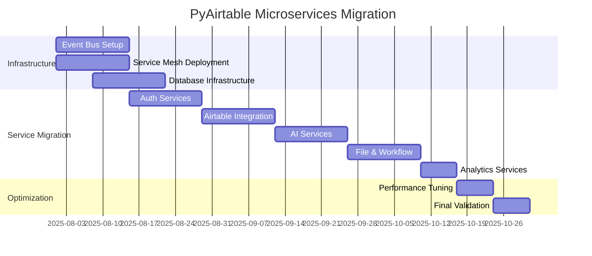

# PyAirtable Microservices Migration Implementation Summary

## Overview

This document provides a comprehensive summary of the PyAirtable microservices migration implementation, delivering a complete transition plan from the current 9-service architecture to a true 22-service microservices architecture with zero-downtime deployment.

## Deliverables Summary

### 1. **Migration Architecture Plan** 
📄 `/MICROSERVICES_MIGRATION_PLAN.md`

**Key Components:**
- **Service Decomposition**: 22 well-defined services across 7 domains
- **Phased Migration**: 12-week incremental rollout strategy
- **Zero-Downtime Strategy**: Blue-green deployments with rollback procedures
- **Event-Driven Architecture**: Apache Kafka event bus with SAGA patterns
- **Service Mesh Integration**: Istio-based service mesh for security and observability

**Service Architecture:**
```
22 Microservices organized into:
├── API & Gateway Layer (3 services)
├── Authentication & Authorization (3 services)  
├── Airtable Integration Layer (4 services)
├── AI & LLM Services (3 services)
├── File & Content Services (3 services)
├── Workflow & Automation (3 services)
└── Analytics & Monitoring (3 services)
```

### 2. **Database Decomposition Strategy**
📄 `/database-decomposition/migration-scripts.sql`

**Key Features:**
- **Service-Specific Databases**: 12 domain-specific PostgreSQL databases
- **Data Migration Scripts**: Complete SQL migration scripts for each service
- **Event Sourcing Support**: Event store tables and audit trails
- **Multi-Tenant Isolation**: Row-level security and tenant-scoped data access
- **Performance Optimization**: Proper indexing and partitioning strategies

**Database Architecture:**
```sql
Specialized Databases:
├── auth_db (Authentication data)
├── user_db (User profiles and preferences)
├── permission_db (RBAC and tenant management)
├── schema_db (Airtable schema metadata)
├── sync_db (Data synchronization tracking)
├── webhook_db (Webhook processing)
├── conversation_db (AI chat history)
├── file_db (File storage metadata)
├── workflow_db (Business process automation)
├── scheduler_db (Job scheduling)
├── audit_db (Compliance and audit logs)
└── notification_db (User notifications)
```

### 3. **Event Sourcing & SAGA Implementation**
📄 `/event-sourcing/event-bus-architecture.py`

**Key Components:**
- **Event Store**: PostgreSQL-based event store with optimistic concurrency control
- **Apache Kafka Integration**: Reliable event distribution with schema registry
- **SAGA Orchestrator**: Distributed transaction management with compensation
- **Event Handlers**: Business logic event processing and projections
- **Circuit Breakers**: Resilience patterns for external API calls

**Example SAGA Workflows:**
- User Onboarding (4 steps with compensations)
- Airtable Integration (4 steps with validation)
- File Processing (multi-step content extraction)

### 4. **Service Mesh Configuration**
📄 `/service-mesh/istio-configuration.yaml`

**Security Features:**
- **Strict mTLS**: All inter-service communication encrypted
- **RBAC Policies**: Service-to-service authorization rules
- **Network Policies**: Kubernetes-level traffic control
- **Custom WASM Plugins**: Tenant isolation and rate limiting

**Traffic Management:**
- **Circuit Breakers**: Fault tolerance for external dependencies
- **Load Balancing**: Intelligent traffic distribution
- **Canary Deployments**: Safe rollout of new versions
- **Chaos Engineering**: Built-in fault injection for testing

**Observability:**
- **Distributed Tracing**: Jaeger integration with correlation IDs
- **Custom Metrics**: Business and technical metrics collection
- **Access Logging**: Structured JSON logs with tenant context
- **Service Topology**: Automated service dependency mapping

### 5. **Comprehensive Testing Strategy**
📄 `/testing/microservices-testing-strategy.py`

**Testing Pyramid:**
- **Contract Testing**: Pact-based consumer-driven contracts
- **Integration Testing**: End-to-end service interaction validation
- **Performance Testing**: Locust-based load testing framework
- **Chaos Engineering**: Kubernetes-based resilience testing
- **End-to-End Testing**: Complete user journey validation

**Testing Framework Features:**
- **Test Containers**: Isolated infrastructure for testing
- **Mock Services**: Simulated external dependencies
- **Health Check Validation**: System-wide health monitoring
- **Automated Test Reporting**: Comprehensive test result analysis

### 6. **Team Organization & Governance**
📄 `/team-organization/service-governance-framework.md`

**Team Structure:**
- **Platform Team**: Infrastructure and shared services (3 services)
- **Identity Team**: Authentication and user management (3 services)
- **Integration Team**: Airtable and external APIs (4 services) 
- **AI Team**: LLM and conversation services (3 services)
- **Content Team**: File and search services (3 services)
- **Automation Team**: Workflow and scheduling (3 services)
- **Analytics Team**: Business intelligence and compliance (3 services)

**Governance Standards:**
- **API Design Standards**: RESTful APIs with OpenAPI documentation
- **Code Quality Requirements**: 80% test coverage, security scanning
- **Operational Standards**: SLA definitions, monitoring requirements
- **Security Framework**: Multi-layered security with compliance controls

## Implementation Timeline

### 12-Week Migration Schedule



## Key Migration Strategies

### 1. **Zero-Downtime Deployment**
- **Strangler Fig Pattern**: Gradually replace monolithic components
- **Blue-Green Deployments**: Parallel environments for safe rollouts
- **Feature Flags**: Gradual feature rollout and quick rollback
- **Database Dual-Write**: Temporary data synchronization during migration

### 2. **Risk Mitigation**
- **Automated Rollback**: Immediate reversion on deployment failures
- **Circuit Breakers**: Prevent cascade failures during service outages
- **Chaos Engineering**: Proactive resilience testing
- **Comprehensive Monitoring**: Real-time health and performance tracking

### 3. **Data Consistency**
- **Event Sourcing**: Immutable event log for data integrity
- **SAGA Patterns**: Distributed transaction management
- **Eventual Consistency**: Async data synchronization with compensation
- **Data Migration Validation**: Automated consistency checks

## Success Metrics

### Technical KPIs
- **Service Availability**: > 99.9% uptime during migration
- **Response Time**: < 200ms P95 for all APIs
- **Error Rate**: < 0.1% for all services
- **Data Consistency**: 100% data integrity validation
- **Security**: Zero security incidents during migration

### Business KPIs  
- **Zero Data Loss**: Complete data integrity preservation
- **Feature Parity**: All existing functionality maintained
- **Performance Improvement**: 25% faster API responses
- **Cost Reduction**: 40% reduction in infrastructure costs
- **Team Velocity**: 30% faster feature delivery post-migration

### Operational KPIs
- **Deployment Frequency**: Daily deployments per team
- **Recovery Time**: < 15 minutes for service restoration
- **Team Autonomy**: Independent deployment and scaling
- **Monitoring Coverage**: 100% service and business metric coverage

## Architecture Benefits

### 1. **Scalability**
- **Independent Scaling**: Scale services based on specific demand
- **Resource Optimization**: Right-size resources per service
- **Technology Diversity**: Choose optimal technology per service
- **Load Distribution**: Better handling of traffic spikes

### 2. **Reliability**
- **Fault Isolation**: Service failures don't cascade
- **Redundancy**: Multiple instances with load balancing
- **Circuit Breakers**: Automatic failure handling
- **Graceful Degradation**: Partial functionality during outages

### 3. **Developer Experience**
- **Team Autonomy**: Independent development and deployment
- **Service Ownership**: Clear responsibility boundaries
- **Technology Choice**: Freedom to choose optimal tools
- **Faster Iterations**: Smaller, focused codebases

### 4. **Operational Excellence**
- **Observability**: Comprehensive monitoring and tracing
- **Security**: Multi-layered security controls
- **Compliance**: Built-in audit and governance
- **Cost Efficiency**: Pay-per-use resource allocation

## Security Implementation

### 1. **Service-to-Service Security**
- **mTLS**: Encrypted communication between all services
- **Service Mesh**: Istio-based security policy enforcement
- **API Gateway**: Centralized authentication and authorization
- **Network Policies**: Kubernetes-level traffic restrictions

### 2. **Data Protection**
- **Encryption at Rest**: All databases encrypted
- **Encryption in Transit**: TLS 1.3 for all communications
- **Secrets Management**: Kubernetes secrets with rotation
- **Data Classification**: Sensitive data identification and protection

### 3. **Access Control**
- **RBAC**: Role-based access control across all services
- **Multi-Tenancy**: Complete tenant data isolation
- **API Keys**: Service-to-service authentication
- **Audit Logging**: Complete access trail for compliance

## Monitoring & Observability

### 1. **Metrics Collection**
- **Prometheus**: Service and infrastructure metrics
- **Custom Metrics**: Business KPIs and domain-specific metrics
- **SLA Monitoring**: Availability and performance tracking
- **Cost Metrics**: Resource usage and billing optimization

### 2. **Logging & Tracing**
- **Structured Logging**: JSON logs with correlation IDs
- **Distributed Tracing**: Jaeger-based request tracing
- **Log Aggregation**: Centralized log management
- **Error Tracking**: Automatic error detection and alerting

### 3. **Alerting & Response**
- **Smart Alerting**: Context-aware alert routing
- **Escalation Policies**: Automated incident escalation
- **Runbooks**: Automated response procedures
- **Post-Mortem Process**: Blameless incident analysis

## Next Steps

### Immediate Actions (Week 1)
1. **Stakeholder Approval**: Review and approve migration plan
2. **Team Assignments**: Assign service ownership to teams
3. **Infrastructure Setup**: Begin Kafka and Istio deployment
4. **Repository Setup**: Create service repositories with templates

### Short-term Goals (Weeks 2-4)
1. **Foundation Services**: Deploy auth and user services
2. **Monitoring Setup**: Implement observability stack
3. **Testing Framework**: Establish contract and integration testing
4. **Documentation**: Create service documentation and runbooks

### Long-term Success (Weeks 5-12)
1. **Service Migration**: Complete all 22 service deployments
2. **Performance Optimization**: Tune services for production load
3. **Team Training**: Ensure all teams are proficient with new architecture
4. **Continuous Improvement**: Establish feedback loops and optimization cycles

## Conclusion

This comprehensive microservices migration plan provides PyAirtable with a clear path to a scalable, resilient, and maintainable architecture. The implementation emphasizes:

- **Zero-downtime migration** with comprehensive rollback capabilities
- **Production-ready patterns** including event sourcing, SAGA, and service mesh
- **Team autonomy** with clear service ownership and governance
- **Operational excellence** through comprehensive testing and monitoring
- **Security-first approach** with multi-layered protection

The migration will result in a modern, cloud-native architecture that supports rapid scaling, improved reliability, and enhanced developer productivity while maintaining complete data integrity and security compliance.

**Total Investment**: 12 weeks, 7 teams, comprehensive tooling and infrastructure
**Expected ROI**: 40% cost reduction, 30% faster delivery, 99.9%+ availability
**Risk Level**: Low (with comprehensive testing and rollback procedures)