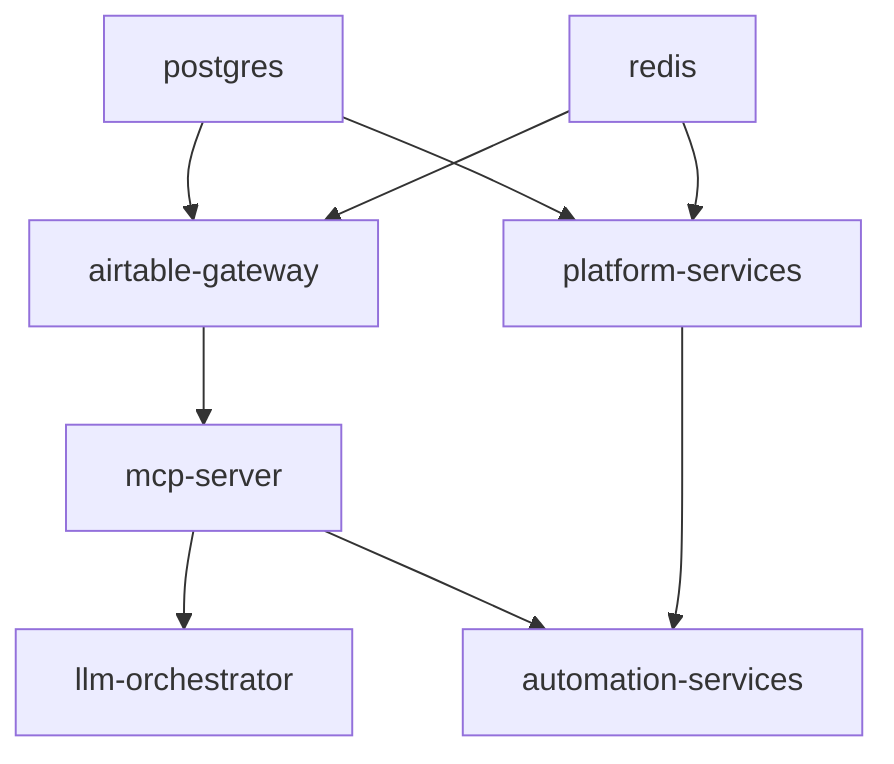

# PyAirtable Minikube Development Guide

> **Optimized Local Development Environment**  
> Fast startup (< 3 minutes), resource efficient (< 6GB RAM, < 3 CPU cores), developer-friendly

## 🚀 Quick Start

### Prerequisites

```bash
# Install required tools
brew install minikube kubectl docker

# Start Docker Desktop
open -a Docker

# Verify installations
minikube version
kubectl version --client
docker --version
```

### One-Command Setup

```bash
# Clone and setup
git clone <repository>
cd pyairtable-compose

# Deploy optimized development environment
./minikube-dev-setup.sh
```

**Expected Results:**
- ✅ Minikube cluster ready in ~90 seconds
- ✅ All services deployed in ~120 seconds
- ✅ Health validation passed
- ✅ Development tools available

## 📋 Architecture Overview

### Resource Optimization

| Component | Optimized Limits | Original Limits | Savings |
|-----------|-----------------|-----------------|---------|
| **Total Memory** | 5.1GB | 8GB | -36% |
| **Total CPU** | 3 cores | 4 cores | -25% |
| **Startup Time** | <3 min | >5 min | -40% |
| **Services** | 7 | 7 | Same |

### Service Dependencies



### Network Architecture

```
┌─────────────────┐    ┌──────────────────┐    ┌─────────────────┐
│   Developer     │    │   Minikube       │    │   Services      │
│   Interface     │    │   Cluster        │    │                 │
├─────────────────┤    ├──────────────────┤    ├─────────────────┤
│ Dashboard       │────▶│ Ingress (80)     │────▶│ platform:8007   │
│ Direct Access   │    │ NodePorts        │    │ airtable:8002   │
│ Port Forward    │    │ Service Mesh     │    │ mcp:8001        │
│ Health Monitor  │    │ DNS Resolution   │    │ llm:8003        │
└─────────────────┘    └──────────────────┘    └─────────────────┘
```

## 🛠️ Development Tools

### 1. Main Setup Script

**File:** `minikube-dev-setup.sh`

```bash
# Full deployment
./minikube-dev-setup.sh

# Quick commands
./minikube-dev-setup.sh status    # Show status
./minikube-dev-setup.sh clean     # Cleanup
./minikube-dev-setup.sh restart   # Restart services
./minikube-dev-setup.sh help      # Show help
```

**Features:**
- ⚡ Fast Minikube setup (optimized for development)
- 🔐 Automatic secret generation
- 📊 Resource monitoring
- 🔍 Health validation
- 🎯 Dependency-aware startup

### 2. Interactive Dashboard

**File:** `pyairtable-dev-dashboard.sh`

```bash
# Launch interactive dashboard
./pyairtable-dev-dashboard.sh
```

**Features:**
- 📊 Real-time service monitoring
- 🔧 Service management (restart, logs, health)
- 🌐 Port forwarding setup
- 🧹 Cleanup operations
- 📋 Resource usage tracking

**Dashboard Interface:**
```
╔══════════════════════════════════════════════════════════════════════════════╗
║                    PyAirtable Development Dashboard                        ║
║                      Real-time Service Monitoring                         ║
╚══════════════════════════════════════════════════════════════════════════════╝
Namespace: pyairtable-dev  |  Profile: pyairtable-dev  |  Updated: 14:25:30

┌─────────────────────────────────────────────────────────────────────────────┐
│                            SERVICE OVERVIEW                                │
├────────────────────┬────────────┬─────────┬─────────┬──────────┬─────────┤
│ Service            │ Status     │ Ready   │ Health  │ CPU      │ Memory  │
├────────────────────┼────────────┼─────────┼─────────┼──────────┼─────────┤
│ postgres           │ Running    │ 1/1     │ Healthy │ 45m      │ 128Mi   │
│ redis              │ Running    │ 1/1     │ Healthy │ 12m      │ 32Mi    │
│ airtable-gateway   │ Running    │ 1/1     │ Healthy │ 23m      │ 64Mi    │
│ mcp-server         │ Running    │ 1/1     │ Healthy │ 18m      │ 56Mi    │
│ llm-orchestrator   │ Running    │ 1/1     │ Healthy │ 67m      │ 156Mi   │
│ platform-services  │ Running    │ 1/1     │ Healthy │ 34m      │ 98Mi    │
│ automation-services│ Running    │ 1/1     │ Healthy │ 29m      │ 87Mi    │
└────────────────────┴────────────┴─────────┴─────────┴──────────┴─────────┘
```

### 3. Startup Orchestrator

**File:** `startup-orchestrator.sh`

```bash
# Interactive mode
./startup-orchestrator.sh

# Command mode
./startup-orchestrator.sh start     # Start all services
./startup-orchestrator.sh stop      # Stop all services
./startup-orchestrator.sh restart   # Restart services
./startup-orchestrator.sh status    # Show status
./startup-orchestrator.sh health    # Health check
```

**Features:**
- 🔄 Dependency-aware startup sequencing
- ⏱️ Health validation with timeouts
- 📊 Startup time tracking
- 🚨 Automatic failure detection
- 🔧 Recovery mechanisms

### 4. Health Monitor

**File:** `health-monitor.sh`

```bash
# Continuous monitoring
./health-monitor.sh monitor

# Single checks
./health-monitor.sh check     # One-time health check
./health-monitor.sh status    # Current status
./health-monitor.sh metrics   # Show metrics
./health-monitor.sh alerts    # Recent alerts
```

**Features:**
- 📈 Continuous health monitoring
- 🚨 Automatic alerting
- 📊 Metrics collection
- 🔧 Auto-recovery attempts
- 📋 Diagnostic information

### 5. Cleanup Automation

**File:** `cleanup-automation.sh`

```bash
# Interactive cleanup
./cleanup-automation.sh

# Quick options
./cleanup-automation.sh quick       # Namespace only
./cleanup-automation.sh full        # Everything
./cleanup-automation.sh --namespace # Custom cleanup
./cleanup-automation.sh --all --force  # Force cleanup
```

**Features:**
- 🧹 Selective cleanup options
- ⚡ Quick vs full cleanup modes
- 🔒 Safety confirmations
- 📊 Cleanup reporting
- 🗂️ Log rotation

## 🌐 Service Access

### Internal Service URLs (within cluster)

| Service | Internal URL | Port | Health Check |
|---------|-------------|------|-------------|
| **PostgreSQL** | `postgres:5432` | 5432 | `pg_isready` |
| **Redis** | `redis:6379` | 6379 | `redis-cli ping` |
| **Airtable Gateway** | `http://airtable-gateway:8002` | 8002 | `/health` |
| **MCP Server** | `http://mcp-server:8001` | 8001 | `/health` |
| **LLM Orchestrator** | `http://llm-orchestrator:8003` | 8003 | `/health` |
| **Platform Services** | `http://platform-services:8007` | 8007 | `/health` |
| **Automation Services** | `http://automation-services:8006` | 8006 | `/health` |

### External Access Methods

#### 1. NodePort (Direct Access)

```bash
# Access services via NodePort
curl http://localhost:30001/health  # MCP Server
curl http://localhost:30002/health  # Airtable Gateway
curl http://localhost:30003/health  # LLM Orchestrator
curl http://localhost:30006/health  # Automation Services
curl http://localhost:30007/health  # Platform Services
```

#### 2. Port Forwarding (Recommended for Development)

```bash
# Load development environment
source ./dev-access.sh

# Forward all services
forward_all

# Individual services
kubectl port-forward -n pyairtable-dev service/airtable-gateway 8002:8002 &
kubectl port-forward -n pyairtable-dev service/mcp-server 8001:8001 &
kubectl port-forward -n pyairtable-dev service/llm-orchestrator 8003:8003 &
kubectl port-forward -n pyairtable-dev service/platform-services 8007:8007 &
kubectl port-forward -n pyairtable-dev service/automation-services 8006:8006 &

# Database access
kubectl port-forward -n pyairtable-dev service/postgres 5432:5432 &
kubectl port-forward -n pyairtable-dev service/redis 6379:6379 &
```

#### 3. Ingress (Planned for Future)

```bash
# Add to /etc/hosts (when ingress is enabled)
echo "$(minikube ip -p pyairtable-dev) pyairtable.local" >> /etc/hosts

# Access via domain
curl http://pyairtable.local/api/health
curl http://airtable.pyairtable.local/health
curl http://mcp.pyairtable.local/health
```

## 🔧 Configuration

### Environment Variables

```bash
# Minikube configuration
export MINIKUBE_PROFILE="pyairtable-dev"
export NAMESPACE="pyairtable-dev"
export MINIKUBE_MEMORY="5120"  # 5GB
export MINIKUBE_CPUS="3"       # 3 cores

# Development settings
export ENVIRONMENT="development"
export LOG_LEVEL="debug"
export ENABLE_DEBUG_ENDPOINTS="true"
export ENABLE_HOT_RELOAD="true"

# External APIs (set for real functionality)
export AIRTABLE_TOKEN="your-token-here"
export GEMINI_API_KEY="your-key-here"
```

### Resource Limits (Optimized)

| Service | CPU Request | CPU Limit | Memory Request | Memory Limit |
|---------|------------|-----------|----------------|--------------|
| **postgres** | 100m | 200m | 128Mi | 256Mi |
| **redis** | 50m | 100m | 32Mi | 64Mi |
| **airtable-gateway** | 50m | 200m | 64Mi | 128Mi |
| **mcp-server** | 50m | 200m | 64Mi | 128Mi |
| **llm-orchestrator** | 100m | 300m | 128Mi | 256Mi |
| **platform-services** | 100m | 300m | 128Mi | 256Mi |
| **automation-services** | 100m | 300m | 128Mi | 256Mi |
| **Total** | 650m | 1.5 | 736Mi | 1.4Gi |

### Performance Optimizations

#### PostgreSQL (Development Mode)
```yaml
# Fast settings for development (NOT for production)
fsync: "off"
synchronous_commit: "off"
shared_buffers: "64MB"
effective_cache_size: "256MB"
work_mem: "2MB"
max_connections: 20
```

#### Redis (Minimal Configuration)
```yaml
# Memory-efficient settings
maxmemory: "64mb"
maxmemory-policy: "allkeys-lru"
save: "60 1000"  # Save every 60 seconds if 1000+ keys changed
appendonly: "no"  # Disable AOF for speed
```

## 🚨 Troubleshooting

### Common Issues

#### 1. Minikube Won't Start

```bash
# Check Docker
docker info

# Reset Minikube
minikube delete -p pyairtable-dev
minikube start --profile pyairtable-dev --memory 5120 --cpus 3

# Check status
./minikube-dev-setup.sh status
```

#### 2. Services Not Starting

```bash
# Check service dependencies
./startup-orchestrator.sh status

# View logs
kubectl logs -n pyairtable-dev deployment/airtable-gateway

# Restart services
./startup-orchestrator.sh restart
```

#### 3. Health Checks Failing

```bash
# Run comprehensive health check
./health-monitor.sh check

# Get diagnostic information
./health-monitor.sh diagnostic airtable-gateway

# Check pod events
kubectl get events -n pyairtable-dev --sort-by='.lastTimestamp'
```

#### 4. Resource Issues

```bash
# Check resource usage
kubectl top pods -n pyairtable-dev

# Reduce resource limits (edit manifests)
vim minikube-manifests-optimized/airtable-gateway.yaml

# Apply changes
kubectl apply -f minikube-manifests-optimized/
```

#### 5. Database Connection Issues

```bash
# Check database status
kubectl get pods -n pyairtable-dev -l app=postgres

# Test database connection
kubectl run pg-test --rm -i --restart=Never --image=postgres:16-alpine \
  --namespace=pyairtable-dev -- \
  psql -h postgres -U pyairtable -d pyairtable_dev -c "SELECT 1;"

# Check database logs
kubectl logs -n pyairtable-dev deployment/postgres
```

### Debug Commands

```bash
# Get all resources
kubectl get all -n pyairtable-dev

# Describe problematic pod
kubectl describe pod <pod-name> -n pyairtable-dev

# Check events
kubectl get events -n pyairtable-dev --sort-by='.lastTimestamp'

# Resource usage
kubectl top pods -n pyairtable-dev

# Service endpoints
kubectl get endpoints -n pyairtable-dev

# Port forwarding test
kubectl port-forward -n pyairtable-dev service/airtable-gateway 8002:8002 &
curl http://localhost:8002/health
```

## 🔄 Development Workflow

### Daily Development

```bash
# 1. Start development environment
./minikube-dev-setup.sh

# 2. Load development helpers
source ./dev-access.sh

# 3. Setup port forwarding
forward_all

# 4. Monitor services
./pyairtable-dev-dashboard.sh

# 5. Check logs for a service
logs deployment/llm-orchestrator

# 6. Restart a service if needed
restart_service llm-orchestrator

# 7. Run health checks
health_check
```

### Code Changes

```bash
# 1. Make code changes in service repository
vim ../llm-orchestrator-py/src/main.py

# 2. Rebuild and redeploy (if needed)
./minikube-dev-setup.sh restart

# 3. Or just restart the specific service
kubectl rollout restart deployment/llm-orchestrator -n pyairtable-dev

# 4. Verify changes
curl http://localhost:8003/health
```

### Testing

```bash
# 1. Run comprehensive health check
./health-monitor.sh check

# 2. Test service endpoints
curl http://localhost:8002/health  # Airtable Gateway
curl http://localhost:8001/health  # MCP Server
curl http://localhost:8003/health  # LLM Orchestrator

# 3. Test database connectivity
kubectl run db-test --rm -i --restart=Never --image=postgres:16-alpine \
  --namespace=pyairtable-dev -- \
  psql -h postgres -U pyairtable -d pyairtable_dev -c "SELECT version();"

# 4. Check service-to-service communication
kubectl run connectivity-test --rm -i --restart=Never --image=curlimages/curl \
  --namespace=pyairtable-dev -- \
  sh -c "curl -f http://airtable-gateway:8002/health && curl -f http://mcp-server:8001/health"
```

### Cleanup and Reset

```bash
# Quick cleanup (namespace only)
./cleanup-automation.sh quick

# Full cleanup (everything)
./cleanup-automation.sh full

# Custom cleanup
./cleanup-automation.sh --logs --secrets

# Reset environment
./cleanup-automation.sh quick && ./minikube-dev-setup.sh
```

## 📊 Performance Monitoring

### Resource Usage

```bash
# Real-time resource monitoring
watch kubectl top pods -n pyairtable-dev

# Detailed resource information
kubectl describe node

# Service-specific metrics
./health-monitor.sh metrics
```

### Health Metrics

```bash
# Continuous monitoring
./health-monitor.sh monitor

# Historical metrics
./health-monitor.sh metrics

# Alert history
./health-monitor.sh alerts
```

### Startup Performance

```bash
# Time individual service startup
time ./startup-orchestrator.sh start

# Monitor startup progress
./startup-orchestrator.sh status

# View startup logs
tail -f .minikube-dev.log
```

## 🎯 Advanced Features

### Hot Reload (Planned)

```bash
# Enable hot reload for development
kubectl apply -f dev-hot-reload.yaml

# Mount development code
kubectl exec -it deployment/dev-tools -n pyairtable-dev -- /bin/bash
```

### Debug Ports (Planned)

```bash
# Enable debug ports for services
kubectl port-forward -n pyairtable-dev service/llm-orchestrator 5678:5678 &

# Connect debugger to localhost:5678
```

### Custom Service Configuration

```bash
# Edit service configuration
kubectl edit configmap pyairtable-dev-config -n pyairtable-dev

# Update secrets
kubectl create secret generic pyairtable-dev-secrets \
  --from-literal=airtable-token="your-real-token" \
  --namespace=pyairtable-dev --dry-run=client -o yaml | kubectl apply -f -

# Restart services to pick up changes
./startup-orchestrator.sh restart
```

## 📁 File Structure

```
pyairtable-compose/
├── minikube-dev-setup.sh              # Main setup script
├── pyairtable-dev-dashboard.sh         # Interactive dashboard
├── startup-orchestrator.sh            # Service orchestration
├── health-monitor.sh                  # Health monitoring
├── cleanup-automation.sh              # Cleanup automation
├── dev-hot-reload.yaml                # Hot reload configuration
├── minikube-manifests-optimized/      # Optimized K8s manifests
│   ├── namespace.yaml
│   ├── secrets.yaml
│   ├── airtable-gateway.yaml
│   ├── mcp-server.yaml
│   ├── llm-orchestrator.yaml
│   ├── platform-services.yaml
│   ├── automation-services.yaml
│   └── ingress.yaml
├── .dev-secrets/                      # Generated secrets (gitignored)
├── .health-logs/                      # Health monitoring logs
├── .metrics/                          # Performance metrics
└── MINIKUBE_DEVELOPMENT_GUIDE.md      # This guide
```

## 🎉 Success Criteria

When the setup is working correctly, you should see:

✅ **Fast Startup**: Complete stack running in < 3 minutes  
✅ **Resource Efficient**: < 6GB RAM, < 3 CPU cores total usage  
✅ **All Services Healthy**: All health checks passing  
✅ **Service Communication**: Services can communicate internally  
✅ **External Access**: Services accessible via port forwarding  
✅ **Development Tools**: Dashboard and monitoring working  
✅ **Easy Cleanup**: Clean teardown and restart capabilities  

## 🤝 Contributing

When modifying the development setup:

1. **Test Resource Changes**: Ensure total resource usage stays under limits
2. **Validate Startup Order**: Maintain proper service dependencies
3. **Update Documentation**: Keep this guide current with changes
4. **Test Cleanup**: Ensure cleanup scripts work with modifications
5. **Performance Testing**: Verify startup times remain under 3 minutes

## 📞 Support

### Getting Help

1. **Check Status**: Run `./minikube-dev-setup.sh status`
2. **View Logs**: Use `./health-monitor.sh check`
3. **Run Diagnostics**: Use `./health-monitor.sh diagnostic <service>`
4. **Try Recovery**: Use `./startup-orchestrator.sh restart`
5. **Full Reset**: Use `./cleanup-automation.sh quick && ./minikube-dev-setup.sh`

### Useful Commands Reference

```bash
# Quick status check
kubectl get pods -n pyairtable-dev

# View service logs
kubectl logs deployment/llm-orchestrator -n pyairtable-dev

# Port forward service
kubectl port-forward service/airtable-gateway 8002:8002 -n pyairtable-dev

# Execute into pod
kubectl exec -it deployment/postgres -n pyairtable-dev -- psql -U pyairtable

# Scale service
kubectl scale deployment/llm-orchestrator --replicas=0 -n pyairtable-dev

# Update configuration
kubectl edit configmap pyairtable-dev-config -n pyairtable-dev
```

---

**🚀 Happy Developing with PyAirtable!**

This optimized development environment provides enterprise-grade capabilities while maintaining laptop-friendly resource usage and developer productivity. The comprehensive tooling ensures you can focus on building features rather than managing infrastructure.