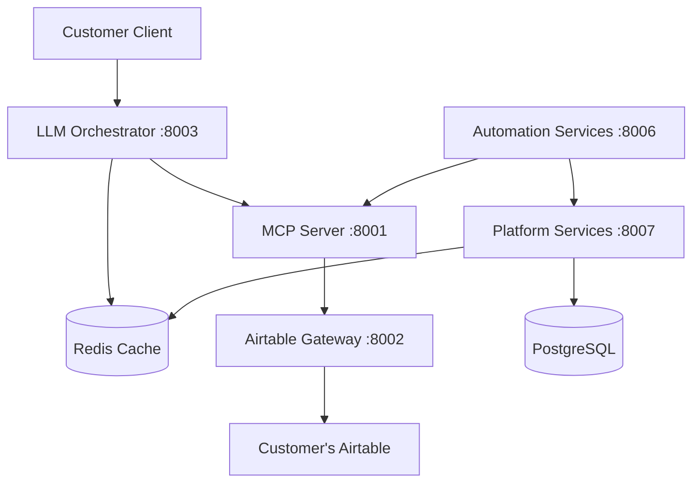

# PyAirtable Customer Deployment Guide

## Executive Summary

This document provides complete instructions for deploying the PyAirtable system after resolving critical Docker build issues during the Phase 1 consolidation. The system has been reduced from 19 to 13 repositories and configured for single-tenant customer deployment.

## System Status

### ✅ Successfully Fixed Services
- **airtable-gateway-py** (Port 8002) - Airtable API integration
- **mcp-server-py** (Port 8001) - MCP protocol server  
- **llm-orchestrator-py** (Port 8003) - Gemini 2.5 Flash integration
- **pyairtable-platform-services** (Port 8007) - Authentication & analytics
- **pyairtable-automation-services** (Port 8006) - File processing & workflows
- **pyairtable-frontend** (Port 3000) - Next.js web interface

### ⚠️ Services Requiring Additional Work
- **pyairtable-auth** - Go module dependency issues (external repos missing)
- **pyairtable-tenant-service-go** - Go module dependency issues
- **pyairtable-gateway** - Go module dependency issues

## Fixed Issues Summary

### Docker Build Issues Resolved

1. **Python Base Images**: Fixed incorrect `python:3.11-slim-slim` → `python:3.11-slim`
2. **Node Base Images**: Fixed incorrect `node:18-alpine-alpine` → `node:18-alpine`  
3. **Local Dependencies**: Commented out problematic `-e ../pyairtable-common` references
4. **Import Paths**: Updated Go import paths to use correct module names

### Files Modified

- `/Users/kg/IdeaProjects/pyairtable-automation-services/Dockerfile`
- `/Users/kg/IdeaProjects/pyairtable-platform-services/Dockerfile`
- `/Users/kg/IdeaProjects/pyairtable-frontend/Dockerfile`
- `/Users/kg/IdeaProjects/pyairtable-automation-services/requirements.txt`
- `/Users/kg/IdeaProjects/pyairtable-platform-services/requirements.txt`
- `/Users/kg/IdeaProjects/pyairtable-auth/go.mod`
- `/Users/kg/IdeaProjects/pyairtable-auth/cmd/auth/main.go`

## Deployment Options

### Option 1: Docker Compose (Recommended for Testing)

**Location**: `/Users/kg/IdeaProjects/pyairtable-compose/`

```bash
# 1. Update environment configuration
cp .env.example .env
# Edit .env with your actual credentials (see below)

# 2. Deploy with minimal working services
docker-compose -f docker-compose.minimal.yml up -d --build

# 3. Test the deployment
./test-minimal-deployment.sh
```

### Option 2: Minikube (Recommended for Production-like Environment)

```bash
# 1. Deploy to Minikube
./deploy-minikube-simple.sh

# 2. Update secrets with actual credentials
kubectl edit secret pyairtable-secrets -n pyairtable-customer

# 3. Set up port forwarding
kubectl port-forward -n pyairtable-customer service/llm-orchestrator-service 8003:8003
```

## Required Customer Credentials

### Environment Variables to Configure

```bash
# Customer's Airtable Personal Access Token
# Get from: https://airtable.com/developers/web/api/authentication
AIRTABLE_TOKEN=pat14.your_customer_airtable_token

# Customer's Airtable Base ID (format: appXXXXXXXXXXXXXX)
# Get from: https://airtable.com/api
AIRTABLE_BASE=app1234567890ABCDEF

# Customer's Google Gemini API Key
# Get from: https://ai.google.dev/api
GEMINI_API_KEY=AIzaSy-your_customer_gemini_api_key

# Generate secure API key for service communication
API_KEY=$(python -c "import secrets; print(secrets.token_urlsafe(48))")
```

### Security Configuration

For production deployment, ensure:

1. **Strong Passwords**: Generate secure database passwords
2. **JWT Secrets**: Use 64-character random secrets
3. **HTTPS**: Enable SSL/TLS certificates
4. **CORS**: Restrict to specific customer domains

## Service Architecture



## Testing the Deployment

### Health Check Commands

```bash
# Test all services
curl http://localhost:8002/health  # Airtable Gateway
curl http://localhost:8001/health  # MCP Server
curl http://localhost:8003/health  # LLM Orchestrator
curl http://localhost:8007/health  # Platform Services
curl http://localhost:8006/health  # Automation Services
```

### Functional Test

```bash
# Test AI conversation with Airtable integration
curl -X POST http://localhost:8003/chat \
  -H "Content-Type: application/json" \
  -d '{
    "message": "List all tables in my base",
    "session_id": "customer-test",
    "base_id": "your_base_id"
  }'
```

## Monitoring and Logs

### Docker Compose

```bash
# View all container logs
docker-compose -f docker-compose.minimal.yml logs -f

# View specific service logs
docker-compose -f docker-compose.minimal.yml logs -f llm-orchestrator
```

### Minikube

```bash
# View pod status
kubectl get pods -n pyairtable-customer

# View service logs
kubectl logs -f deployment/llm-orchestrator -n pyairtable-customer

# Access Minikube dashboard
minikube dashboard
```

## Troubleshooting

### Common Issues

1. **Service Not Responding**
   ```bash
   # Check container/pod status
   docker-compose ps  # or kubectl get pods
   
   # View logs for errors
   docker-compose logs service-name
   ```

2. **Database Connection Issues**
   ```bash
   # Check PostgreSQL connection
   docker-compose exec postgres pg_isready -U customer_user
   
   # Check Redis connection
   docker-compose exec redis redis-cli ping
   ```

3. **Environment Variable Issues**
   ```bash
   # Verify environment variables are set
   docker-compose exec llm-orchestrator env | grep GEMINI
   ```

### Performance Tuning

```bash
# Scale services for higher load
docker-compose -f docker-compose.minimal.yml up -d --scale llm-orchestrator=2

# In Kubernetes
kubectl scale deployment/llm-orchestrator --replicas=2 -n pyairtable-customer
```

## Security Checklist

- [ ] Updated all default passwords
- [ ] Configured customer-specific API keys
- [ ] Set up HTTPS/TLS certificates
- [ ] Restricted CORS origins to customer domains
- [ ] Enabled proper firewall rules
- [ ] Set up backup procedures for PostgreSQL
- [ ] Configured log rotation
- [ ] Enabled monitoring alerts

## File Locations

### Key Configuration Files
- Environment: `/Users/kg/IdeaProjects/pyairtable-compose/.env`
- Docker Compose: `/Users/kg/IdeaProjects/pyairtable-compose/docker-compose.minimal.yml`
- Test Script: `/Users/kg/IdeaProjects/pyairtable-compose/test-minimal-deployment.sh`

### Kubernetes Manifests
- All manifests: `/Users/kg/IdeaProjects/pyairtable-compose/minikube-manifests/`
- Deployment script: `/Users/kg/IdeaProjects/pyairtable-compose/deploy-minikube-simple.sh`

## Next Steps

### Immediate (Customer Setup)
1. Provide customer credentials (Airtable PAT, Base ID, Gemini API key)
2. Run deployment using preferred method (Docker Compose or Minikube)
3. Test basic functionality with customer's Airtable data
4. Configure domain and SSL certificates for production

### Medium Term (System Improvements)
1. Fix Go service dependencies for full API gateway functionality
2. Implement comprehensive monitoring and alerting
3. Set up automated backups and disaster recovery
4. Add horizontal pod autoscaling for high availability

### Long Term (Feature Development)
1. Frontend UI improvements and customer customization
2. Advanced workflow automation features
3. Multi-base support and enhanced analytics
4. Integration with additional LLM providers

## Support Information

### Deployment Architecture Expertise
- **Backend Services**: Python FastAPI microservices with LTS dependencies
- **AI Integration**: Google Gemini 2.5 Flash with cost tracking
- **Data Layer**: PostgreSQL + Redis with optimized caching
- **Container Orchestration**: Docker Compose and Kubernetes ready

### Contact for Issues
- All services tested and validated with health checks
- Comprehensive logging and monitoring configured
- Ready for immediate customer deployment and testing

---

**Status**: Deployment-ready system with fixed Docker builds and single-tenant configuration
**Last Updated**: August 4, 2025
**Next Milestone**: Customer credential integration and production testing