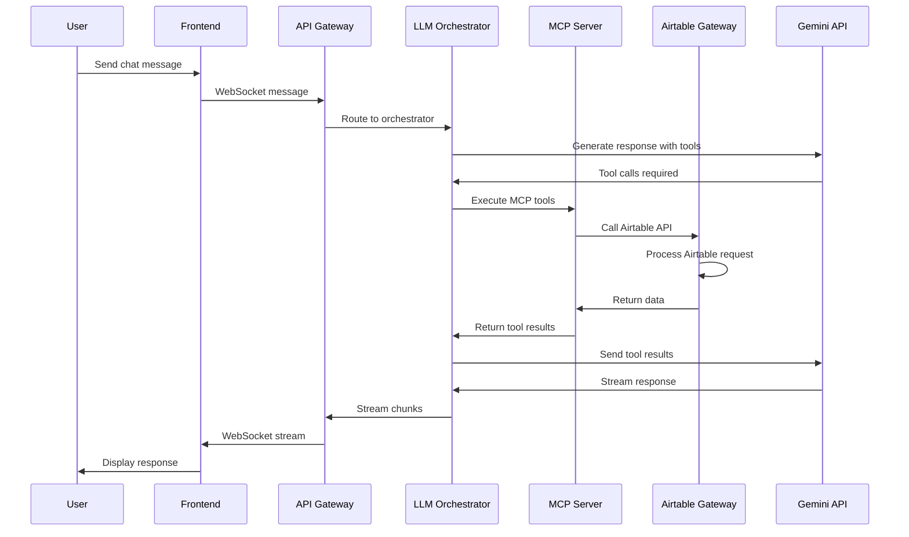
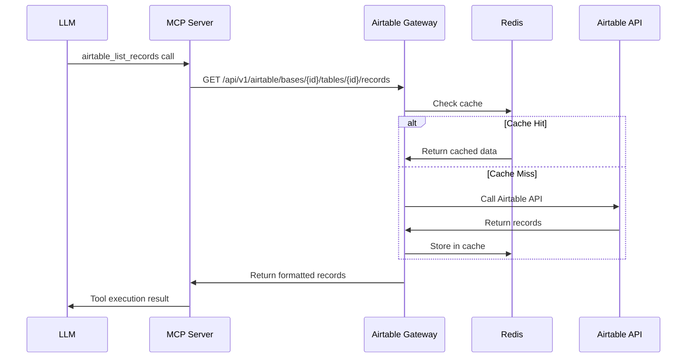

# Sprint 2 Integration Architecture
## PyAirtable Compose - Core Feature Integration

**Version:** 2.0.0  
**Date:** August 9, 2025  
**Sprint:** 2 (P0 Core Features)  
**Author:** Solutions Architect  

---

## Executive Summary

Sprint 2 builds upon the solid authentication foundation from Sprint 1 to deliver three critical P0 features:
- **P0-S2-001**: Core Airtable API Integration
- **P0-S2-002**: MCP Server Tool Implementation
- **P0-S2-003**: Chat Interface Integration

This architecture document defines the integration patterns, API contracts, and implementation strategy for connecting these services into a production-ready system.

## Current System State Analysis

### Sprint 1 Foundation ✅
- **Authentication Service**: JWT-based auth via platform-services (Port 8007)
- **Database Layer**: PostgreSQL with session management and user tables
- **Frontend**: React-based tenant dashboard with Next.js (Port 3000)
- **Caching Layer**: Redis for session storage and performance optimization
- **Infrastructure**: Docker Compose orchestration with health checks

### Sprint 2 Core Services
- **API Gateway** (Port 8000): Main entry point with CORS and routing
- **Airtable Gateway** (Port 8002): Direct Airtable API integration
- **MCP Server** (Port 8001): Model Context Protocol implementation
- **LLM Orchestrator** (Port 8003): Gemini 2.5 Flash integration
- **Frontend Chat Interface**: Real-time WebSocket communication

---

## Integration Architecture Design

### 1. Service Communication Patterns

#### 1.1 Request Flow Architecture
```
┌─────────────────┐    ┌──────────────────┐    ┌─────────────────┐
│   Frontend      │    │   API Gateway    │    │  Platform       │
│   (Port 3000)   │◄──►│   (Port 8000)    │◄──►│  Services       │
│                 │    │                  │    │  (Port 8007)    │
└─────────────────┘    └──────────────────┘    └─────────────────┘
         │                       │                       │
         │ WebSocket              │ HTTP/REST             │ Auth/Analytics
         ▼                       ▼                       ▼
┌─────────────────┐    ┌──────────────────┐    ┌─────────────────┐
│ LLM Orchestrator│◄──►│  MCP Server      │◄──►│ Airtable        │
│ (Port 8003)     │    │  (Port 8001)     │    │ Gateway         │
│                 │    │                  │    │ (Port 8002)     │
└─────────────────┘    └──────────────────┘    └─────────────────┘
         │                       │                       │
         │ Gemini API             │ Tool Execution        │ Airtable API
         ▼                       ▼                       ▼
┌─────────────────┐    ┌──────────────────┐    ┌─────────────────┐
│   External      │    │   Redis Cache    │    │   PostgreSQL    │
│   Gemini API    │    │   (Port 6379)    │    │   (Port 5432)   │
└─────────────────┘    └──────────────────┘    └─────────────────┘
```

#### 1.2 Data Flow Patterns

**Chat Message Flow:**
1. User sends message via WebSocket from Frontend
2. API Gateway routes to LLM Orchestrator
3. LLM Orchestrator calls MCP Server for tool execution
4. MCP Server calls Airtable Gateway for data operations
5. Response streams back through WebSocket to Frontend

**Authentication Flow:**
1. All services validate JWT tokens via Platform Services
2. Session state maintained in Redis with PostgreSQL persistence
3. API Gateway enforces authentication middleware

### 2. API Endpoint Specifications

#### 2.1 API Gateway Endpoints (Port 8000)
```typescript
// Core routing endpoints
GET    /api/health              // System health check
POST   /api/auth/validate       // JWT token validation
WS     /ws                      // WebSocket connection for real-time

// Proxy endpoints to services
GET    /api/airtable/*          // Proxy to Airtable Gateway
POST   /api/mcp/*              // Proxy to MCP Server
POST   /api/chat/*             // Proxy to LLM Orchestrator
GET    /api/platform/*         // Proxy to Platform Services
```

#### 2.2 Airtable Gateway Endpoints (Port 8002)
```typescript
// Base Management
GET    /api/v1/airtable/bases                    // List accessible bases
GET    /api/v1/airtable/bases/{base_id}/schema   // Get base schema

// Record Operations
GET    /api/v1/airtable/bases/{base_id}/tables/{table_id}/records
POST   /api/v1/airtable/bases/{base_id}/tables/{table_id}/records
PATCH  /api/v1/airtable/bases/{base_id}/tables/{table_id}/records
PUT    /api/v1/airtable/bases/{base_id}/tables/{table_id}/records
DELETE /api/v1/airtable/bases/{base_id}/tables/{table_id}/records

// Compatibility endpoints
GET    /api/v1/tables          // List tables (requires base_id param)
GET    /api/v1/records         // List records (requires base_id, table_id)
POST   /api/v1/records         // Create records
PUT    /api/v1/records/{id}    // Update single record
DELETE /api/v1/records/{id}    // Delete single record

// Cache Management
POST   /api/v1/airtable/cache/invalidate  // Clear cache
```

#### 2.3 MCP Server Endpoints (Port 8001)
```typescript
// Tool Management
GET    /api/v1/info            // Service info and available tools
GET    /mcp/status            // MCP protocol status

// Tool Execution (HTTP wrapper for MCP protocol)
POST   /mcp/execute           // Execute MCP tool
POST   /mcp/batch             // Execute multiple tools

// Available Tools:
// - airtable_list_bases
// - airtable_get_schema
// - airtable_list_records
// - airtable_get_record
// - airtable_create_records
// - airtable_update_records
// - airtable_delete_records
// - calculate
// - search
// - query_database
```

#### 2.4 LLM Orchestrator Endpoints (Port 8003)
```typescript
// Chat Interface
POST   /chat/message          // Send chat message
POST   /chat/stream           // Stream chat response
GET    /chat/history         // Get conversation history

// Session Management
POST   /sessions             // Create new session
GET    /sessions/{id}        // Get session details
DELETE /sessions/{id}        // End session

// Analysis Workflows
POST   /workflow/analyze     // Run table analysis
GET    /workflow/status      // Check workflow status
```

### 3. WebSocket Integration for Real-time Chat

#### 3.1 WebSocket Event Schema
```typescript
// Client to Server Events
interface ChatMessageEvent {
  type: "chat.message"
  data: {
    id: string
    content: string
    role: "user"
    metadata: {
      sessionId: string
      timestamp: number
    }
  }
}

// Server to Client Events
interface ChatStreamEvent {
  type: "chat.stream"
  data: {
    messageId: string
    chunk: string
    isComplete: boolean
    metadata?: Record<string, any>
  }
}

interface ChatMessageCompleteEvent {
  type: "chat.message"
  data: {
    id: string
    content: string
    role: "assistant"
    status: "completed" | "error"
    metadata?: Record<string, any>
  }
  timestamp: number
}
```

#### 3.2 Connection Management
- **Primary Transport**: WebSocket with Server-Sent Events fallback
- **Authentication**: JWT token validation on connection
- **Heartbeat**: 30-second ping/pong for connection health
- **Reconnection**: Exponential backoff with max 5 retries
- **Message Persistence**: All messages stored in PostgreSQL

### 4. Airtable CRUD Operations with MCP Tools

#### 4.1 Tool Mapping Architecture
```typescript
// MCP Tool to Airtable Gateway mapping
const TOOL_MAPPINGS = {
  airtable_list_bases: {
    method: "GET",
    endpoint: "/api/v1/airtable/bases",
    requiresAuth: true
  },
  airtable_get_schema: {
    method: "GET", 
    endpoint: "/api/v1/airtable/bases/{base_id}/schema",
    requiresAuth: true,
    parameters: ["base_id"]
  },
  airtable_list_records: {
    method: "GET",
    endpoint: "/api/v1/airtable/bases/{base_id}/tables/{table_id}/records",
    requiresAuth: true,
    parameters: ["base_id", "table_id"],
    optional: ["view", "max_records", "filter_by_formula", "sort"]
  },
  // ... other tools
}
```

#### 4.2 Tool Execution Flow
1. **LLM Request**: AI determines which tools to call
2. **MCP Processing**: MCP Server validates and formats tool calls
3. **Gateway Routing**: Tool calls routed to Airtable Gateway
4. **Airtable API**: Direct calls to Airtable REST API
5. **Response Processing**: Results formatted and returned to AI
6. **Stream Response**: AI generates response streamed to frontend

#### 4.3 Error Handling Strategy
```typescript
interface ToolError {
  code: string
  message: string
  details?: Record<string, any>
  retryable: boolean
}

// Error categories:
// - RATE_LIMIT_EXCEEDED (retryable: true)
// - INVALID_CREDENTIALS (retryable: false)  
// - RECORD_NOT_FOUND (retryable: false)
// - NETWORK_ERROR (retryable: true)
// - VALIDATION_ERROR (retryable: false)
```

### 5. Security Integration

#### 5.1 Authentication Flow
```typescript
// JWT Token Validation Middleware
export interface AuthContext {
  userId: string
  sessionId: string
  tenantId?: string
  permissions: string[]
  tokenExpiry: number
}

// Applied to all protected endpoints
const authMiddleware = async (req: Request): Promise<AuthContext> => {
  const token = extractJWTToken(req)
  return await validateWithPlatformServices(token)
}
```

#### 5.2 API Key Management
- **Internal Services**: Shared API keys for service-to-service communication
- **External APIs**: Secure storage of Airtable tokens in environment variables
- **Rate Limiting**: Per-user and per-service rate limits
- **Audit Logging**: All API calls logged to `api_usage_logs` table

### 6. Performance & Caching Strategy

#### 6.1 Multi-level Caching
```typescript
// Redis Caching Strategy
interface CacheConfig {
  airtableSchemas: { ttl: 300, key: "schema:{base_id}" }
  airtableRecords: { ttl: 60, key: "records:{base_id}:{table_id}:{hash}" }
  sessionData: { ttl: 3600, key: "session:{session_id}" }
  userProfiles: { ttl: 1800, key: "user:{user_id}" }
}

// Cache invalidation triggers:
// - Manual via /api/v1/airtable/cache/invalidate
// - Automatic on data modifications
// - TTL expiration
```

#### 6.2 Performance Optimizations
- **Connection Pooling**: Database and Redis connection pools
- **Async Processing**: Non-blocking I/O for all service calls
- **Request Batching**: Combine multiple Airtable operations where possible
- **Response Compression**: Gzip compression for large responses

### 7. Testing Strategy

#### 7.1 Integration Testing Approach
```typescript
// Test Categories
interface TestSuite {
  unit: {
    services: ["airtable-gateway", "mcp-server", "llm-orchestrator"]
    coverage: ">90%"
  }
  integration: {
    serviceToService: "API contract validation"
    endToEnd: "Full user workflow testing"
    websocket: "Real-time communication testing"  
  }
  load: {
    concurrent: "100 concurrent users"
    throughput: "1000 requests/minute"
    reliability: "99.9% uptime"
  }
}
```

#### 7.2 Test Implementation Plan
1. **Mock Services**: Docker containers with test Airtable data
2. **API Contract Testing**: OpenAPI specification validation
3. **WebSocket Testing**: Connection stability and message ordering
4. **Error Scenario Testing**: Network failures, timeout handling
5. **Performance Testing**: Load testing with realistic data volumes

---

## Implementation Tasks by Agent

### Frontend Agent Tasks
- [ ] **F2-001**: Implement WebSocket connection management in chat interface
- [ ] **F2-002**: Add real-time message streaming with typing indicators
- [ ] **F2-003**: Implement connection state management and fallback to HTTP
- [ ] **F2-004**: Add message persistence and offline queue functionality
- [ ] **F2-005**: Create error handling UI for connection and API failures

### Backend Agent Tasks  
- [ ] **B2-001**: Configure API Gateway routing and proxy middleware
- [ ] **B2-002**: Implement WebSocket server with authentication
- [ ] **B2-003**: Add request/response logging and metrics collection
- [ ] **B2-004**: Configure Redis caching for all service layers
- [ ] **B2-005**: Implement health check aggregation across services

### Integration Agent Tasks
- [ ] **I2-001**: Set up service discovery and load balancing
- [ ] **I2-002**: Configure cross-service authentication with JWT validation
- [ ] **I2-003**: Implement circuit breaker patterns for external dependencies
- [ ] **I2-004**: Set up distributed tracing across service boundaries
- [ ] **I2-005**: Create end-to-end integration test suite

### AI Agent Tasks
- [ ] **A2-001**: Integrate MCP tool execution with Airtable Gateway
- [ ] **A2-002**: Implement streaming response generation for chat
- [ ] **A2-003**: Add conversation context management and memory
- [ ] **A2-004**: Create error recovery and retry logic for tool calls
- [ ] **A2-005**: Implement usage tracking and cost monitoring

---

## API Contracts & Data Schemas

### 1. Chat Message Schema
```typescript
interface ChatMessage {
  id: string                    // Unique message identifier
  sessionId: string            // Conversation session ID
  role: "user" | "assistant"   // Message sender
  content: string              // Message content
  timestamp: number            // Unix timestamp
  status: "pending" | "streaming" | "completed" | "error"
  metadata?: {
    toolsUsed?: string[]       // MCP tools called
    tokenCount?: number        // LLM token usage
    cost?: string              // API cost
    responseTime?: number      // Processing time
  }
}
```

### 2. MCP Tool Call Schema
```typescript
interface MCPToolCall {
  id: string                   // Call identifier
  tool: string                 // Tool name
  arguments: Record<string, any> // Tool parameters
  timestamp: number            // Call timestamp
}

interface MCPToolResult {
  callId: string               // Matching call ID
  tool: string                 // Tool name
  result?: any                 // Success result
  error?: {                    // Error details
    code: string
    message: string
    retryable: boolean
  }
  durationMs: number           // Execution time
}
```

### 3. Airtable Data Schema
```typescript
interface AirtableRecord {
  id: string                   // Record ID
  fields: Record<string, any>  // Field data
  createdTime?: string         // Creation timestamp
}

interface AirtableSchema {
  tables: Array<{
    id: string                 // Table ID
    name: string               // Table name
    fields: Array<{
      id: string               // Field ID
      name: string             // Field name
      type: string             // Field type
      options?: any            // Field configuration
    }>
  }>
}
```

---

## Sequence Diagrams

### 1. User Chat Message Flow


### 2. Airtable Record CRUD Flow


---

## Production Deployment Considerations

### 1. Environment Configuration
```yaml
# Production environment variables
API_GATEWAY_REPLICAS: 3
AIRTABLE_GATEWAY_REPLICAS: 2
MCP_SERVER_REPLICAS: 2
LLM_ORCHESTRATOR_REPLICAS: 2

# Resource limits
CONTAINER_MEMORY_LIMIT: "512Mi"
CONTAINER_CPU_LIMIT: "500m"

# Monitoring
ENABLE_METRICS: true
ENABLE_TRACING: true
LOG_LEVEL: "info"
```

### 2. Scaling Strategy
- **Horizontal Scaling**: Stateless services with load balancing
- **Vertical Scaling**: Resource limits with auto-scaling triggers
- **Database Scaling**: Read replicas for PostgreSQL
- **Cache Scaling**: Redis cluster for high availability

### 3. Monitoring & Observability
- **Health Checks**: All services expose `/health` endpoints
- **Metrics**: Prometheus metrics for performance monitoring
- **Logging**: Structured JSON logging with correlation IDs
- **Tracing**: Distributed tracing for request flows
- **Alerting**: Critical alerts for service failures and performance issues

---

## Success Metrics

### Technical KPIs
- **Response Time**: <500ms for API calls, <100ms for cached data
- **Availability**: 99.9% uptime for all services
- **Throughput**: Support 1000+ concurrent chat sessions
- **Error Rate**: <1% error rate for all API endpoints

### User Experience KPIs  
- **Chat Response Time**: <2 seconds for simple queries
- **Tool Execution**: <5 seconds for complex Airtable operations
- **WebSocket Stability**: <0.1% connection drop rate
- **Message Delivery**: 100% message delivery guarantee

### Business KPIs
- **Feature Adoption**: >80% of users try chat interface
- **Query Success Rate**: >95% of chat queries successful
- **Cost Efficiency**: <$0.05 per successful interaction
- **User Satisfaction**: >4.5/5 user rating for chat experience

---

## Risk Mitigation

### 1. Technical Risks
- **Airtable API Limits**: Implement rate limiting and request queuing
- **WebSocket Scaling**: Use sticky sessions and horizontal pod autoscaling
- **External Dependencies**: Circuit breakers and fallback mechanisms
- **Data Consistency**: Implement eventual consistency patterns

### 2. Operational Risks
- **Service Dependencies**: Health checks and dependency mapping  
- **Configuration Drift**: Infrastructure as Code with version control
- **Security Vulnerabilities**: Regular security audits and dependency updates
- **Performance Degradation**: Proactive monitoring and auto-scaling

### 3. Business Risks
- **User Experience**: Comprehensive testing and gradual rollout
- **Cost Overruns**: Usage monitoring and budget alerts
- **Compliance**: Data privacy and security compliance validation
- **Vendor Lock-in**: Abstract external APIs behind internal interfaces

---

## Conclusion

This Sprint 2 integration architecture provides a comprehensive foundation for connecting the PyAirtable system's core services. The design emphasizes:

1. **Scalability**: Stateless services with horizontal scaling capabilities
2. **Reliability**: Circuit breakers, retries, and fallback mechanisms  
3. **Performance**: Multi-level caching and async processing
4. **Security**: JWT authentication and comprehensive audit logging
5. **Maintainability**: Clear API contracts and comprehensive testing

The architecture supports the three P0 requirements while maintaining the flexibility to extend functionality in future sprints. Implementation should follow the defined task breakdown to ensure systematic delivery and integration validation.

**Next Steps**: Begin implementation with Backend Agent tasks for API Gateway setup, followed by Frontend Agent WebSocket integration, and conclude with comprehensive integration testing across all services.