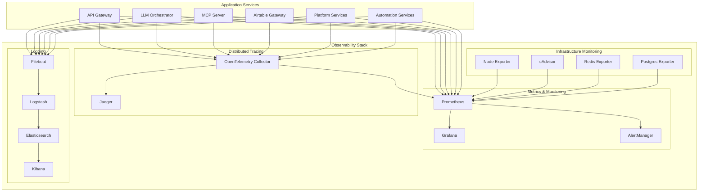

# PyAirtable Platform Observability Foundation

## Overview

This document describes the comprehensive observability infrastructure implemented for the PyAirtable platform, providing monitoring, logging, tracing, and alerting capabilities optimized for cloud-native operations and cost efficiency.

## Architecture

### Core Components



## Features

### 1. Metrics Collection & Monitoring
- **Prometheus**: Time-series metrics collection with service discovery
- **Grafana**: Rich visualization dashboards with business metrics
- **Cost-aware sampling**: Intelligent sampling to optimize observability costs
- **Infrastructure monitoring**: System, container, and database metrics

### 2. Distributed Tracing
- **OpenTelemetry**: Comprehensive instrumentation for Go and Python services
- **Jaeger**: Distributed tracing backend with UI
- **Context propagation**: End-to-end request tracing across services
- **Performance insights**: Latency analysis and bottleneck identification

### 3. Log Aggregation & Analysis
- **ELK Stack**: Elasticsearch, Logstash, Kibana for log processing
- **Filebeat**: Log shipping from Docker containers
- **Structured logging**: JSON-based logs with business context
- **Security event detection**: Automated threat identification

### 4. Alerting & Notification
- **AlertManager**: Intelligent alert routing and suppression
- **Multi-channel notifications**: Email, Slack, PagerDuty integration
- **Cost optimization alerts**: Proactive cost management notifications
- **Business metrics alerts**: KPI monitoring and alerting

## Quick Start

### 1. Deploy Observability Stack

```bash
# Make deployment script executable
chmod +x scripts/deploy-observability.sh

# Deploy the complete observability stack
./scripts/deploy-observability.sh
```

### 2. Access Services

| Service | URL | Credentials |
|---------|-----|-------------|
| Prometheus | http://localhost:9090 | - |
| Grafana | http://localhost:3001 | admin/admin123 |
| Jaeger UI | http://localhost:16686 | - |
| Kibana | http://localhost:5601 | - |
| Elasticsearch | http://localhost:9200 | - |
| AlertManager | http://localhost:9093 | - |

### 3. Configure Application Services

#### Go Services (Fiber)

```go
package main

import (
    "context"
    "log"
    
    "github.com/gofiber/fiber/v2"
    "your-project/pkg/telemetry"
)

func main() {
    // Initialize telemetry
    config := telemetry.NewConfig("api-gateway")
    config.ServiceTier = "gateway"
    config.Environment = "production"
    
    telemetryProvider, err := telemetry.InitializeTracing(config, logger)
    if err != nil {
        log.Fatal(err)
    }
    defer telemetryProvider.Shutdown(context.Background())
    
    // Create Fiber app
    app := fiber.New()
    
    // Add tracing middleware
    tracingConfig := telemetry.DefaultFiberTracingConfig("api-gateway", "gateway")
    app.Use(telemetry.FiberTracing(tracingConfig))
    
    // Your routes here
    app.Get("/health", healthHandler)
    
    app.Listen(":8000")
}
```

#### Python Services (FastAPI)

```python
from fastapi import FastAPI
from python_services.shared.telemetry import initialize_telemetry

# Initialize telemetry
tracer = initialize_telemetry(
    service_name="llm-orchestrator",
    service_version="1.0.0",
    service_tier="ai-ml"
)

app = FastAPI()

@app.get("/health")
async def health():
    return {"status": "healthy"}

if __name__ == "__main__":
    import uvicorn
    uvicorn.run(app, host="0.0.0.0", port=8003)
```

## Configuration

### Environment Variables

Key environment variables for observability configuration:

```bash
# OpenTelemetry Configuration
OTEL_EXPORTER_OTLP_ENDPOINT=http://otel-collector:4317
OTEL_SAMPLING_RATIO=0.1
OTEL_DEBUG=false

# Service Configuration
SERVICE_NAME=your-service-name
SERVICE_VERSION=1.0.0
SERVICE_TIER=application
ENVIRONMENT=production

# Alerting Configuration
SLACK_WEBHOOK_URL=https://hooks.slack.com/...
PAGERDUTY_SERVICE_KEY=your-key
CRITICAL_EMAIL=ops@company.com
```

### Docker Labels

Add these labels to your service containers for automatic discovery:

```yaml
services:
  your-service:
    image: your-service:latest
    labels:
      - "prometheus.scrape=true"
      - "prometheus.port=8080"
      - "prometheus.path=/metrics"
      - "service=your-service"
      - "tier=application"
      - "version=1.0.0"
```

## Cost Optimization

### 1. Sampling Configuration

The observability stack implements cost-aware sampling:

- **Development**: 100% sampling for full visibility
- **Production**: 10% default sampling with intelligent overrides
- **Error traces**: Always sampled regardless of ratio
- **Slow requests**: Always sampled (>2s response time)

### 2. Data Retention

Optimized retention policies to balance cost and compliance:

- **Metrics**: 15 days (configurable)
- **Traces**: 7 days with sampling
- **Logs**: 90 days with lifecycle management
- **Alerts**: 30 days history

### 3. Resource Limits

All services have resource limits configured:

```yaml
deploy:
  resources:
    limits:
      memory: 512M
      cpus: '0.5'
    reservations:
      memory: 256M
      cpus: '0.25'
```

## Monitoring Dashboards

### Pre-built Dashboards

1. **Platform Overview**: Service health, request rates, error rates
2. **Infrastructure**: CPU, memory, disk, network metrics
3. **Cost Tracking**: Resource utilization and cost projections
4. **AI/ML Metrics**: Token usage, model costs, performance
5. **Security Events**: Authentication failures, suspicious activity

### Custom Metrics

#### Business Metrics

```go
// Go service example
span.SetAttributes(
    attribute.String("business.feature", "workflow_execution"),
    attribute.String("business.tier", "premium"),
    attribute.Float64("business.value", 150.00),
)
```

```python
# Python service example
add_business_attributes(
    span,
    user_id="user_123",
    tenant_id="tenant_456",
    cost_center="ai-ml"
)
```

## Alerting Rules

### Critical Alerts

- **ServiceDown**: Immediate notification via PagerDuty
- **HighErrorRate**: >10% error rate for 2 minutes
- **DatabaseIssues**: Connection failures, slow queries
- **SecurityEvents**: Authentication failures, suspicious activity

### Cost Optimization Alerts

- **UnusedService**: No traffic for 1+ hours
- **HighAICosts**: AI API costs trending high
- **InefficientResources**: High CPU with low traffic

### Business Alerts

- **LowUserEngagement**: Session rate below threshold
- **WorkflowFailures**: High automation failure rate

## Troubleshooting

### Common Issues

#### 1. Services Not Appearing in Prometheus

Check service labels and network connectivity:

```bash
# Verify service is accessible
curl http://your-service:port/metrics

# Check Prometheus targets
curl http://localhost:9090/api/v1/targets
```

#### 2. No Traces in Jaeger

Verify OpenTelemetry configuration:

```bash
# Check OTLP collector logs
docker-compose logs otel-collector

# Verify service can reach collector
telnet otel-collector 4317
```

#### 3. Missing Logs in Kibana

Check Filebeat and Logstash:

```bash
# Check Filebeat logs
docker-compose logs filebeat

# Check Logstash processing
docker-compose logs logstash

# Verify Elasticsearch indices
curl http://localhost:9200/_cat/indices
```

### Health Checks

Quick health check commands:

```bash
# Check all services
docker-compose -f docker-compose.observability.yml ps

# Check service health endpoints
curl http://localhost:9090/-/healthy  # Prometheus
curl http://localhost:3001/api/health # Grafana
curl http://localhost:16686/         # Jaeger
curl http://localhost:5601/api/status # Kibana
```

## Migration to Kubernetes

The observability stack is designed for easy migration to Kubernetes:

### 1. Helm Charts

```bash
# Install monitoring stack
helm repo add prometheus-community https://prometheus-community.github.io/helm-charts
helm install prometheus prometheus-community/kube-prometheus-stack

# Install tracing
helm repo add jaegertracing https://jaegertracing.github.io/helm-charts
helm install jaeger jaegertracing/jaeger
```

### 2. Service Mesh Integration

For enhanced observability with Istio:

```yaml
apiVersion: install.istio.io/v1alpha1
kind: IstioOperator
metadata:
  name: observability
spec:
  values:
    telemetry:
      v2:
        prometheus:
          configOverride:
            metric_relabeling_configs:
              - source_labels: [__name__]
                regex: 'istio_.*'
                action: keep
```

## Security Considerations

### 1. Network Security

- All observability services run in isolated networks
- No external access to sensitive metrics endpoints
- TLS encryption for production deployments

### 2. Data Privacy

- Sensitive data masked in logs and traces
- API keys and tokens are hashed for tracking
- GDPR-compliant data retention policies

### 3. Access Control

Production deployment should include:

```yaml
# Grafana with OAuth
grafana:
  auth:
    github:
      enabled: true
      client_id: your_github_client_id
      client_secret: your_github_client_secret
```

## Performance Tuning

### 1. Elasticsearch Optimization

```yaml
elasticsearch:
  environment:
    - "ES_JAVA_OPTS=-Xms2g -Xmx2g"
    - "discovery.type=single-node"
    - "index.number_of_replicas=0"
```

### 2. Prometheus Configuration

```yaml
prometheus:
  global:
    scrape_interval: 15s
    evaluation_interval: 15s
  rule_files:
    - "alert_rules.yml"
  storage:
    tsdb:
      retention.time: 15d
      retention.size: 10GB
```

## Support and Maintenance

### Backup Strategy

```bash
# Backup Prometheus data
docker run --rm -v prometheus-data:/data -v $(pwd):/backup alpine tar czf /backup/prometheus-backup.tar.gz /data

# Backup Grafana dashboards
curl -H "Authorization: Bearer $GRAFANA_API_KEY" http://localhost:3001/api/search | jq -r '.[] | .uid' | xargs -I {} curl -H "Authorization: Bearer $GRAFANA_API_KEY" http://localhost:3001/api/dashboards/uid/{} > dashboards-backup.json
```

### Log Rotation

Automated log rotation is configured via Docker Compose:

```yaml
logging:
  driver: "json-file"
  options:
    max-size: "10m"
    max-file: "3"
```

### Updates and Maintenance

Regular maintenance tasks:

1. **Weekly**: Review cost optimization alerts
2. **Monthly**: Update observability stack components
3. **Quarterly**: Review and update alert thresholds
4. **Annually**: Audit data retention policies

---

For additional support, please refer to:
- [Prometheus Documentation](https://prometheus.io/docs/)
- [Grafana Documentation](https://grafana.com/docs/)
- [OpenTelemetry Documentation](https://opentelemetry.io/docs/)
- [Elastic Stack Documentation](https://www.elastic.co/guide/)

## Estimated Monthly Costs

### Development Environment
- **Compute**: ~$50/month (4 vCPU, 8GB RAM)
- **Storage**: ~$20/month (200GB)
- **Total**: ~$70/month

### Production Environment
- **Compute**: ~$200/month (8 vCPU, 16GB RAM)
- **Storage**: ~$100/month (1TB)
- **Alerting**: ~$50/month (PagerDuty, email)
- **Total**: ~$350/month

### Cost Optimization Savings
- Intelligent sampling: 40% reduction in trace storage
- Log lifecycle management: 60% reduction in log storage
- Resource right-sizing: 30% compute cost reduction
- **Total Savings**: ~$200/month in production