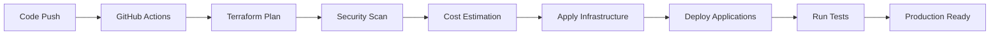

# PyAirtable AWS EKS Infrastructure

This repository contains the complete AWS EKS infrastructure setup for the PyAirtable platform, designed with cost optimization, security, and scalability in mind.

## 🏗️ Architecture Overview

The infrastructure includes:

- **Multi-AZ EKS Cluster** with auto-scaling node groups
- **Spot Instance Support** for up to 70% cost savings
- **ARM64 Nodes** for better price/performance ratio
- **Karpenter** for advanced auto-scaling and cost optimization
- **Comprehensive Monitoring** with Prometheus, Grafana, and Loki
- **Security-First Design** with pod security standards and network policies
- **GitOps-Ready** CI/CD with GitHub Actions
- **Blue/Green Deployments** for zero-downtime releases

## 📁 Directory Structure

```
infrastructure/aws-eks/
├── modules/                    # Terraform modules
│   ├── vpc/                   # VPC with public/private subnets
│   ├── security/              # Security groups and NACLs
│   ├── iam/                   # IAM roles and policies
│   ├── eks/                   # EKS cluster and node groups
│   ├── storage/               # EBS CSI, EFS, and backup strategies
│   ├── karpenter/             # Karpenter for auto-scaling
│   ├── monitoring/            # LGTM stack and CloudWatch
│   └── secrets/               # AWS Secrets Manager integration
├── environments/              # Environment-specific configurations
│   ├── dev.tfvars            # Development environment
│   ├── staging.tfvars        # Staging environment
│   └── production.tfvars     # Production environment
├── .github/workflows/         # CI/CD workflows
│   ├── terraform-deploy.yml  # Infrastructure deployment
│   └── blue-green-deploy.yml # Application deployments
├── main.tf                   # Main Terraform configuration
├── variables.tf              # Variable definitions
├── outputs.tf               # Output definitions
└── README.md                # This file
```

## 🚀 Quick Start

### Prerequisites

1. **AWS CLI** configured with appropriate permissions
2. **Terraform** >= 1.5
3. **kubectl** >= 1.28
4. **Helm** >= 3.13

### Initial Setup

1. **Clone the repository**:
   ```bash
   git clone <repository-url>
   cd infrastructure/aws-eks
   ```

2. **Create S3 backend** (first time only):
   ```bash
   # Create S3 bucket for Terraform state
   aws s3 mb s3://pyairtable-terraform-state-dev --region us-west-2
   
   # Create DynamoDB table for state locking
   aws dynamodb create-table \
     --table-name pyairtable-terraform-locks-dev \
     --attribute-definitions AttributeName=LockID,AttributeType=S \
     --key-schema AttributeName=LockID,KeyType=HASH \
     --provisioned-throughput ReadCapacityUnits=5,WriteCapacityUnits=5 \
     --region us-west-2
   ```

3. **Initialize Terraform**:
   ```bash
   terraform init
   ```

4. **Plan the deployment**:
   ```bash
   terraform plan -var-file="environments/dev.tfvars"
   ```

5. **Apply the configuration**:
   ```bash
   terraform apply -var-file="environments/dev.tfvars"
   ```

6. **Configure kubectl**:
   ```bash
   aws eks update-kubeconfig --region us-west-2 --name pyairtable-dev-eks
   ```

## 🌍 Environments

### Development Environment
- **Cost-optimized** with minimal resources
- **Spot instances** for maximum savings
- **Basic monitoring** stack
- **Simplified backup** strategy

### Staging Environment
- **Production-like** configuration
- **Mixed spot/on-demand** instances
- **Full monitoring** stack
- **Standard backup** retention

### Production Environment
- **High availability** multi-AZ setup
- **Comprehensive monitoring** and alerting
- **Enterprise security** features
- **Extended backup** retention
- **Automatic secret rotation**

## 💰 Cost Optimization Features

### 1. Spot Instances
- Up to **70% cost savings** compared to on-demand
- **Diversified allocation** strategy for reliability
- **Automatic replacement** of interrupted instances

### 2. ARM64 Nodes
- **20-40% better price/performance** ratio
- Support for **Graviton2/3** processors
- **Compatible workloads** automatically scheduled

### 3. Karpenter Auto-scaling
- **Just-in-time** node provisioning
- **Bin-packing optimization** for efficiency
- **Automatic node termination** when idle

### 4. Resource Right-sizing
- **Burstable instances** for variable workloads
- **Horizontal Pod Autoscaling** (HPA)
- **Vertical Pod Autoscaling** (VPA)

### 5. Storage Optimization
- **EBS GP3** volumes with optimal IOPS
- **EFS Intelligent Tiering** for infrequent access
- **Automated lifecycle policies** for snapshots

## 🛡️ Security Features

### Network Security
- **VPC with private subnets** for worker nodes
- **Security groups** with least privilege access
- **Network policies** for pod-to-pod communication
- **VPC Flow Logs** for network monitoring

### Pod Security
- **Pod Security Standards** enforcement
- **Service mesh** with mutual TLS
- **Container image scanning**
- **Runtime security monitoring**

### Secrets Management
- **AWS Secrets Manager** integration
- **Automatic secret rotation**
- **External Secrets Operator** for Kubernetes
- **Encryption at rest and in transit**

### Identity and Access
- **IAM Roles for Service Accounts** (IRSA)
- **RBAC** for Kubernetes access
- **AWS IAM** integration
- **Audit logging** enabled

## 📊 Monitoring and Observability

### Metrics (Prometheus + Grafana)
- **Cluster metrics** and health
- **Application performance** monitoring
- **Cost tracking** and optimization
- **Custom dashboards** and alerts

### Logging (Loki + Fluent Bit)
- **Centralized log aggregation**
- **Log filtering** and processing
- **Long-term retention** strategies
- **Log-based alerting**

### Tracing (Tempo + OpenTelemetry)
- **Distributed tracing** for microservices
- **Performance bottleneck** identification
- **Request flow** visualization
- **Error tracking** and debugging

### Alerting (AlertManager)
- **Multi-channel notifications** (Slack, email, PagerDuty)
- **Alert routing** and escalation
- **Maintenance windows** and silencing
- **Alert fatigue** prevention

## 🔄 CI/CD and Deployments

### Infrastructure CI/CD
- **Terraform validation** and security scanning
- **Cost estimation** with Infracost
- **Automated drift detection**
- **Multi-environment** deployments

### Application Deployments
- **Blue/Green deployments** for zero downtime
- **Canary releases** with automatic rollback
- **Feature flags** integration
- **Automated testing** and validation

### GitOps Workflow


## 🚨 Disaster Recovery

### Backup Strategy
- **Automated EBS snapshots** with lifecycle management
- **EFS backup** to AWS Backup vault
- **Application data backup** to S3
- **Cross-region replication** for critical data

### Recovery Procedures
- **RTO (Recovery Time Objective)**: < 4 hours
- **RPO (Recovery Point Objective)**: < 1 hour
- **Automated failover** for stateless services
- **Manual intervention** for stateful services

## 📈 Scaling Guidelines

### Horizontal Scaling
- **Karpenter** handles node scaling automatically
- **HPA** scales pods based on metrics
- **Custom metrics** for application-specific scaling
- **Predictive scaling** for known traffic patterns

### Vertical Scaling
- **VPA** recommends resource adjustments
- **Right-sizing** based on historical usage
- **Burst capacity** for temporary spikes
- **Resource quotas** to prevent resource exhaustion

## 🔧 Operations Runbooks

### Daily Operations
1. **Monitor dashboards** for anomalies
2. **Review cost reports** and optimization opportunities
3. **Check backup status** and retention policies
4. **Validate security compliance**

### Weekly Operations
1. **Review and rotate secrets** if needed
2. **Update node groups** with latest AMIs
3. **Analyze performance metrics** and trends
4. **Plan capacity** for upcoming deployments

### Monthly Operations
1. **Review and update** security policies
2. **Conduct disaster recovery** tests
3. **Optimize costs** based on usage patterns
4. **Update dependencies** and versions

## 🐛 Troubleshooting

### Common Issues

#### Node Not Ready
```bash
# Check node status
kubectl get nodes

# Describe problematic node
kubectl describe node <node-name>

# Check system pods
kubectl get pods -n kube-system
```

#### Pod Stuck in Pending
```bash
# Check pod events
kubectl describe pod <pod-name>

# Check resource availability
kubectl top nodes
kubectl top pods

# Check Karpenter logs
kubectl logs -n karpenter deployment/karpenter
```

#### High Costs
```bash
# Check Spot instance usage
kubectl get nodes -l node.kubernetes.io/instance-type

# Review Karpenter provisioning
kubectl get provisioners
kubectl describe provisioner default

# Check resource utilization
kubectl top nodes
```

### Support Contacts
- **Platform Team**: platform-team@pyairtable.com
- **On-call Engineer**: +1-XXX-XXX-XXXX
- **Slack Channel**: #infrastructure-alerts

## 📚 Additional Resources

- [AWS EKS Best Practices](https://aws.github.io/aws-eks-best-practices/)
- [Kubernetes Documentation](https://kubernetes.io/docs/)
- [Terraform AWS Provider](https://registry.terraform.io/providers/hashicorp/aws/latest/docs)
- [Karpenter Documentation](https://karpenter.sh/)
- [Prometheus Monitoring](https://prometheus.io/docs/)

## 🤝 Contributing

1. **Fork** the repository
2. **Create** a feature branch
3. **Make** your changes
4. **Test** thoroughly
5. **Submit** a pull request

### Development Guidelines
- **Use descriptive** commit messages
- **Include tests** for new features
- **Update documentation** as needed
- **Follow security** best practices

## 📄 License

This project is licensed under the MIT License - see the LICENSE file for details.

---

**Generated with Claude Code** 🤖

Co-Authored-By: Claude <noreply@anthropic.com>