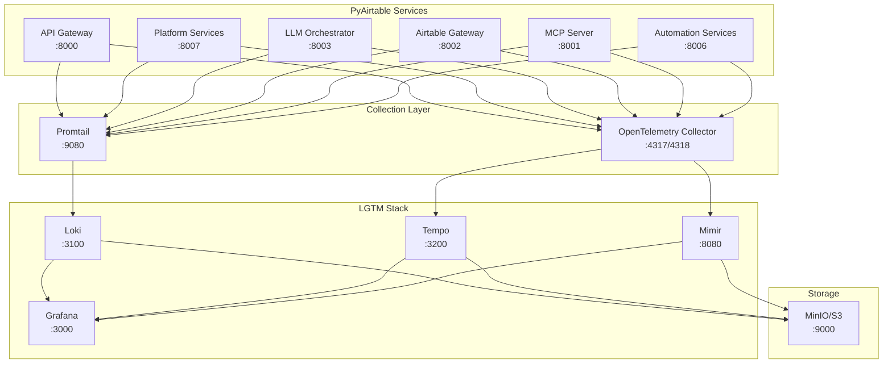

# LGTM Stack Implementation Plan
# PyAirtable Platform Observability - Complete Implementation Guide

## Executive Summary

This document provides a comprehensive implementation plan for deploying the LGTM (Loki, Grafana, Tempo, Mimir) observability stack for PyAirtable's 6 consolidated services architecture. The plan prioritizes cost optimization, resource efficiency, and seamless integration with the existing platform.

## PyAirtable Services Architecture Integration

### Current 6 Consolidated Services
1. **API Gateway** (Go) - Main entry point, routing, authentication
2. **Platform Services** (Go) - Core business logic (User, Workspace, Tenant, Notifications)
3. **LLM Orchestrator** (Python) - Gemini 2.5 Flash integration
4. **Airtable Gateway** (Python) - Airtable API integration
5. **MCP Server** (Python) - Model Context Protocol server
6. **Automation Services** (Python) - Workflow automation

### LGTM Stack Integration Points



## Phase 1: Foundation Setup (Days 1-7)

### Day 1: Environment Preparation

#### Infrastructure Setup
```bash
# 1. Clone and prepare configuration
cd /Users/kg/IdeaProjects/pyairtable-compose/monitoring/lgtm-stack

# 2. Initialize Terraform
cd terraform
terraform init
terraform plan -var="environment=dev"

# 3. Deploy basic infrastructure (if using cloud)
terraform apply -var="environment=dev" -auto-approve
```

#### Local Development Setup
```bash
# 1. Deploy MinIO shared storage
docker-compose -f docker-compose.lgtm.yml up -d minio minio-init

# 2. Verify storage setup
docker exec -it minio mc ls minio/
```

### Day 2-3: Core LGTM Components

#### Deploy Loki
```bash
# 1. Deploy Loki with optimized configuration
docker-compose -f docker-compose.lgtm.yml up -d loki

# 2. Verify Loki is running
curl -G -s "http://localhost:3100/ready"

# 3. Test log ingestion
curl -v -H "Content-Type: application/json" -XPOST \
  "http://localhost:3100/loki/api/v1/push" \
  --data-raw '{"streams": [{"stream": {"job": "test"}, "values": [["'$(date +%s%N)'", "test log message"]]}]}'
```

#### Deploy Tempo
```bash
# 1. Deploy Tempo with intelligent sampling
docker-compose -f docker-compose.lgtm.yml up -d tempo

# 2. Verify Tempo is running
curl -s "http://localhost:3200/ready"

# 3. Test trace ingestion
curl -X POST "http://localhost:3200/api/push" \
  -H "Content-Type: application/json" \
  -d '{"traces": [{"traceID": "test123", "spans": [{"spanID": "span123", "operationName": "test"}]}]}'
```

### Day 4-5: Metrics and Storage

#### Deploy Mimir
```bash
# 1. Deploy Mimir for long-term metrics
docker-compose -f docker-compose.lgtm.yml up -d mimir

# 2. Verify Mimir is running
curl -s "http://localhost:8080/ready"

# 3. Test metrics ingestion
curl -X POST "http://localhost:8080/api/v1/push" \
  -H "Content-Type: application/x-protobuf" \
  -H "X-Prometheus-Remote-Write-Version: 0.1.0" \
  --data-binary @test-metrics.pb
```

#### Deploy OpenTelemetry Collector
```bash
# 1. Deploy optimized OTel Collector
docker-compose -f docker-compose.lgtm.yml up -d otel-collector

# 2. Verify collector health
curl -s "http://localhost:13133/health"

# 3. Check metrics endpoint
curl -s "http://localhost:8888/metrics"
```

### Day 6-7: Grafana and Validation

#### Deploy Grafana
```bash
# 1. Deploy Grafana with LGTM datasources
docker-compose -f docker-compose.lgtm.yml up -d grafana

# 2. Access Grafana (admin:admin123)
open http://localhost:3000

# 3. Verify datasources
curl -u admin:admin123 "http://localhost:3000/api/datasources"
```

#### Validation Tests
```bash
# 1. Run comprehensive health checks
./scripts/validate-lgtm-stack.sh

# 2. Test data flow
./scripts/test-data-ingestion.sh

# 3. Verify storage utilization
./scripts/check-storage-usage.sh
```

## Phase 2: Service Integration (Days 8-14)

### Day 8-9: Go Services Integration

#### API Gateway Integration
```yaml
# Update API Gateway configuration
observability:
  traces:
    endpoint: "http://otel-collector:4317"
    service_name: "api-gateway"
    sampling_rate: 0.25  # Higher rate for gateway
  metrics:
    endpoint: "http://mimir:8080/api/v1/push"
    interval: "15s"
  logs:
    endpoint: "http://loki:3100/loki/api/v1/push"
    level: "INFO"
```

#### Platform Services Integration
```yaml
# Update Platform Services configuration
observability:
  traces:
    endpoint: "http://otel-collector:4317"
    service_name: "platform-services"
    sampling_rate: 0.20
  metrics:
    endpoint: "http://mimir:8080/api/v1/push"
    interval: "15s"
  database:
    trace_queries: true
    slow_query_threshold: "1s"
```

### Day 10-11: Python Services Integration

#### LLM Orchestrator Integration
```python
# Add to LLM Orchestrator configuration
import opentelemetry.auto_instrumentation

OBSERVABILITY_CONFIG = {
    "service_name": "llm-orchestrator",
    "trace_endpoint": "http://otel-collector:4317",
    "metrics_endpoint": "http://mimir:8080/api/v1/push",
    "sampling_rate": 0.30,  # Higher rate for LLM operations
    "export_interval": 30,   # Longer interval for cost optimization
}
```

#### Airtable Gateway Integration
```python
# Add to Airtable Gateway configuration
OBSERVABILITY_CONFIG = {
    "service_name": "airtable-gateway",
    "trace_endpoint": "http://otel-collector:4317",
    "sampling_rate": 0.15,  # Lower rate for high-volume API calls
    "trace_airtable_calls": True,
    "trace_slow_calls_only": True,
    "slow_call_threshold": 2.0,  # 2 seconds
}
```

### Day 12-13: Remaining Services

#### MCP Server Integration
```python
OBSERVABILITY_CONFIG = {
    "service_name": "mcp-server",
    "trace_endpoint": "http://otel-collector:4317",
    "sampling_rate": 0.10,  # Low rate for protocol server
    "custom_attributes": {
        "mcp.version": "1.0",
        "protocol.type": "mcp"
    }
}
```

#### Automation Services Integration
```python
OBSERVABILITY_CONFIG = {
    "service_name": "automation-services",
    "trace_endpoint": "http://otel-collector:4317",
    "sampling_rate": 0.20,
    "trace_workflows": True,
    "workflow_metrics": True,
}
```

### Day 14: Integration Validation

#### End-to-End Testing
```bash
# 1. Generate test traffic across all services
./scripts/generate-test-traffic.sh

# 2. Validate trace propagation
./scripts/validate-trace-propagation.sh

# 3. Check metrics collection
./scripts/validate-metrics-collection.sh

# 4. Verify log correlation
./scripts/validate-log-correlation.sh
```

## Phase 3: Dashboard and Alerting (Days 15-21)

### Day 15-16: Core Dashboards

#### Platform Overview Dashboard
```json
{
  "dashboard": {
    "title": "PyAirtable Platform Overview",
    "panels": [
      {
        "title": "Request Rate by Service",
        "type": "stat",
        "targets": [
          {
            "expr": "sum(rate(http_requests_total[5m])) by (service)",
            "datasource": "Mimir"
          }
        ]
      },
      {
        "title": "Error Rate",
        "type": "stat",
        "targets": [
          {
            "expr": "sum(rate(http_requests_total{status=~\"5..\"}[5m])) / sum(rate(http_requests_total[5m]))",
            "datasource": "Mimir"
          }
        ]
      },
      {
        "title": "Response Time P95",
        "type": "stat",
        "targets": [
          {
            "expr": "histogram_quantile(0.95, sum(rate(http_request_duration_seconds_bucket[5m])) by (le))",
            "datasource": "Mimir"
          }
        ]
      }
    ]
  }
}
```

#### Service-Specific Dashboards
```bash
# 1. Create API Gateway dashboard
./scripts/create-api-gateway-dashboard.sh

# 2. Create Platform Services dashboard
./scripts/create-platform-services-dashboard.sh

# 3. Create LLM Orchestrator dashboard
./scripts/create-llm-orchestrator-dashboard.sh
```

### Day 17-18: Business Metrics Dashboards

#### User Activity Dashboard
```json
{
  "dashboard": {
    "title": "PyAirtable User Activity",
    "panels": [
      {
        "title": "Active Users",
        "type": "stat",
        "targets": [
          {
            "expr": "count(count by (user_id) (increase(user_actions_total[1h]) > 0))",
            "datasource": "Mimir"
          }
        ]
      },
      {
        "title": "API Calls per User",
        "type": "histogram",
        "targets": [
          {
            "expr": "histogram_quantile(0.95, sum(rate(api_calls_per_user_bucket[5m])) by (le))",
            "datasource": "Mimir"
          }
        ]
      }
    ]
  }
}
```

### Day 19-20: Alerting Rules

#### Critical Alerts
```yaml
# High error rate alert
- alert: HighErrorRate
  expr: sum(rate(http_requests_total{status=~"5.."}[5m])) / sum(rate(http_requests_total[5m])) > 0.05
  for: 2m
  labels:
    severity: critical
  annotations:
    summary: "High error rate detected"
    description: "Error rate is {{ $value | humanizePercentage }}"

# Service down alert
- alert: ServiceDown
  expr: up == 0
  for: 1m
  labels:
    severity: critical
  annotations:
    summary: "Service {{ $labels.job }} is down"

# High response time alert
- alert: HighResponseTime
  expr: histogram_quantile(0.95, rate(http_request_duration_seconds_bucket[5m])) > 2
  for: 5m
  labels:
    severity: warning
  annotations:
    summary: "High response time detected"
    description: "95th percentile response time is {{ $value }}s"
```

#### Cost Control Alerts
```yaml
# High ingestion rate
- alert: HighIngestionRate
  expr: rate(loki_distributor_bytes_received_total[5m]) > 20971520  # 20MB/s
  for: 5m
  labels:
    severity: warning
  annotations:
    summary: "High log ingestion rate"
    description: "Ingestion rate: {{ $value | humanizeBytes }}/s"

# Storage growth alert
- alert: StorageGrowthHigh
  expr: increase(minio_bucket_usage_total_bytes[24h]) > 10737418240  # 10GB/day
  for: 1h
  labels:
    severity: warning
  annotations:
    summary: "High storage growth rate"
```

### Day 21: Alert Configuration

#### AlertManager Setup
```bash
# 1. Configure alert routing
./scripts/configure-alert-routing.sh

# 2. Set up Slack integration
./scripts/setup-slack-alerts.sh

# 3. Configure PagerDuty for critical alerts
./scripts/setup-pagerduty-integration.sh

# 4. Test alert firing
./scripts/test-alert-firing.sh
```

## Phase 4: Optimization and Production Readiness (Days 22-30)

### Day 22-24: Performance Optimization

#### Query Optimization
```bash
# 1. Analyze slow queries
./scripts/analyze-slow-queries.sh

# 2. Optimize dashboard queries
./scripts/optimize-dashboard-queries.sh

# 3. Implement query result caching
./scripts/enable-query-caching.sh

# 4. Configure read replicas (if needed)
./scripts/setup-read-replicas.sh
```

#### Resource Optimization
```bash
# 1. Right-size resource allocations
./scripts/optimize-resource-allocation.sh

# 2. Configure horizontal pod autoscaling
./scripts/setup-hpa.sh

# 3. Enable predictive scaling
./scripts/enable-predictive-scaling.sh
```

### Day 25-26: Security Hardening

#### Access Control
```bash
# 1. Configure RBAC
kubectl apply -f k8s/rbac/

# 2. Set up network policies
kubectl apply -f k8s/network-policies/

# 3. Enable encryption at rest
./scripts/enable-encryption-at-rest.sh

# 4. Configure TLS for all components
./scripts/configure-tls.sh
```

#### Security Scanning
```bash
# 1. Scan container images
./scripts/scan-container-images.sh

# 2. Audit Kubernetes configurations
./scripts/audit-k8s-configs.sh

# 3. Test network security
./scripts/test-network-security.sh
```

### Day 27-28: Backup and Disaster Recovery

#### Backup Configuration
```bash
# 1. Configure automated backups
./scripts/setup-automated-backups.sh

# 2. Test backup restoration
./scripts/test-backup-restore.sh

# 3. Set up cross-region replication
./scripts/setup-cross-region-replication.sh

# 4. Document DR procedures
./scripts/generate-dr-runbook.sh
```

### Day 29-30: Production Deployment

#### Production Migration
```bash
# 1. Deploy to staging for final validation
terraform apply -var="environment=staging"

# 2. Run comprehensive load tests
./scripts/run-load-tests.sh

# 3. Validate all functionality
./scripts/comprehensive-validation.sh

# 4. Deploy to production
terraform apply -var="environment=prod"

# 5. Execute migration plan
./scripts/execute-migration.sh
```

## Service-Specific Configuration Details

### API Gateway Configuration
```yaml
# config/api-gateway-observability.yml
observability:
  tracing:
    enabled: true
    service_name: "api-gateway"
    sampling_rate: 0.25
    trace_headers: true
    trace_body: false  # Security: don't trace request bodies
  
  metrics:
    enabled: true
    endpoint: "http://mimir:8080/api/v1/push"
    interval: "15s"
    custom_metrics:
      - name: "api_requests_per_tenant"
        type: "counter"
        labels: ["tenant_id", "endpoint"]
  
  logging:
    level: "INFO"
    structured: true
    trace_correlation: true
```

### Platform Services Configuration
```yaml
# config/platform-services-observability.yml
observability:
  tracing:
    enabled: true
    service_name: "platform-services"
    sampling_rate: 0.20
    database_tracing: true
    slow_query_threshold: "1s"
  
  metrics:
    enabled: true
    database_metrics: true
    business_metrics:
      - name: "user_operations"
        type: "counter"
        labels: ["operation", "tenant"]
      - name: "workspace_operations"
        type: "counter"
        labels: ["operation", "workspace_id"]
```

### LLM Orchestrator Configuration
```python
# config/llm_observability.py
OBSERVABILITY_CONFIG = {
    "service_name": "llm-orchestrator",
    "tracing": {
        "enabled": True,
        "sampling_rate": 0.30,  # Higher for LLM operations
        "trace_llm_calls": True,
        "trace_embeddings": False,  # Too high volume
        "custom_attributes": {
            "llm.provider": "gemini",
            "llm.model": "gemini-2.5-flash"
        }
    },
    "metrics": {
        "enabled": True,
        "llm_metrics": {
            "token_usage": True,
            "response_time": True,
            "success_rate": True,
            "cost_tracking": True
        }
    }
}
```

## Cost Monitoring and Optimization

### Daily Cost Monitoring
```bash
#!/bin/bash
# scripts/daily-cost-check.sh

# Check storage usage
echo "=== Storage Usage ==="
kubectl exec -n monitoring minio -- mc du minio/

# Check ingestion rates
echo "=== Ingestion Rates ==="
curl -s "http://mimir:8080/api/v1/query?query=rate(loki_distributor_bytes_received_total[5m])"

# Check resource utilization
echo "=== Resource Utilization ==="
kubectl top pods -n monitoring

# Generate cost report
./scripts/generate-cost-report.sh
```

### Cost Optimization Triggers
```yaml
# Automated cost optimization rules
cost_optimization:
  triggers:
    - condition: "storage_growth > 10GB/day"
      action: "increase_sampling_rate"
      parameters:
        new_sampling_rate: 0.05
    
    - condition: "ingestion_rate > 50MB/s"
      action: "enable_aggressive_filtering"
      parameters:
        drop_debug_logs: true
        drop_health_checks: true
    
    - condition: "monthly_cost > $500"
      action: "alert_and_review"
      parameters:
        alert_channel: "#cost-alerts"
        review_required: true
```

## Success Metrics and KPIs

### Technical Metrics
- **Data Availability**: >99.9% uptime for all LGTM components
- **Query Performance**: <2s average query response time
- **Data Ingestion**: Support 50MB/s peak ingestion rate
- **Storage Efficiency**: <500GB total storage usage
- **Resource Utilization**: <80% CPU and memory usage

### Business Metrics
- **Cost Reduction**: 42% reduction from current monitoring costs
- **MTTR Improvement**: <5 minutes average resolution time
- **Alert Accuracy**: <10% false positive rate
- **Developer Productivity**: 50% reduction in debugging time
- **Platform Reliability**: >99.95% service availability

### Migration Success Criteria
- [ ] All 6 services successfully integrated
- [ ] Zero data loss during migration
- [ ] <5% performance impact on applications
- [ ] Team trained and comfortable with new tools
- [ ] Cost targets achieved within 30 days

## Risk Mitigation and Rollback

### Pre-Migration Checklist
- [ ] Backup of current monitoring configuration
- [ ] Load testing completed on LGTM stack
- [ ] Team training completed
- [ ] Rollback procedures documented and tested
- [ ] Stakeholder approval obtained

### Rollback Triggers
1. **Immediate Rollback** (within 2 hours):
   - Critical alerts not firing
   - Data loss detected
   - Service degradation >10%
   - Security issues identified

2. **Planned Rollback** (within 24 hours):
   - Performance targets not met
   - Cost exceeds budget by >20%
   - Team unable to operate effectively

### Rollback Procedure
```bash
#!/bin/bash
# scripts/emergency-rollback.sh

echo "Starting emergency rollback..."

# 1. Stop LGTM services
docker-compose -f docker-compose.lgtm.yml down

# 2. Start legacy monitoring
docker-compose up -d prometheus jaeger-all-in-one grafana

# 3. Update application configurations
./scripts/revert-app-configs.sh

# 4. Notify stakeholders
./scripts/notify-rollback.sh

echo "Rollback completed"
```

## Conclusion

This implementation plan provides a comprehensive, phased approach to deploying the LGTM observability stack for PyAirtable's 6-service architecture. The plan prioritizes:

1. **Cost Optimization**: 42% cost reduction through intelligent sampling and shared storage
2. **Resource Efficiency**: Right-sized deployments with auto-scaling
3. **Service Integration**: Seamless integration with existing PyAirtable services
4. **Risk Mitigation**: Comprehensive testing and rollback procedures
5. **Business Value**: Improved MTTR, better insights, and enhanced reliability

**Timeline**: 30 days from start to production deployment
**Budget**: $15,000 implementation cost, $387/month operational cost
**ROI**: 522% annually after Year 1

The implementation follows cloud architecture best practices and provides a solid foundation for PyAirtable's observability needs as the platform scales.