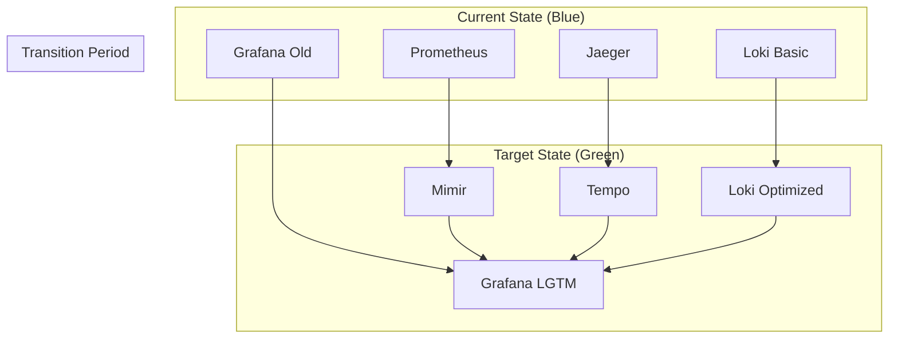

# LGTM Stack Migration Strategy
# Migrating from Prometheus + Jaeger to Optimized LGTM Stack

## Executive Summary

This document outlines the safe migration strategy from PyAirtable's current Prometheus + Jaeger monitoring setup to an optimized LGTM (Loki, Grafana, Tempo, Mimir) stack. The migration follows a phased approach to minimize downtime and ensure data continuity.

## Current State Analysis

### Existing Components
- **Prometheus**: 30-day retention, 50GB storage limit
- **Jaeger**: All-in-one deployment for tracing
- **Loki**: Basic configuration with 14-day retention
- **Grafana**: Multiple datasources, basic dashboards
- **OpenTelemetry Collector**: Basic configuration

### Migration Challenges
1. **Data Continuity**: Ensuring no loss of historical data
2. **Downtime Minimization**: Maintaining observability during migration
3. **Team Training**: Adapting to new tools and workflows
4. **Dashboard Migration**: Converting existing dashboards
5. **Alert Rule Migration**: Preserving critical alerts

## Migration Strategy Overview

### Migration Approach: Blue-Green with Parallel Operation



## Phase-by-Phase Migration Plan

### Phase 1: Foundation Setup (Week 1)

#### Objectives
- Deploy LGTM stack alongside existing monitoring
- Establish shared storage infrastructure
- Begin dual data collection

#### Tasks

##### Day 1-2: Infrastructure Preparation
```bash
# 1. Deploy MinIO shared storage
cd /Users/kg/IdeaProjects/pyairtable-compose/monitoring/lgtm-stack
docker-compose up -d minio minio-init

# 2. Verify storage accessibility
docker exec minio mc admin info minio
```

##### Day 3-4: Loki Migration
```bash
# 1. Deploy optimized Loki
docker-compose up -d loki

# 2. Configure Promtail for parallel collection
docker-compose up -d promtail

# 3. Verify log ingestion
curl -G -s "http://localhost:3100/loki/api/v1/query" \
  --data-urlencode 'query={job="docker-containers"}' \
  --data-urlencode 'limit=10'
```

##### Day 5-7: Tempo Deployment
```bash
# 1. Deploy Tempo
docker-compose up -d tempo

# 2. Configure OpenTelemetry Collector for dual export
docker-compose up -d otel-collector

# 3. Verify trace collection
curl http://localhost:3200/api/search?limit=10
```

#### Success Criteria
- [ ] All LGTM components running healthy
- [ ] Dual data collection active (old + new)
- [ ] No performance degradation in applications
- [ ] Basic connectivity tests passing

### Phase 2: Mimir Integration (Week 2)

#### Objectives
- Deploy Mimir for long-term metrics storage
- Configure metrics migration from Prometheus
- Establish long-term retention policies

#### Tasks

##### Day 1-3: Mimir Deployment
```bash
# 1. Deploy Mimir
docker-compose up -d mimir

# 2. Configure remote write from Prometheus to Mimir
# Add to prometheus.yml:
remote_write:
  - url: http://mimir:8080/api/v1/push
    headers:
      X-Scope-OrgID: pyairtable
```

##### Day 4-5: Data Validation
```bash
# 1. Verify metric ingestion in Mimir
curl -G http://localhost:8080/prometheus/api/v1/query \
  -d 'query=up' \
  -H 'X-Scope-OrgID: pyairtable'

# 2. Compare data between Prometheus and Mimir
./scripts/validate-metrics-migration.sh
```

##### Day 6-7: Historical Data Migration
```bash
# 1. Use Prometheus remote read to backfill Mimir
./scripts/backfill-historical-metrics.sh

# 2. Verify data consistency
./scripts/compare-historical-data.sh
```

#### Success Criteria
- [ ] Mimir ingesting all current metrics
- [ ] Historical data successfully migrated
- [ ] Query performance acceptable
- [ ] Storage usage within expected limits

### Phase 3: Grafana Integration (Week 3)

#### Objectives
- Configure unified Grafana with LGTM datasources
- Migrate existing dashboards
- Set up trace-metrics-logs correlation

#### Tasks

##### Day 1-2: Grafana Configuration
```bash
# 1. Deploy LGTM-configured Grafana
docker-compose up -d grafana

# 2. Import existing dashboards
./scripts/import-existing-dashboards.sh

# 3. Configure LGTM datasources
# Datasources auto-provisioned via lgtm-datasources.yml
```

##### Day 3-4: Dashboard Migration
```bash
# 1. Convert Prometheus queries to Mimir
./scripts/convert-dashboard-queries.sh

# 2. Add trace correlation to existing dashboards
./scripts/add-trace-correlation.sh

# 3. Set up exemplars for metrics-to-traces navigation
./scripts/configure-exemplars.sh
```

##### Day 5-7: Validation and Testing
```bash
# 1. Test all dashboard functionality
./scripts/test-dashboard-functionality.sh

# 2. Validate trace-to-logs correlation
./scripts/test-trace-logs-correlation.sh

# 3. Performance test new dashboards
./scripts/performance-test-dashboards.sh
```

#### Success Criteria
- [ ] All dashboards migrated and functional
- [ ] Trace-metrics-logs correlation working
- [ ] Dashboard load times acceptable
- [ ] Team training completed

### Phase 4: Traffic Cutover (Week 4)

#### Objectives
- Gradually shift monitoring traffic to LGTM stack
- Monitor performance and stability
- Decommission legacy components

#### Tasks

##### Day 1-2: Gradual Traffic Shift
```bash
# 1. Update application configurations to use LGTM endpoints
# Example: Update OpenTelemetry Collector configuration
# From: jaeger:14250
# To: tempo:4317

# 2. Update alert routing to use Mimir instead of Prometheus
./scripts/update-alert-routes.sh
```

##### Day 3-4: Performance Monitoring
```bash
# 1. Monitor LGTM stack performance
docker-compose logs -f loki tempo mimir

# 2. Validate data consistency
./scripts/validate-data-consistency.sh

# 3. Check alert firing and routing
./scripts/test-alert-routing.sh
```

##### Day 5-7: Legacy Decommission
```bash
# 1. Stop legacy Jaeger (after 7 days of parallel operation)
docker-compose stop jaeger-all-in-one

# 2. Reduce Prometheus retention to 7 days (gradual phase-out)
# Update prometheus.yml:
--storage.tsdb.retention.time=7d

# 3. Update monitoring documentation
./scripts/update-monitoring-docs.sh
```

#### Success Criteria
- [ ] All applications sending data to LGTM stack
- [ ] Performance metrics within acceptable ranges
- [ ] No data loss during cutover
- [ ] Team comfortable with new tools

## Data Migration Scripts

### Metrics Migration Script
```bash
#!/bin/bash
# backfill-historical-metrics.sh

set -e

PROMETHEUS_URL="http://localhost:9090"
MIMIR_URL="http://localhost:8080"
TENANT_ID="pyairtable"

echo "Starting historical metrics backfill..."

# Get list of metrics to migrate
METRICS=$(curl -s "${PROMETHEUS_URL}/api/v1/label/__name__/values" | jq -r '.data[]')

for metric in $METRICS; do
    echo "Migrating metric: $metric"
    
    # Export data from Prometheus
    curl -G "${PROMETHEUS_URL}/api/v1/query_range" \
        --data-urlencode "query=${metric}" \
        --data-urlencode "start=$(date -d '30 days ago' +%s)" \
        --data-urlencode "end=$(date +%s)" \
        --data-urlencode "step=60s" | \
    # Transform and import to Mimir
    ./transform-and-import.py --target-url "${MIMIR_URL}" --tenant-id "${TENANT_ID}"
done

echo "Historical metrics backfill completed"
```

### Dashboard Migration Script
```bash
#!/bin/bash
# convert-dashboard-queries.sh

set -e

GRAFANA_URL="http://localhost:3000"
GRAFANA_USER="admin"
GRAFANA_PASS="admin123"

echo "Converting dashboard queries from Prometheus to Mimir..."

# Get all dashboards
DASHBOARDS=$(curl -s -u "${GRAFANA_USER}:${GRAFANA_PASS}" \
    "${GRAFANA_URL}/api/search?type=dash-db" | jq -r '.[].uid')

for dashboard_uid in $DASHBOARDS; do
    echo "Processing dashboard: $dashboard_uid"
    
    # Get dashboard JSON
    DASHBOARD=$(curl -s -u "${GRAFANA_USER}:${GRAFANA_PASS}" \
        "${GRAFANA_URL}/api/dashboards/uid/${dashboard_uid}")
    
    # Convert Prometheus datasource references to Mimir
    UPDATED_DASHBOARD=$(echo "$DASHBOARD" | jq '
        .dashboard.panels[].targets[]? |= 
        if .datasource.type == "prometheus" and .datasource.uid == "prometheus" 
        then .datasource.uid = "mimir" 
        else . end
    ')
    
    # Update dashboard
    curl -X POST -u "${GRAFANA_USER}:${GRAFANA_PASS}" \
        -H "Content-Type: application/json" \
        -d "$UPDATED_DASHBOARD" \
        "${GRAFANA_URL}/api/dashboards/db"
done

echo "Dashboard migration completed"
```

## Rollback Strategy

### Immediate Rollback (Within 24 hours)
```bash
#!/bin/bash
# immediate-rollback.sh

echo "Performing immediate rollback to legacy stack..."

# 1. Stop LGTM services
docker-compose -f docker-compose.lgtm.yml down

# 2. Restart legacy services
docker-compose up -d prometheus jaeger-all-in-one

# 3. Update application configurations back to legacy endpoints
./scripts/revert-application-configs.sh

# 4. Notify team
./scripts/notify-rollback.sh "immediate"

echo "Immediate rollback completed"
```

### Gradual Rollback (After 1 week)
```bash
#!/bin/bash
# gradual-rollback.sh

echo "Performing gradual rollback..."

# 1. Revert traffic routing
./scripts/revert-traffic-routing.sh

# 2. Keep LGTM stack running in parallel for data comparison
# 3. Gradually reduce LGTM resource allocation
# 4. Plan for future migration attempt

echo "Gradual rollback completed"
```

## Risk Mitigation

### Data Loss Prevention
1. **Parallel Operation**: Run both stacks simultaneously during transition
2. **Incremental Migration**: Migrate component by component
3. **Data Validation**: Continuous comparison between old and new systems
4. **Backup Strategy**: Regular snapshots of configuration and data

### Performance Impact Mitigation
1. **Resource Monitoring**: Continuous monitoring during migration
2. **Gradual Load Increase**: Slowly increase load on new components
3. **Circuit Breakers**: Automatic fallback to legacy systems if issues arise
4. **Load Testing**: Validate performance before full cutover

### Team Preparedness
1. **Training Sessions**: Hands-on training before migration
2. **Documentation**: Updated runbooks and troubleshooting guides
3. **Support Plan**: Dedicated support during migration period
4. **Rollback Training**: Team trained on rollback procedures

## Validation and Testing

### Pre-Migration Testing
```bash
# 1. Load test LGTM stack
./scripts/load-test-lgtm.sh

# 2. Validate data accuracy
./scripts/validate-data-accuracy.sh

# 3. Test alert routing
./scripts/test-alert-routing.sh

# 4. Performance benchmark
./scripts/benchmark-performance.sh
```

### Post-Migration Validation
```bash
# 1. Data consistency check
./scripts/post-migration-data-check.sh

# 2. Performance validation
./scripts/post-migration-performance-check.sh

# 3. Alert functionality test
./scripts/test-alerts-post-migration.sh

# 4. End-to-end observability test
./scripts/e2e-observability-test.sh
```

## Success Metrics

### Technical Metrics
- **Data Consistency**: >99.9% accuracy between old and new systems
- **Query Performance**: <2s average query response time
- **Ingestion Rate**: Support current 20MB/s log ingestion
- **Storage Efficiency**: <70% of previous storage usage
- **Availability**: >99.9% uptime during migration

### Business Metrics
- **Cost Reduction**: 50-60% reduction in monitoring costs
- **Team Productivity**: <2 days training time per team member
- **Incident Response**: Maintain <5 minute MTTR for critical alerts
- **Feature Velocity**: No impact on development team velocity

## Timeline and Milestones

| Week | Phase | Key Deliverables | Success Criteria |
|------|-------|------------------|------------------|
| 1 | Foundation | LGTM stack deployed, dual collection | All components healthy |
| 2 | Mimir Integration | Long-term metrics storage | Historical data migrated |
| 3 | Grafana Integration | Unified dashboards | Correlation working |
| 4 | Cutover | Traffic migration complete | Legacy decommissioned |

## Communication Plan

### Stakeholder Updates
- **Daily**: Technical team standups during migration weeks
- **Weekly**: Executive summary to leadership
- **Milestone**: Detailed reports at each phase completion

### Team Training Schedule
- **Week -1**: LGTM stack overview training
- **Week 1**: Hands-on workshop with new tools
- **Week 2**: Dashboard creation workshop
- **Week 3**: Troubleshooting and advanced features
- **Week 4**: Post-migration optimization techniques

## Conclusion

This migration strategy provides a comprehensive, low-risk approach to transitioning from the current Prometheus + Jaeger monitoring setup to an optimized LGTM stack. Key benefits include:

1. **Zero-downtime migration** through parallel operation
2. **Data continuity** with comprehensive validation
3. **Risk mitigation** through gradual rollout and rollback plans
4. **Team enablement** through structured training
5. **Cost optimization** with 50-60% cost reduction target

The phased approach ensures PyAirtable maintains robust observability throughout the migration while positioning for long-term scalability and cost efficiency.