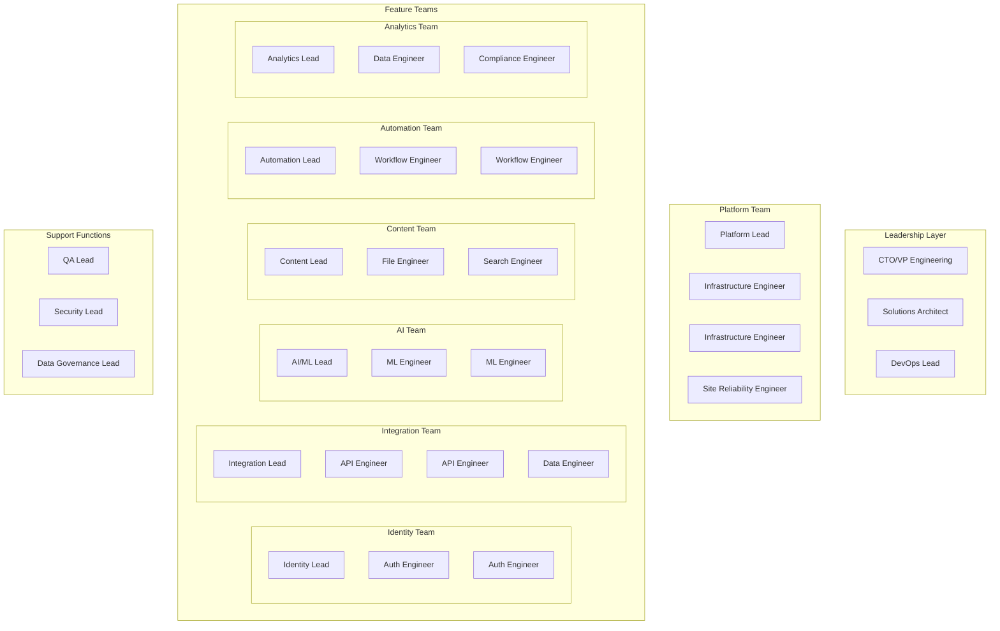

# PyAirtable Microservices Team Organization & Service Governance Framework

## Executive Summary

This document establishes the organizational structure, ownership model, and governance patterns for PyAirtable's 22-service microservices architecture. It defines clear boundaries of responsibility, service standards, and operational procedures to ensure scalable, maintainable, and secure microservices development.

## Team Structure & Service Ownership

### 1. Team Organization Model



### 2. Service Ownership Matrix

| Team | Primary Services | Secondary Services | Responsibilities |
|------|------------------|-------------------|------------------|
| **Platform Team** | api-gateway, edge-cache-service, rate-limiter-service | All services (infrastructure) | Core infrastructure, deployment pipeline, monitoring |
| **Identity Team** | auth-service, user-service, permission-service | - | Authentication, authorization, user management |
| **Integration Team** | airtable-connector, schema-service, data-sync-service, webhook-service | - | External API integration, data synchronization |
| **AI Team** | llm-orchestrator, conversation-service, ai-analytics-service | - | LLM processing, AI features, conversation management |
| **Content Team** | file-storage-service, content-processor, search-service | - | File management, content processing, search |
| **Automation Team** | workflow-engine, scheduler-service, event-processor | - | Business process automation, workflow orchestration |
| **Analytics Team** | analytics-service, audit-service, notification-service | - | Business intelligence, compliance, notifications |

### 3. Team Responsibilities and SLAs

#### Platform Team
**Mission**: Provide reliable, scalable infrastructure and development tools for all feature teams.

**Primary Responsibilities:**
- Kubernetes cluster management and upgrades
- CI/CD pipeline maintenance and optimization
- Service mesh (Istio) configuration and monitoring
- Infrastructure as Code (Terraform) management
- Cross-cutting concerns (logging, monitoring, alerting)
- Developer tooling and platform APIs

**Service Level Objectives:**
- Platform uptime: 99.9%
- Build pipeline success rate: 95%
- Deployment time: < 15 minutes
- Infrastructure provisioning: < 30 minutes
- Support response time: < 4 hours

**On-Call Rotation:** 24/7 coverage with primary and secondary on-call engineers

#### Identity Team
**Mission**: Secure and scalable identity management across all PyAirtable services.

**Primary Responsibilities:**
- User authentication and session management
- Role-based access control (RBAC) implementation
- Multi-tenant data isolation
- Security token management (JWT, API keys)
- User lifecycle management
- Compliance with authentication standards (OAuth, OIDC)

**Service Level Objectives:**
- Auth service uptime: 99.95%
- Authentication latency: < 100ms P95
- User data consistency: 100%
- Security incident response: < 1 hour
- Password reset completion: < 2 minutes

**Security Requirements:**
- All authentication flows must use HTTPS
- Passwords must meet complexity requirements
- Failed login attempts must be rate-limited
- All user actions must be audited

#### Integration Team
**Mission**: Reliable and performant integration with Airtable and other external services.

**Primary Responsibilities:**
- Airtable API client and rate limiting
- Schema synchronization and validation
- Real-time webhook processing
- Data consistency and conflict resolution
- API versioning and backward compatibility
- Third-party service monitoring

**Service Level Objectives:**
- Integration service uptime: 99.5%
- Airtable API success rate: 98%
- Schema sync latency: < 30 seconds
- Webhook processing: < 5 seconds
- Data consistency checks: 100%

**Integration Standards:**
- All external API calls must have circuit breakers
- Webhook failures must trigger retries with exponential backoff
- Schema changes must be backward compatible
- Rate limiting must respect API provider limits

### 4. Service Governance Standards

#### 4.1 Service Development Standards

**API Design Standards:**
```yaml
api_standards:
  versioning:
    - Use semantic versioning (v1, v2, etc.)
    - Maintain backward compatibility for at least 2 versions
    - Deprecation notices must be given 90 days in advance
  
  endpoints:
    - RESTful design principles
    - Consistent error response format
    - Comprehensive OpenAPI 3.0 documentation
    - Health check endpoint at /health
    - Metrics endpoint at /metrics
  
  authentication:
    - JWT tokens for user authentication
    - API keys for service-to-service communication
    - mTLS for internal service communication
  
  data_formats:
    - JSON for API requests/responses
    - ISO 8601 for timestamps
    - UUID v4 for entity identifiers
    - UTF-8 encoding for all text
```

**Code Quality Standards:**
```yaml
code_quality:
  testing:
    - Unit test coverage: minimum 80%
    - Integration tests for all API endpoints
    - Contract tests with Pact for service dependencies
    - End-to-end tests for critical user journeys
  
  security:
    - Static code analysis with SonarQube
    - Dependency vulnerability scanning
    - Container image security scanning
    - Regular security audits
  
  performance:
    - API response time: < 200ms P95
    - Database query optimization
    - Caching strategy implementation
    - Load testing before production deployment
```

#### 4.2 Operational Standards

**Monitoring and Observability:**
```yaml
observability_requirements:
  logging:
    - Structured JSON logging
    - Correlation ID for request tracing
    - Log levels: ERROR, WARN, INFO, DEBUG
    - No sensitive data in logs
  
  metrics:
    - Prometheus metrics exposed at /metrics
    - Business metrics (user actions, API calls)
    - Technical metrics (response time, error rate)
    - Custom metrics for domain-specific KPIs
  
  tracing:
    - Distributed tracing with Jaeger
    - Trace all external API calls
    - Include database query tracing
    - Service dependency mapping
  
  alerting:
    - Error rate > 1% for 5 minutes
    - Response time > 500ms P95 for 5 minutes
    - Service availability < 99% for 15 minutes
    - Custom business metric thresholds
```

**Deployment Standards:**
```yaml
deployment_requirements:
  containerization:
    - Docker containers with multi-stage builds
    - Minimal base images (Alpine Linux preferred)
    - Non-root user execution
    - Health check commands
  
  kubernetes:
    - Resource limits and requests defined
    - Readiness and liveness probes
    - Horizontal Pod Autoscaler (HPA) configuration
    - Pod Disruption Budget (PDB)
  
  ci_cd:
    - Automated testing on all commits
    - Security scanning in pipeline
    - Blue-green or canary deployments
    - Automated rollback on failure
```

### 5. Communication and Coordination Patterns

#### 5.1 Inter-Team Communication

**Regular Meetings:**
- **Architecture Review Board (ARB)**: Weekly, all team leads
- **Service Owner Sync**: Bi-weekly, service owners and platform team
- **Cross-Team Dependencies**: Weekly, as needed
- **Incident Review**: Within 48 hours of major incidents

**Communication Channels:**
- **Slack Channels:**
  - `#architecture` - Architecture decisions and discussions
  - `#incidents` - Real-time incident communication
  - `#deployments` - Deployment notifications and coordination
  - `#platform-team`, `#identity-team`, etc. - Team-specific channels

**Documentation Requirements:**
- **Architecture Decision Records (ADRs)** for significant technical decisions
- **Service documentation** in team repositories
- **Runbooks** for operational procedures
- **API documentation** using OpenAPI/Swagger

#### 5.2 Service Interface Contracts

**API Contracts:**
```yaml
contract_testing:
  consumer_driven:
    - Consumers define expectations using Pact
    - Providers verify contracts in CI/CD
    - Contract versioning aligned with API versioning
    - Breaking changes require consumer notification
  
  schema_evolution:
    - Additive changes allowed without version bump
    - Field removals require new API version
    - Data type changes require new API version
    - Deprecation warnings for removed fields
```

**Event Contracts:**
```yaml
event_contracts:
  schema_registry:
    - Avro schemas for all events
    - Schema compatibility rules enforced
    - Version management for event schemas
    - Consumer compatibility validation
  
  event_design:
    - Events describe facts, not commands
    - Include correlation and causation IDs
    - Immutable event data
    - Backward and forward compatibility
```

### 6. Service Lifecycle Management

#### 6.1 Service Creation Process

1. **Proposal Phase:**
   - RFC (Request for Comments) document
   - Architecture Review Board approval
   - Resource allocation and team assignment

2. **Development Phase:**
   - Repository setup with templates
   - CI/CD pipeline configuration
   - Initial implementation and testing
   - Documentation creation

3. **Deployment Phase:**
   - Staging environment deployment
   - Performance and security testing
   - Production deployment approval
   - Monitoring and alerting setup

4. **Operational Phase:**
   - Service registration in service catalog
   - On-call rotation assignment
   - SLA definition and monitoring
   - Regular health assessments

#### 6.2 Service Retirement Process

1. **Deprecation Notice:**
   - 180-day advance notice
   - Migration plan for consumers
   - Alternative service recommendations

2. **Migration Phase:**
   - Consumer migration support
   - Data migration procedures
   - Parallel operation period
   - Usage monitoring and validation

3. **Decommission Phase:**
   - Service shutdown
   - Resource cleanup
   - Documentation archival
   - Post-mortem documentation

### 7. Performance and Quality Metrics

#### 7.1 Service-Level Metrics

**Availability Metrics:**
- Service uptime percentage
- Mean Time To Recovery (MTTR)
- Mean Time Between Failures (MTBF)
- Error rate and error budget consumption

**Performance Metrics:**
- API response time percentiles (P50, P95, P99)
- Throughput (requests per second)
- Resource utilization (CPU, memory)
- Database query performance

**Business Metrics:**
- User engagement metrics
- API usage patterns
- Feature adoption rates
- Customer satisfaction scores

#### 7.2 Team-Level Metrics

**Development Velocity:**
- Deployment frequency
- Lead time for changes
- Change failure rate
- Recovery time from failures

**Quality Metrics:**
- Code coverage percentage
- Bug escape rate
- Security vulnerability count
- Technical debt ratio

### 8. Security and Compliance Framework

#### 8.1 Security Responsibilities

**Platform Team:**
- Infrastructure security (network, cluster, secrets)
- Security tool integration (SAST, DAST, container scanning)
- Security policy enforcement
- Incident response coordination

**Feature Teams:**
- Application security (authentication, authorization)
- Data protection and privacy
- Secure coding practices
- Vulnerability remediation

#### 8.2 Compliance Requirements

**Data Protection:**
- GDPR compliance for EU users
- Data retention and deletion policies
- Audit trail for data access
- Encryption at rest and in transit

**Industry Standards:**
- SOC 2 Type II compliance
- ISO 27001 security controls
- Regular penetration testing
- Security awareness training

### 9. Incident Management

#### 9.1 Incident Classification

**Severity Levels:**
- **P0 (Critical)**: Complete service outage affecting all users
- **P1 (High)**: Major functionality impacted, significant user impact
- **P2 (Medium)**: Partial functionality impact, some users affected
- **P3 (Low)**: Minor issues, minimal user impact

**Response Times:**
- P0: Immediate response, 15-minute acknowledgment
- P1: 30-minute response, 1-hour acknowledgment
- P2: 2-hour response, 4-hour acknowledgment
- P3: 8-hour response, next business day acknowledgment

#### 9.2 Incident Response Process

1. **Detection and Alerting:**
   - Automated monitoring alerts
   - User reports through support channels
   - Internal team notifications

2. **Response and Mitigation:**
   - Incident commander assignment
   - Service team notification
   - Initial impact assessment
   - Immediate mitigation actions

3. **Resolution and Recovery:**
   - Root cause analysis
   - Permanent fix implementation
   - Service restoration validation
   - Customer communication

4. **Post-Incident Review:**
   - Blameless post-mortem
   - Action item identification
   - Process improvement recommendations
   - Documentation updates

### 10. Continuous Improvement

#### 10.1 Regular Review Processes

**Quarterly Business Reviews:**
- Service performance against SLAs
- Team productivity metrics
- Technology roadmap alignment
- Resource allocation review

**Monthly Technical Reviews:**
- Architecture evolution discussion
- Technical debt assessment
- Security vulnerability review
- Performance optimization opportunities

**Weekly Operational Reviews:**
- Incident trend analysis
- Deployment success rates
- Monitoring effectiveness
- Tool and process improvements

#### 10.2 Innovation and Experimentation

**Technology Evaluation:**
- Regular assessment of new technologies
- Proof-of-concept projects
- Technology radar maintenance
- Community contribution encouragement

**Process Innovation:**
- Team retrospectives and improvements
- Cross-team knowledge sharing
- Best practice documentation
- Automation opportunity identification

### 11. Onboarding and Training

#### 11.1 New Team Member Onboarding

**Week 1: Foundation**
- PyAirtable architecture overview
- Service ownership assignments
- Development environment setup
- Security and compliance training

**Week 2: Service Deep Dive**
- Assigned service architecture review
- Code base walkthrough
- Testing strategy understanding
- Operational procedures training

**Week 3: Hands-On Experience**
- First bug fix or small feature
- Code review participation
- Monitoring and alerting setup
- Documentation contribution

**Week 4: Independent Contribution**
- Feature development assignment
- On-call rotation preparation
- Customer impact understanding
- Team process integration

#### 11.2 Continuous Learning

**Technical Skills:**
- Microservices design patterns
- Kubernetes and cloud platforms
- Security best practices
- Performance optimization techniques

**Soft Skills:**
- Cross-team communication
- Incident management
- Customer empathy
- Leadership development

### 12. Success Metrics and KPIs

#### 12.1 Organizational KPIs

**Delivery Metrics:**
- Time from idea to production: < 4 weeks
- Deployment frequency: Daily per team
- Change failure rate: < 5%
- Recovery time: < 2 hours

**Quality Metrics:**
- Service availability: > 99.9%
- Bug escape rate: < 2%
- Security incidents: 0 critical
- Customer satisfaction: > 4.5/5

**Team Health Metrics:**
- Employee satisfaction: > 4.0/5
- Knowledge sharing sessions: Monthly per team
- Cross-team collaboration incidents: > 5 per quarter
- Innovation projects: > 1 per team per quarter

#### 12.2 Service Governance Effectiveness

**Compliance Metrics:**
- Services meeting standards: 100%
- Documentation coverage: > 95%
- Security scan compliance: 100%
- SLA compliance: > 98%

**Operational Excellence:**
- Incident response time adherence: > 95%
- Post-mortem completion rate: 100%
- Action item completion rate: > 90%
- Process improvement suggestions: > 2 per team per month

## Implementation Roadmap

### Phase 1: Foundation (Weeks 1-2)
- [ ] Establish team structure and assignments
- [ ] Create service ownership documentation
- [ ] Set up communication channels and processes
- [ ] Define initial governance standards

### Phase 2: Process Implementation (Weeks 3-6)
- [ ] Implement service development standards
- [ ] Deploy monitoring and observability tools
- [ ] Establish incident management procedures
- [ ] Create onboarding materials

### Phase 3: Optimization (Weeks 7-12)
- [ ] Refine processes based on initial feedback
- [ ] Implement advanced governance automation
- [ ] Establish continuous improvement cycles
- [ ] Measure and optimize team performance

### Phase 4: Maturity (Ongoing)
- [ ] Regular review and adaptation of standards
- [ ] Advanced automation and self-service capabilities
- [ ] Cross-team collaboration optimization
- [ ] Innovation and experimentation programs

This governance framework provides the foundation for successful microservices development at PyAirtable, ensuring scalability, reliability, and team effectiveness as the organization grows.