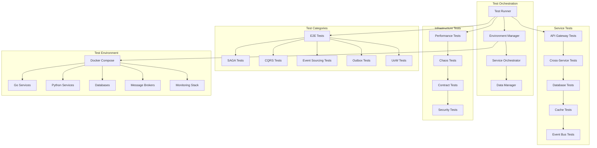

# PyAirtable Comprehensive Integration Test Suite

This comprehensive integration test suite validates all architectural patterns and services implemented in the PyAirtable platform, ensuring production readiness through extensive end-to-end testing.

## Overview

The test suite provides comprehensive coverage across:

### 🏗️ **Architectural Patterns**
- **SAGA Workflows**: End-to-end orchestration with compensation
- **CQRS Projections**: Command-query separation with eventual consistency
- **Event Sourcing**: Event replay validation and consistency checks
- **Outbox Pattern**: Transactional message delivery and reliability
- **Unit of Work**: Transaction boundary validation across services

### 🔧 **Service Integration**
- **API Gateway**: Routing, authentication, and load balancing
- **Cross-Service Communication**: Service mesh and authentication
- **Database Transactions**: ACID compliance and distributed transactions
- **Cache Invalidation**: Multi-level cache coherence
- **Event Bus**: Message flow and delivery guarantees

### 🧪 **Test Infrastructure**
- **Docker Environment**: Containerized test environment with service orchestration
- **Test Data Management**: Fixture generation and data seeding
- **Performance Testing**: Load testing and benchmarking
- **Chaos Engineering**: Fault injection and resilience testing
- **Contract Testing**: API contract validation between services

### 🚀 **Test Automation**
- **CI/CD Integration**: Automated test execution in pipelines
- **Test Reporting**: Comprehensive metrics and reporting
- **Parallel Execution**: Optimized test execution strategies
- **Environment Management**: Automated setup and cleanup
- **Smoke Testing**: Production readiness validation

## Architecture



## Quick Start

### Prerequisites
- Docker and Docker Compose
- Go 1.21+
- Python 3.11+
- Make (optional)

### Run Complete Test Suite
```bash
# Run all tests with full environment
./run-integration-suite.sh

# Run specific test categories
./run-integration-suite.sh --category e2e
./run-integration-suite.sh --category service-integration
./run-integration-suite.sh --category performance

# Run with specific environment
./run-integration-suite.sh --env local
./run-integration-suite.sh --env ci
./run-integration-suite.sh --env production-like
```

### Quick Validation
```bash
# Smoke tests for PR validation
./run-integration-suite.sh --smoke

# Health check only
./run-integration-suite.sh --health-check

# Environment validation
./run-integration-suite.sh --validate-env
```

## Test Categories

### 1. End-to-End Architectural Pattern Tests

#### SAGA Workflow Tests
- **User Registration SAGA**: Multi-step user onboarding with rollback
- **Workspace Creation SAGA**: Complex resource provisioning workflow
- **Payment Processing SAGA**: Financial transaction coordination
- **Data Migration SAGA**: Large-scale data movement operations

#### CQRS Projection Tests
- **User Projection Consistency**: Command-query synchronization
- **Workspace Projection Rebuilding**: Event replay validation
- **Analytics Projection Updates**: Real-time data aggregation
- **Cross-Service Projection Sync**: Distributed consistency

#### Event Sourcing Tests
- **Event Stream Integrity**: Event ordering and consistency
- **Replay Validation**: State reconstruction from events
- **Snapshot Management**: Optimization and consistency
- **Concurrent Event Processing**: Race condition handling

#### Outbox Pattern Tests
- **Transactional Publishing**: Event-data consistency
- **Delivery Guarantees**: At-least-once delivery validation
- **Publisher Fault Tolerance**: Failure recovery testing
- **Dead Letter Queue**: Failed message handling

#### Unit of Work Tests
- **Transaction Boundaries**: Multi-repository coordination
- **Rollback Scenarios**: Failure handling and cleanup
- **Nested Transactions**: Complex transaction hierarchies
- **Cross-Service Transactions**: Distributed transaction coordination

### 2. Service Integration Tests

#### API Gateway Integration
- **Routing Validation**: Request routing and load balancing
- **Authentication Flow**: Token validation and propagation
- **Rate Limiting**: Traffic control and throttling
- **Circuit Breaker**: Fault tolerance and recovery

#### Cross-Service Communication
- **Service Discovery**: Dynamic service registration
- **Load Balancing**: Request distribution strategies
- **Timeout Handling**: Graceful degradation
- **Error Propagation**: Cross-service error handling

#### Database Transaction Tests
- **ACID Compliance**: Transaction isolation and consistency
- **Connection Pooling**: Resource management
- **Distributed Transactions**: Two-phase commit validation
- **Deadlock Resolution**: Concurrent access handling

#### Cache Invalidation Tests
- **Multi-Level Caching**: L1, L2, and distributed cache coordination
- **Cache Coherence**: Consistency across cache layers
- **Invalidation Patterns**: Selective and bulk invalidation
- **Performance Impact**: Cache hit/miss optimization

### 3. Infrastructure and Performance Tests

#### Performance Benchmarking
- **Load Testing**: Concurrent user simulation
- **Stress Testing**: System limit identification
- **Spike Testing**: Traffic surge handling
- **Endurance Testing**: Long-running stability

#### Chaos Engineering
- **Service Failures**: Random service termination
- **Network Partitions**: Split-brain scenarios
- **Resource Exhaustion**: Memory and CPU constraints
- **Data Corruption**: Fault injection testing

#### Contract Testing
- **API Contract Validation**: Service interface compliance
- **Schema Evolution**: Backward compatibility testing
- **Version Compatibility**: Multi-version coexistence
- **Consumer-Driven Contracts**: Provider-consumer validation

## Environment Configuration

### Test Environments

#### Local Development
```yaml
environment: local
services:
  - api-gateway
  - auth-service
  - user-service
  - workspace-service
  - permission-service
databases:
  - postgres-primary
  - postgres-read-replica
  - redis-cache
monitoring:
  - prometheus
  - grafana
```

#### CI/CD Pipeline
```yaml
environment: ci
parallel_execution: true
resource_limits:
  memory: 4GB
  cpu: 2cores
timeout: 30m
cleanup: aggressive
```

#### Production-Like
```yaml
environment: production-like
high_availability: true
security_enabled: true
monitoring_full: true
data_encryption: true
```

### Configuration Files

- `config/local.yml` - Local development configuration
- `config/ci.yml` - CI/CD pipeline configuration
- `config/production-like.yml` - Production simulation
- `docker-compose.test.yml` - Docker service definitions
- `environments/` - Environment-specific overrides

## Test Data Management

### Fixture Strategy
- **Deterministic Data**: Consistent test data across runs
- **Tenant Isolation**: Multi-tenant test scenarios
- **Hierarchical Data**: Complex relationship structures
- **Performance Data**: Large datasets for load testing

### Data Generation
- **Factory Pattern**: Programmatic test data creation
- **Realistic Data**: Production-like data characteristics
- **Relationship Integrity**: Consistent foreign key relationships
- **Volume Scaling**: Configurable data volumes

### Cleanup Strategy
- **Automatic Cleanup**: Post-test resource cleanup
- **Incremental Cleanup**: Selective data removal
- **Environment Reset**: Full environment restoration
- **Garbage Collection**: Resource leak prevention

## Monitoring and Observability

### Test Metrics
- **Execution Time**: Test duration tracking
- **Success Rate**: Pass/fail metrics
- **Resource Usage**: CPU, memory, and network utilization
- **Service Health**: Component availability monitoring

### Reporting
- **HTML Reports**: Comprehensive test results
- **JUnit XML**: CI/CD integration format
- **Performance Reports**: Load testing results
- **Coverage Reports**: Test coverage analysis

### Real-Time Monitoring
- **Grafana Dashboards**: Live test execution monitoring
- **Prometheus Metrics**: Detailed performance metrics
- **Alert Manager**: Test failure notifications
- **Log Aggregation**: Centralized log analysis

## Advanced Features

### Parallel Execution
- **Test Isolation**: Independent test execution
- **Resource Partitioning**: Isolated test environments
- **Load Balancing**: Optimal resource utilization
- **Dependency Management**: Test execution ordering

### Fault Injection
- **Network Failures**: Simulated network issues
- **Service Crashes**: Random service termination
- **Resource Constraints**: Limited resource scenarios
- **Data Corruption**: Invalid data injection

### Security Testing
- **Authentication Bypass**: Security vulnerability testing
- **Authorization Violations**: Permission boundary testing
- **Input Validation**: SQL injection and XSS testing
- **Rate Limit Bypass**: DDoS protection testing

## CI/CD Integration

### GitHub Actions
```yaml
name: Integration Test Suite
on: [push, pull_request]
jobs:
  integration-tests:
    runs-on: ubuntu-latest
    strategy:
      matrix:
        test-category: [e2e, service-integration, performance]
    steps:
      - uses: actions/checkout@v3
      - name: Run Integration Tests
        run: ./run-integration-suite.sh --category ${{ matrix.test-category }}
```

### Jenkins Pipeline
```groovy
pipeline {
    agent any
    stages {
        stage('Integration Tests') {
            parallel {
                stage('E2E Tests') {
                    steps {
                        sh './run-integration-suite.sh --category e2e'
                    }
                }
                stage('Service Tests') {
                    steps {
                        sh './run-integration-suite.sh --category service-integration'
                    }
                }
            }
        }
    }
}
```

## Best Practices

### Test Design
- **Independent Tests**: No test dependencies
- **Idempotent Operations**: Repeatable test execution
- **Clear Assertions**: Explicit success criteria
- **Comprehensive Coverage**: All critical paths tested

### Performance Optimization
- **Resource Reuse**: Shared test infrastructure
- **Parallel Execution**: Concurrent test running
- **Smart Cleanup**: Efficient resource management
- **Caching**: Test artifact reuse

### Debugging
- **Verbose Logging**: Detailed execution logs
- **Environment Inspection**: Runtime environment analysis
- **Service Logs**: Individual service log access
- **Debug Mode**: Interactive debugging support

## Troubleshooting

### Common Issues
- **Port Conflicts**: Service port collisions
- **Resource Exhaustion**: Memory or CPU limits
- **Network Issues**: Service communication failures
- **Data Corruption**: Test data inconsistencies

### Debug Commands
```bash
# Check service health
./run-integration-suite.sh --health-check

# View service logs
./run-integration-suite.sh --logs --service api-gateway

# Run single test with verbose output
./run-integration-suite.sh --test TestSAGAWorkflow --verbose

# Environment inspection
./run-integration-suite.sh --inspect-env
```

## Contributing

### Adding New Tests
1. Create test in appropriate category directory
2. Update test configuration
3. Add necessary fixtures and mocks
4. Update documentation
5. Run full test suite validation

### Test Guidelines
- Follow existing test patterns
- Include both positive and negative scenarios
- Add comprehensive documentation
- Ensure proper cleanup
- Validate in CI environment

## Support

For issues with the integration test suite:

1. **Check Health**: `./run-integration-suite.sh --health-check`
2. **View Logs**: `./run-integration-suite.sh --logs`
3. **Environment Reset**: `./run-integration-suite.sh --reset-env`
4. **Debug Mode**: `./run-integration-suite.sh --debug`

**Documentation**: `/docs/testing/`
**Issue Tracking**: GitHub Issues
**Support Channel**: #testing Slack channel